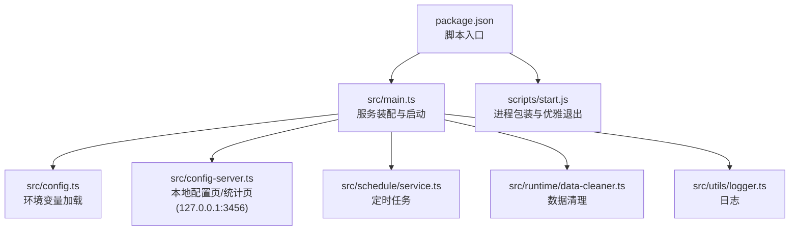
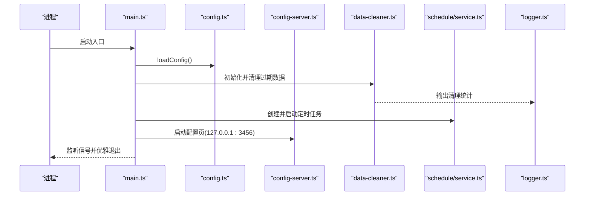
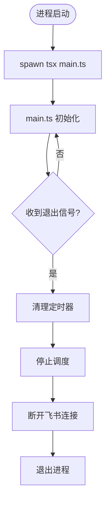
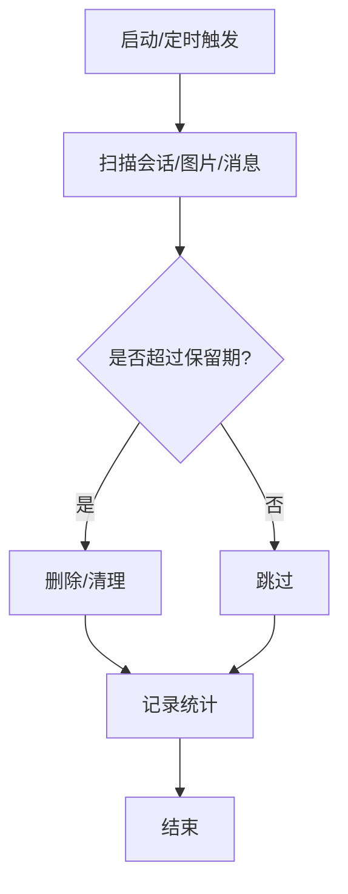
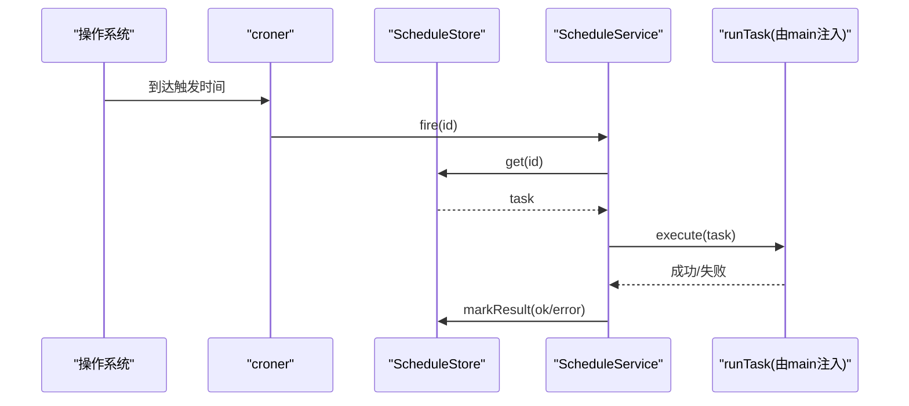
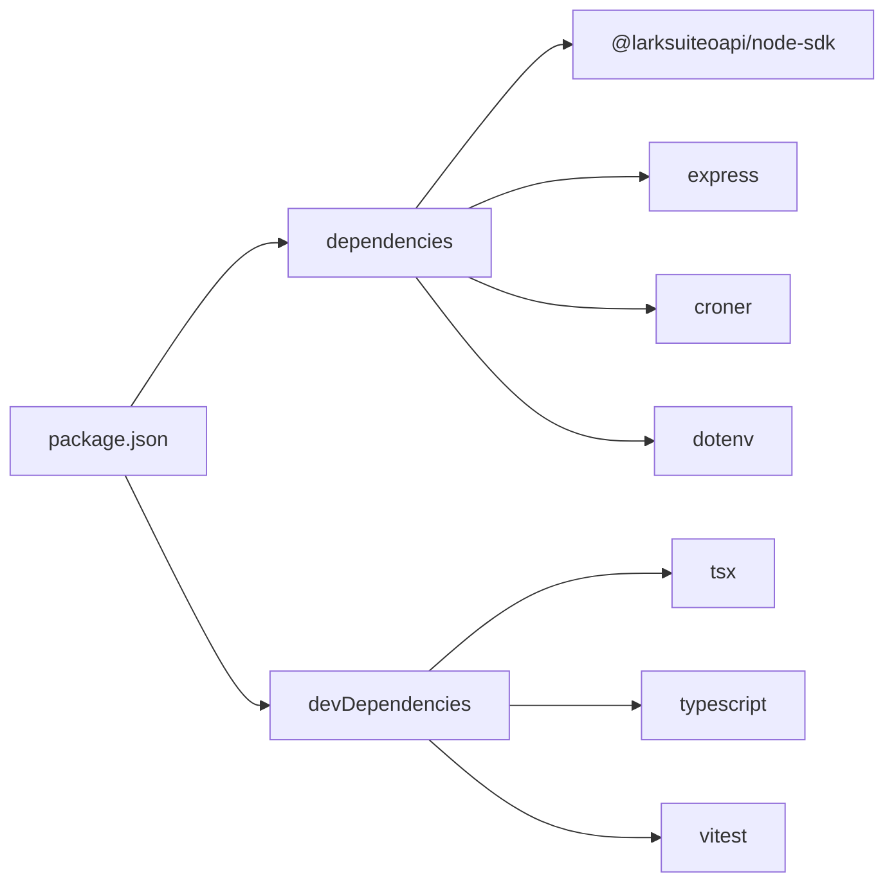

# 部署运维

<cite>
**本文引用的文件**
- [package.json](file://package.json)
- [README.md](file://README.md)
- [src/main.ts](file://src/main.ts)
- [src/config.ts](file://src/config.ts)
- [src/config-server.ts](file://src/config-server.ts)
- [scripts/start.js](file://scripts/start.js)
- [src/utils/logger.ts](file://src/utils/logger.ts)
- [src/schedule/service.ts](file://src/schedule/service.ts)
- [src/runtime/data-cleaner.ts](file://src/runtime/data-cleaner.ts)
</cite>

## 目录
1. [简介](#简介)
2. [项目结构](#项目结构)
3. [核心组件](#核心组件)
4. [架构总览](#架构总览)
5. [详细组件分析](#详细组件分析)
6. [依赖分析](#依赖分析)
7. [性能考虑](#性能考虑)
8. [故障排查指南](#故障排查指南)
9. [结论](#结论)
10. [附录](#附录)

## 简介
本指南面向生产环境运维，覆盖安装与配置、容器化部署、监控告警、日志管理、备份恢复、扩缩容与灾难恢复、检查清单与脚本、常见问题与优化建议。目标是让运维人员快速、安全、稳定地交付并长期维护 feishu-pi（飞书 Agent 应用平台）。

## 项目结构
- 入口与启动：通过 package.json 的 scripts 提供 start/dev/config/check/test 等命令；实际运行入口为 src/main.ts。
- 配置与界面：src/config.ts 负责从环境变量加载配置；src/config-server.ts 提供本机 Web 配置页面与统计页面（仅监听 127.0.0.1:3456）。
- 运行时与调度：src/schedule/service.ts 实现定时任务持久化与调度；src/runtime/data-cleaner.ts 实现会话/图片/消息清理。
- 日志：src/utils/logger.ts 统一输出带时间戳的日志。
- 启动包装：scripts/start.js 作为进程包装器，确保子进程退出时父进程完全退出。

**图示来源**
- [package.json:6-12](file://package.json#L6-L12)
- [src/main.ts:27-286](file://src/main.ts#L27-L286)
- [src/config.ts:24-50](file://src/config.ts#L24-L50)
- [src/config-server.ts:12-149](file://src/config-server.ts#L12-L149)
- [src/schedule/service.ts:105-236](file://src/schedule/service.ts#L105-L236)
- [src/runtime/data-cleaner.ts:30-184](file://src/runtime/data-cleaner.ts#L30-L184)
- [scripts/start.js:1-77](file://scripts/start.js#L1-L77)

**章节来源**
- [package.json:6-12](file://package.json#L6-L12)
- [src/main.ts:27-286](file://src/main.ts#L27-L286)
- [src/config.ts:24-50](file://src/config.ts#L24-L50)
- [src/config-server.ts:12-149](file://src/config-server.ts#L12-L149)
- [scripts/start.js:1-77](file://scripts/start.js#L1-L77)

## 核心组件
- 配置加载：从环境变量读取必需项（如飞书 App ID/Secret、管理员标识、模型 Provider/Name/BaseURL/API Key），并提供默认值与超时参数。
- 配置服务器：提供 / 和 /stats 两个页面，以及 /api/config 读写 .env；仅监听 127.0.0.1，避免暴露到局域网。
- 数据清理：按保留天数清理会话、图片缓存与消息状态；支持干跑模式；定期执行。
- 定时任务：基于 cron 表达式持久化任务，启动后恢复调度，失败记录状态，结果以卡片推送至目标会话。
- 日志：统一时间戳前缀，区分 info/warn/error/log 及用户/AI 响应标记。

**章节来源**
- [src/config.ts:24-50](file://src/config.ts#L24-L50)
- [src/config-server.ts:26-149](file://src/config-server.ts#L26-L149)
- [src/runtime/data-cleaner.ts:30-184](file://src/runtime/data-cleaner.ts#L30-L184)
- [src/schedule/service.ts:105-236](file://src/schedule/service.ts#L105-L236)
- [src/utils/logger.ts:1-40](file://src/utils/logger.ts#L1-L40)

## 架构总览
服务启动流程：加载配置 → 初始化消息存储与数据清理 → 创建飞书 Client → 解析管理员 Open ID → 构建传输层与授权卡回调 → 注册权限策略与工具守卫 → 初始化运行时与对话管理器 → 启动桥接与连接 → 恢复定时任务 → 打印配置页地址 → 处理优雅退出。

**图示来源**
- [src/main.ts:27-286](file://src/main.ts#L27-L286)
- [src/config.ts:24-50](file://src/config.ts#L24-L50)
- [src/config-server.ts:12-149](file://src/config-server.ts#L12-L149)
- [src/runtime/data-cleaner.ts:30-184](file://src/runtime/data-cleaner.ts#L30-L184)
- [src/schedule/service.ts:105-236](file://src/schedule/service.ts#L105-L236)
- [src/utils/logger.ts:1-40](file://src/utils/logger.ts#L1-L40)

## 详细组件分析

### 环境与配置
- 必需环境变量：FEISHU_APP_ID、FEISHU_APP_SECRET、FEISHU_ADMIN（可选但推荐）、模型相关 FEISHU_PI_MODEL_*、API Key。
- 可选增强：系统提示词、审核接口（guard）相关变量、授权卡超时。
- 配置页面：/ 展示表单，/api/config 读取/写入 .env；/stats 展示技能使用统计。
- 安全注意：配置页仅绑定 127.0.0.1，禁止对外暴露。

**章节来源**
- [src/config.ts:24-50](file://src/config.ts#L24-L50)
- [src/config-server.ts:26-149](file://src/config-server.ts#L26-L149)
- [README.md:187-224](file://README.md#L187-L224)

### 启动与生命周期
- 启动命令：npm start（tsx 运行 src/main.ts）。
- 进程包装：scripts/start.js 启动子进程并保证 SIGINT/SIGTERM 下彻底退出，必要时 SIGKILL。
- 优雅退出：关闭定时器、停止调度、断开飞书连接、短宽限后退出。

**图示来源**
- [scripts/start.js:1-77](file://scripts/start.js#L1-L77)
- [src/main.ts:252-286](file://src/main.ts#L252-L286)

**章节来源**
- [package.json:6-12](file://package.json#L6-L12)
- [scripts/start.js:1-77](file://scripts/start.js#L1-L77)
- [src/main.ts:252-286](file://src/main.ts#L252-L286)

### 数据清理与健康自检
- 启动时清理“卡住的消息”与过期数据（会话、图片、消息状态），默认保留 7 天。
- 每 24 小时周期性执行一次清理。
- 支持 dryRun 只统计不删除，便于预检。

**图示来源**
- [src/runtime/data-cleaner.ts:30-184](file://src/runtime/data-cleaner.ts#L30-L184)
- [src/main.ts:31-59](file://src/main.ts#L31-L59)

**章节来源**
- [src/runtime/data-cleaner.ts:30-184](file://src/runtime/data-cleaner.ts#L30-L184)
- [src/main.ts:31-59](file://src/main.ts#L31-L59)

### 定时任务
- 任务持久化：JSON 文件，原子写入（先写 tmp 再 rename）。
- 调度：croner 驱动，启动时恢复启用中的任务。
- 执行：注入 runTask 执行智能体并推送卡片，失败记录 lastStatus/lastError。

**图示来源**
- [src/schedule/service.ts:105-236](file://src/schedule/service.ts#L105-L236)

**章节来源**
- [src/schedule/service.ts:105-236](file://src/schedule/service.ts#L105-L236)

### 日志与可观测性
- 统一 logger 输出时间戳与级别，便于集中采集。
- 关键路径均记录信息：启动、清理、调度、错误等。
- 建议将 stdout/stderr 接入日志收集系统（如 JSON 格式或结构化字段）。

**章节来源**
- [src/utils/logger.ts:1-40](file://src/utils/logger.ts#L1-L40)
- [src/main.ts:31-59](file://src/main.ts#L31-L59)
- [src/schedule/service.ts:116-123](file://src/schedule/service.ts#L116-L123)

## 依赖分析
- 运行时依赖：Node.js 22+（类型定义基于 @types/node 22.x），包管理器 npm。
- 关键依赖：飞书 SDK、Express（配置页）、croner（定时任务）、dotenv（环境变量）。
- 开发依赖：tsx、typescript、vitest、vite。

**图示来源**
- [package.json:14-32](file://package.json#L14-L32)

**章节来源**
- [package.json:14-32](file://package.json#L14-L32)
- [README.md:120-133](file://README.md#L120-L133)

## 性能考虑
- 会话与缓存清理：默认保留 7 天，避免磁盘增长；可根据业务调整 retentionDays。
- 定时任务并发：同一任务串行执行，避免重复并发导致资源争用。
- 配置页网络：仅监听 127.0.0.1，减少攻击面与网络开销。
- 外部调用超时：审核接口与授权卡均有超时控制，避免长尾阻塞。
- 日志吞吐：生产环境建议将日志输出重定向到文件或使用日志采集器，避免 I/O 阻塞主线程。

[本节为通用指导，无需特定文件引用]

## 故障排查指南
- 启动失败
  - 检查必填环境变量是否齐全（App ID/Secret/Admin/模型配置）。
  - 确认 Node.js 版本满足要求（22+）。
  - 查看控制台日志定位具体错误。
- 无法接收飞书事件
  - 检查飞书开放平台事件订阅与长连接配置。
  - 确认防火墙/代理允许出站 WebSocket。
- 配置页不可访问
  - 确认端口 3456 未被占用且仅绑定 127.0.0.1。
  - 如需远程访问，请通过反向代理并限制来源 IP。
- 定时任务未执行
  - 检查 cron 表达式是否合法。
  - 查看任务持久化文件与 lastStatus/lastError。
- 数据膨胀
  - 检查 data-cleaner 是否正常运行与周期任务是否生效。
  - 评估是否需要缩短保留天数。

**章节来源**
- [src/config.ts:24-50](file://src/config.ts#L24-L50)
- [src/config-server.ts:145-149](file://src/config-server.ts#L145-L149)
- [src/schedule/service.ts:131-150](file://src/schedule/service.ts#L131-L150)
- [src/runtime/data-cleaner.ts:30-184](file://src/runtime/data-cleaner.ts#L30-L184)

## 结论
feishu-pi 提供了轻量、可配置的飞书 Agent 后端，具备完善的启动流程、数据清理、定时任务与本地配置页。结合环境变量管理与日志输出，可在生产环境中稳定运行。建议配合容器化、日志采集与监控告警体系，形成完整的运维闭环。

[本节为总结，无需特定文件引用]

## 附录

### 生产环境部署步骤
- 准备环境
  - Node.js 22+，npm。
  - 在飞书开放平台完成权限与事件订阅配置。
- 安装依赖
  - npm install（自动执行 postinstall 补丁）。
- 配置应用
  - 方式一：运行 npm run config，浏览器打开 http://localhost:3456 填写配置并保存。
  - 方式二：手动编辑 .env 文件，填入必需环境变量。
- 启动服务
  - npm start。
- 验证
  - 访问 http://localhost:3456/stats 查看统计页面。
  - 在飞书中发送消息验证机器人响应。

**章节来源**
- [README.md:120-231](file://README.md#L120-L231)
- [package.json:6-12](file://package.json#L6-L12)
- [src/config-server.ts:94-149](file://src/config-server.ts#L94-L149)

### 容器化部署方案
- 基础镜像
  - 选择包含 Node.js 22+ 的官方镜像。
- 构建步骤
  - 复制源码与依赖声明。
  - 执行 npm ci（或 npm install）安装依赖。
  - 构建 TypeScript（如需要）或直接使用 tsx 运行。
- 运行配置
  - 通过环境变量注入 FEISHU_APP_ID、FEISHU_APP_SECRET、FEISHU_ADMIN、模型相关变量等。
  - 将 data 目录挂载为持久卷，避免重启丢失会话与任务。
- 健康检查
  - 可通过 HTTP 探针探测 / 或 /stats（需确保仅内网访问）。
- 日志与指标
  - 将 stdout/stderr 输出到容器日志，由日志系统采集。
  - 如需指标，可在后续扩展 Prometheus 指标端点。

[本节为通用指导，无需特定文件引用]

### 监控告警配置
- 进程级
  - 监控进程存活、CPU/内存使用率。
- 应用级
  - 关注日志中 warn/error 数量突增。
  - 关注定时任务 lastStatus=error 的频率。
- 外部依赖
  - 监控飞书 API 调用成功率与延迟。
  - 监控 AI 模型调用成功率与耗时。
- 告警阈值建议
  - 连续错误次数、请求超时比例、磁盘使用率、会话/图片清理失败次数。

[本节为通用指导，无需特定文件引用]

### 日志管理
- 输出位置
  - 标准输出/错误输出，便于容器日志采集。
- 采集建议
  - 使用结构化日志（JSON）以便检索与分析。
- 轮转与保留
  - 若直接落盘，建议配置日志轮转与保留策略。

**章节来源**
- [src/utils/logger.ts:1-40](file://src/utils/logger.ts#L1-L40)

### 备份恢复策略
- 备份范围
  - data/sessions（会话与消息状态）。
  - data/stats（技能使用统计）。
  - data/schedules.json（定时任务）。
  - .env（应用配置）。
- 备份频率
  - 建议每日增量，每周全量归档。
- 恢复步骤
  - 停止服务。
  - 替换 data 与 .env。
  - 启动服务并验证功能。

**章节来源**
- [src/runtime/data-cleaner.ts:30-184](file://src/runtime/data-cleaner.ts#L30-L184)
- [src/schedule/service.ts:27-90](file://src/schedule/service.ts#L27-L90)
- [src/config-server.ts:26-88](file://src/config-server.ts#L26-L88)

### 扩容缩容方案
- 水平扩容
  - 多实例部署时，共享 data 目录（如网络存储）以保证会话与任务一致性。
  - 通过负载均衡分发流量，注意会话隔离由 chatId/threadId 决定。
- 垂直扩容
  - 根据 CPU/内存使用率调整实例规格。
- 缩容
  - 逐步下线实例，确保无活跃会话或会话已迁移。

[本节为通用指导，无需特定文件引用]

### 灾难恢复计划
- RTO/RPO
  - 依据业务需求设定恢复时间与数据丢失容忍度。
- 演练
  - 定期演练从备份恢复，验证数据一致性与服务可用性。
- 回滚
  - 保留上一版本镜像与配置，支持快速回滚。

[本节为通用指导，无需特定文件引用]

### 部署检查清单
- 环境
  - Node.js 版本符合要求。
  - 依赖安装成功（postinstall 补丁生效）。
- 配置
  - 环境变量齐全且正确。
  - 配置页可访问（仅内网）。
- 功能
  - 飞书消息收发正常。
  - 定时任务可创建、调度、执行。
  - 数据清理按预期工作。
- 安全
  - 配置页未暴露公网。
  - 敏感信息未硬编码。
- 运维
  - 日志采集正常。
  - 监控告警已配置。

**章节来源**
- [package.json:6-12](file://package.json#L6-L12)
- [src/config-server.ts:145-149](file://src/config-server.ts#L145-L149)
- [src/schedule/service.ts:116-123](file://src/schedule/service.ts#L116-L123)
- [src/runtime/data-cleaner.ts:30-184](file://src/runtime/data-cleaner.ts#L30-L184)

### 运维脚本
- 启动
  - npm start 或 node scripts/start.js。
- 开发
  - npm run dev（热重载）。
- 类型检查
  - npm run check。
- 测试
  - npm test。
- 配置
  - npm run config（启动本地配置页）。

**章节来源**
- [package.json:6-12](file://package.json#L6-L12)
- [scripts/start.js:1-77](file://scripts/start.js#L1-L77)

### 监控指标建议
- 进程指标：存活、CPU、内存、句柄数。
- 应用指标：请求成功率、平均耗时、错误率。
- 业务指标：技能使用次数、定时任务执行成功率。
- 外部依赖：飞书 API 成功率、AI 模型调用成功率与耗时。

[本节为通用指导，无需特定文件引用]

### 常见问题与优化建议
- 问题：配置页无法访问
  - 检查端口占用与绑定地址（仅 127.0.0.1）。
- 问题：定时任务不执行
  - 校验 cron 表达式；查看 lastStatus/lastError。
- 问题：磁盘增长过快
  - 调整 retentionDays；检查清理任务是否运行。
- 优化：日志采集
  - 采用结构化日志，集中采集与分析。
- 优化：外部调用超时
  - 合理设置 guard 与授权卡超时，避免长尾。

**章节来源**
- [src/config-server.ts:145-149](file://src/config-server.ts#L145-L149)
- [src/schedule/service.ts:131-150](file://src/schedule/service.ts#L131-L150)
- [src/runtime/data-cleaner.ts:30-184](file://src/runtime/data-cleaner.ts#L30-L184)
- [src/utils/logger.ts:1-40](file://src/utils/logger.ts#L1-L40)