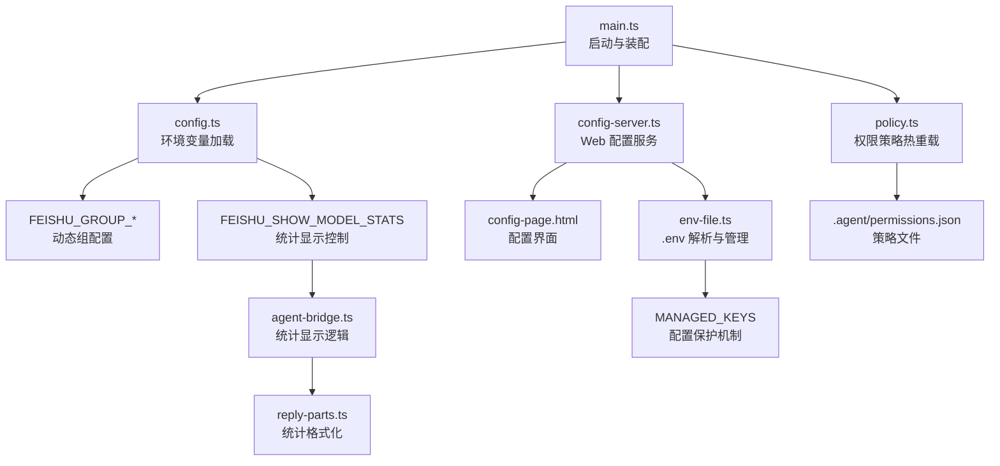
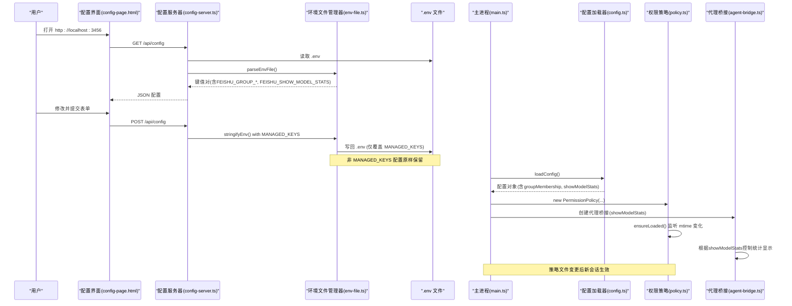
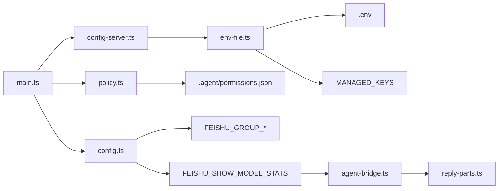

# 配置管理

<cite>
**本文引用的文件**
- [src/config.ts](file://src/config.ts)
- [src/config-server.ts](file://src/config-server.ts)
- [src/config-page.html](file://src/config-page.html)
- [src/main.ts](file://src/main.ts)
- [src/permission/policy.ts](file://src/permission/policy.ts)
- [.agent/permissions.json](file://.agent/permissions.json)
- [src/utils/env-file.ts](file://src/utils/env-file.ts)
- [test/env-file.test.ts](file://test/env-file.test.ts)
- [package.json](file://package.json)
- [README.md](file://README.md)
- [src/feishu/agent-bridge.ts](file://src/feishu/agent-bridge.ts)
- [src/feishu/reply-parts.ts](file://src/feishu/reply-parts.ts)
- [test/config.test.ts](file://test/config.test.ts)
</cite>

## 更新摘要
**所做更改**
- 新增模型统计显示控制功能，通过 FEISHU_SHOW_MODEL_STATS 环境变量控制回复末尾统计小字的显示
- 增强 Web 配置界面，在 AI 模型配置区域增加统计显示开关选项
- 改进环境文件管理，新增 upsertEnvLine 函数支持环境变量的原地更新
- 完善配置保护机制，确保非 MANAGED_KEYS 的配置项不被意外覆盖
- 更新故障排除指南，包含新的统计显示控制相关问题

## 目录
1. [简介](#简介)
2. [项目结构](#项目结构)
3. [核心组件](#核心组件)
4. [架构总览](#架构总览)
5. [详细组件分析](#详细组件分析)
6. [依赖关系分析](#依赖关系分析)
7. [性能与可靠性](#性能与可靠性)
8. [故障排除指南](#故障排除指南)
9. [结论](#结论)
10. [附录：配置项说明与示例](#附录配置项说明与示例)

## 简介
本文件为"配置管理系统"的完整参考文档，覆盖环境变量配置、Web 配置界面、动态配置更新机制、配置验证、默认值处理、热重载能力，以及飞书应用配置、AI 模型设置与权限策略配置。面向管理员与开发者，提供从入门到高级配置的完整指引，并包含常见问题排查方法。

**重要更新**：系统已移除旧的团队配置系统（feishuTeamMembers）和.settings.json配置文件，现在使用FEISHU_GROUP_*环境变量进行动态组分配，权限配置统一迁移到.permissions.json格式。**新增模型统计显示控制功能**，通过FEISHU_SHOW_MODEL_STATS环境变量控制回复末尾统计小字的显示，同时增强了环境文件管理模块，提供upsertEnvLine函数支持环境变量的原地更新操作。

## 项目结构
配置相关代码主要分布在以下位置：
- 环境变量加载与校验：src/config.ts
- Web 配置服务器与静态页面：src/config-server.ts、src/config-page.html
- 运行时装配与热切换入口：src/main.ts
- 权限策略与热重载：src/permission/policy.ts、.agent/permissions.json
- **.env 文件解析工具**：src/utils/env-file.ts
- 消息回复与统计显示：src/feishu/agent-bridge.ts、src/feishu/reply-parts.ts
- 启动脚本与命令：package.json
- 使用与配置说明：README.md



**图表来源**
- [src/main.ts:27-132](file://src/main.ts#L27-L132)
- [src/config.ts:24-61](file://src/config.ts#L24-L61)
- [src/config-server.ts:12-149](file://src/config-server.ts#L12-L149)
- [src/config-page.html:94-127](file://src/config-page.html#L94-L127)
- [src/permission/policy.ts:68-210](file://src/permission/policy.ts#L68-L210)
- [.agent/permissions.json:1-42](file://.agent/permissions.json#L1-L42)
- [src/utils/env-file.ts:21-84](file://src/utils/env-file.ts#L21-L84)
- [src/feishu/agent-bridge.ts:203-215](file://src/feishu/agent-bridge.ts#L203-L215)
- [src/feishu/reply-parts.ts:147-177](file://src/feishu/reply-parts.ts#L147-L177)

**章节来源**
- [src/main.ts:27-132](file://src/main.ts#L27-L132)
- [src/config.ts:24-61](file://src/config.ts#L24-L61)
- [src/config-server.ts:12-149](file://src/config-server.ts#L12-L149)
- [src/config-page.html:94-127](file://src/config-page.html#L94-L127)
- [src/permission/policy.ts:68-210](file://src/permission/policy.ts#L68-L210)
- [.agent/permissions.json:1-42](file://.agent/permissions.json#L1-L42)
- [src/utils/env-file.ts:21-84](file://src/utils/env-file.ts#L21-L84)
- [package.json:6-12](file://package.json#L6-L12)
- [README.md:187-250](file://README.md#L187-L250)

## 核心组件
- 环境变量加载器：负责读取、校验、提供默认值，构建运行时配置对象，包括动态组分配和统计显示控制。
- Web 配置服务器：提供本地 HTTP 服务，读写 .env 文件，暴露配置表单与统计页面。
- 配置界面：前端 HTML + JS，渲染表单、加载/保存配置、选择随机表情等。
- 权限策略系统：基于 .agent/permissions.json 的动态权限控制，支持 mtime 热重载和多组并集。
- 环境文件管理器：独立的 .env 文件解析和序列化模块，提供配置保护和数据安全机制。
- 统计显示控制器：根据 showModelStats 配置控制回复末尾统计小字的显示。
- 运行时装配：主进程在启动时加载配置、初始化传输层、工具守卫、会话管理等。

**章节来源**
- [src/config.ts:24-61](file://src/config.ts#L24-L61)
- [src/config-server.ts:23-149](file://src/config-server.ts#L23-L149)
- [src/config-page.html:47-127](file://src/config-page.html#L47-L127)
- [src/permission/policy.ts:68-210](file://src/permission/policy.ts#L68-L210)
- [src/utils/env-file.ts:1-84](file://src/utils/env-file.ts#L1-L84)
- [src/feishu/agent-bridge.ts:203-215](file://src/feishu/agent-bridge.ts#L203-L215)
- [src/main.ts:27-132](file://src/main.ts#L27-L132)

## 架构总览
下图展示了配置系统的整体交互：用户通过浏览器访问配置界面，后端读取/写入 .env；应用启动时由配置加载器解析环境变量（包括FEISHU_GROUP_*动态组配置和FEISHU_SHOW_MODEL_STATS统计控制）；权限策略文件变更会被自动检测并热重载；运行时将配置注入到传输层、工具守卫和会话管理中。



**图表来源**
- [src/config-page.html:210-260](file://src/config-page.html#L210-L260)
- [src/config-server.ts:94-120](file://src/config-server.ts#L94-L120)
- [src/utils/env-file.ts:33-83](file://src/utils/env-file.ts#L33-L83)
- [src/config.ts:24-61](file://src/config.ts#L24-L61)
- [src/main.ts:27-132](file://src/main.ts#L27-L132)
- [src/permission/policy.ts:178-210](file://src/permission/policy.ts#L178-L210)
- [src/feishu/agent-bridge.ts:203-215](file://src/feishu/agent-bridge.ts#L203-L215)

## 详细组件分析

### 模型统计显示控制（新增）
**新增** 模型统计显示控制功能，允许管理员控制回复末尾是否显示模型统计信息：

- **FEISHU_SHOW_MODEL_STATS 环境变量**：布尔类型配置，控制回复末尾统计小字的显示
  - 默认值：true（显示统计）
  - 支持的值：`1`、`true`、`on`、`yes` 表示开启；`0`、`false`、`off` 表示关闭
- **Web 配置界面集成**：在 AI 模型配置区域新增下拉选择框，提供直观的开关选项
- **统计信息显示内容**：当开启时，回复末尾显示 `模型 · token（新增 x） · ctx ~n% · $费用 · 耗时 · 会话别名`
- **影响范围**：仅影响最终回复的统计小字显示，不影响工具调用过程中的状态显示
- **配置持久化**：通过 Web 界面修改后自动保存到 .env 文件

**章节来源**
- [src/config.ts:28-36](file://src/config.ts#L28-L36)
- [src/config.ts:78-79](file://src/config.ts#L78-L79)
- [src/config-page.html:87-94](file://src/config-page.html#L87-L94)
- [src/config-page.html:226-231](file://src/config-page.html#L226-L231)
- [src/feishu/agent-bridge.ts:26-27](file://src/feishu/agent-bridge.ts#L26-L27)
- [src/feishu/agent-bridge.ts:203-211](file://src/feishu/agent-bridge.ts#L203-L211)
- [test/config.test.ts:10-23](file://test/config.test.ts#L10-L23)

### 环境文件管理增强
**增强** 环境文件管理模块，新增 upsertEnvLine 函数支持环境变量的原地更新：

- **parseEnvFile 函数**：解析 .env 文件内容为键值对对象，跳过注释和无 "=" 的行，正确处理值中的 "=" 字符。
- **stringifyEnv 函数**：将配置对象转换为 .env 格式，支持结构化输出和配置保护。
- **upsertEnvLine 函数（新增）**：将单个键值对写入 .env 内容，已有该键则原位替换，没有则追加到末尾。
- **MANAGED_KEYS 系统**：定义表单管理的配置键白名单，保护其他配置不被意外覆盖。
- **配置保护机制**：保存时仅覆盖 MANAGED_KEYS 中的配置，其他配置（如 FEISHU_GROUP_*、FEISHU_GUARD_*等）按原顺序原样保留。

**章节来源**
- [src/utils/env-file.ts:6-19](file://src/utils/env-file.ts#L6-L19)
- [src/utils/env-file.ts:22-26](file://src/utils/env-file.ts#L22-L26)
- [src/utils/env-file.ts:33-83](file://src/utils/env-file.ts#L33-L83)
- [src/utils/env-file.ts:93-98](file://src/utils/env-file.ts#L93-L98)
- [test/env-file.test.ts:25-45](file://test/env-file.test.ts#L25-L45)

### 环境变量配置与校验
- 必填字段：FEISHU_APP_ID、FEISHU_APP_SECRET 缺失会抛出错误，阻止启动。
- 可选字段与默认值：
  - FEISHU_ADMIN：留空表示未配置管理员。
  - FEISHU_PI_CWD：默认当前工作目录。
  - sessionDir：固定为 data/sessions。
  - modelProvider：默认 anthropic。
  - modelName：默认 claude-sonnet-4-6。
  - modelBaseUrl/systemPrompt：可选。
  - guardBaseUrl/guardModels/guardApiKey/guardTimeoutMs/approvalTimeoutMs：用于智能体审核与授权卡超时。
  - **showModelStats：默认 true，控制回复末尾统计小字显示**。
- **新增动态组配置**：FEISHU_GROUP_<组名>=成员1,成员2,... 格式，支持任意组名和多个成员。
- 废弃字段：FEISHU_CMD_WHITELIST 已废弃，仅保留解析并在启动时给出警告提示，规则迁移至 .agent/permissions.json。

**章节来源**
- [src/config.ts:24-61](file://src/config.ts#L24-L61)
- [src/main.ts:113-115](file://src/main.ts#L113-L115)

### Web 配置界面与服务
- 启动方式：npm run config，监听本机 127.0.0.1:3456，避免暴露到局域网。
- 路由：
  - GET /：返回配置页面 HTML。
  - GET /api/config：读取 .env 并返回键值对。
  - POST /api/config：接收表单数据，仅覆盖 MANAGED_KEYS 对应的键，其余键原样保留。
- 表单字段：
  - 飞书应用：FEISHU_APP_ID、FEISHU_APP_SECRET、FEISHU_ADMIN。
  - AI 模型：FEISHU_PI_MODEL_PROVIDER、FEISHU_PI_MODEL_NAME、FEISHU_PI_MODEL_BASE_URL。
  - **统计显示：FEISHU_SHOW_MODEL_STATS（新增下拉选择框）**。
  - API Key：FEISHU_PI_MODEL_API_KEY。
  - 系统提示词：FEISHU_PI_SYSTEM_PROMPT。
  - 随机表情：FEISHU_RANDOM_EMOJIS（逗号分隔类型）。
- **增强安全特性**：非MANAGED_KEYS的配置（如FEISHU_GROUP_*、FEISHU_GUARD_*等）不会被覆盖，确保手工配置不丢失。

**章节来源**
- [src/config-server.ts:12-149](file://src/config-server.ts#L12-L149)
- [src/config-page.html:47-127](file://src/config-page.html#L47-L127)
- [src/utils/env-file.ts:21-84](file://src/utils/env-file.ts#L21-L84)
- [package.json:6-12](file://package.json#L6-L12)

### 动态配置更新机制
- .env 持久化：POST /api/config 将表单数据写回 .env，重启后生效。
- 模型热切换：
  - 运行时通过 onModelSwitch 回调将新模型名注入运行时实例，新会话立即使用新模型。
  - 同时持久化到 .env，保证重启后一致。
- 权限策略热重载：
  - 策略文件 .agent/permissions.json 的 mtime 变化会被检测，下次查询组策略时重新加载。
  - 新会话生效，无需重启服务。
- **动态组热重载**：FEISHU_GROUP_*环境变量的变更会在下次配置加载时生效。
- **统计显示热重载**：FEISHU_SHOW_MODEL_STATS 的变更会影响新创建的会话的统计显示行为。

**章节来源**
- [src/main.ts:93-104](file://src/main.ts#L93-L104)
- [src/permission/policy.ts:178-210](file://src/permission/policy.ts#L178-L210)

### 配置验证与默认值处理
- 必填校验：loadConfig 中对必需环境变量进行严格检查，缺失即抛错。
- 默认值：
  - 模型提供商与名称有合理默认值。
  - 审核超时与授权超时具备数值兜底。
  - **showModelStats 默认为 true，确保默认情况下显示统计信息**。
- 兼容与降级：
  - 管理员标识支持多种格式，启动时尝试解析。
  - 策略文件缺失或解析失败按保守默认处理，确保最小权限。
- **动态组默认值**：未配置任何FEISHU_GROUP_*变量时，groupMembership为空对象。

**章节来源**
- [src/config.ts:24-61](file://src/config.ts#L24-L61)
- [src/permission/policy.ts:178-210](file://src/permission/policy.ts#L178-L210)

### 飞书应用配置
- 必需：FEISHU_APP_ID、FEISHU_APP_SECRET。
- 可选：FEISHU_ADMIN（支持 Open ID、中文名、英文名、邮箱），启动时解析为 Open ID。
- 事件订阅与权限：详见 README 中"开始使用"部分，需配置消息、反应、联系人等权限及事件订阅。

**章节来源**
- [src/config.ts:31-39](file://src/config.ts#L31-L39)
- [README.md:147-186](file://README.md#L147-L186)

### AI 模型设置
- Provider：anthropic 或 openai。
- Model Name：如 claude-sonnet-4-6。
- Base URL：模型服务的 Base URL。
- API Key：对应 Provider 的密钥。
- 系统提示词：可选，用于定义助手行为。
- **统计显示控制：FEISHU_SHOW_MODEL_STATS 控制回复末尾统计小字显示**。
- 模型切换：通过 /model 指令点击按钮即时切换，新会话生效并持久化到 .env。

**章节来源**
- [src/config.ts:37-40](file://src/config.ts#L37-L40)
- [src/config-page.html:69-100](file://src/config-page.html#L69-L100)
- [README.md:615-679](file://README.md#L615-L679)

### 权限策略配置
- **新架构**：统一的 .agent/permissions.json 文件定义所有权限策略，替代了旧的settings.json。
- 策略文件结构：
  - admin：管理员组，拥有全量权限（Bash(*)、Read(**)、Write(**)、Tools(*)）。
  - 自定义组：任意命名的组（如 group1、vip），可配置精细权限。
  - 每条规则格式：Read(路径glob)、Write(路径glob)、Tools(工具名)、Bash(命令)。
- **动态组成员配置**：通过 .env 中的 FEISHU_GROUP_<组名>=成员1,成员2,... 配置。
- **多组并集机制**：一人可属多组，能力取并集；admin 组自动包含 FEISHU_ADMIN 或 FEISHU_GROUP_ADMIN。
- 生效规则：common ∪ 所属各组（并集）；缺失/非法时按保守默认处理。
- 热重载：mtime 变化时自动重载，新会话生效。

**章节来源**
- [src/permission/policy.ts:5-32](file://src/permission/policy.ts#L5-L32)
- [src/permission/policy.ts:109-158](file://src/permission/policy.ts#L109-L158)
- [src/permission/policy.ts:178-210](file://src/permission/policy.ts#L178-L210)
- [.agent/permissions.json:1-42](file://.agent/permissions.json#L1-L42)

### 配置界面使用说明
- 启动：npm run config，浏览器访问 http://localhost:3456。
- 操作步骤：
  - 填写飞书应用信息（App ID、Secret、管理员）。
  - 选择模型 Provider、输入模型名称与 Base URL。
  - **选择统计显示开关（新增选项）**。
  - 填写 API Key 与可选的系统提示词。
  - 选择随机表情（支持全选/反选）。
  - 提交保存，刷新页面查看结果。
- **注意事项**：
  - 仅本机访问，勿暴露到公网。
  - 非 MANAGED_KEYS 的配置不会被覆盖，避免丢失自定义项（包括FEISHU_GROUP_*动态组配置）。

**章节来源**
- [src/config-server.ts:94-120](file://src/config-server.ts#L94-L120)
- [src/config-page.html:47-127](file://src/config-page.html#L47-L127)
- [README.md:187-200](file://README.md#L187-L200)

### 高级配置技巧
- 多模型审核：guardModels 支持逗号分隔多个模型，取安全交集放行。
- 授权卡超时：approvalTimeoutMs 控制等待管理员点击的超时时间。
- 工作目录：FEISHU_PI_CWD 指定运行目录，便于多实例隔离。
- **统计显示控制**：
  - 使用 FEISHU_SHOW_MODEL_STATS=0 关闭统计显示以获得更简洁的回复。
  - 使用 FEISHU_SHOW_MODEL_STATS=1 开启统计显示以获取详细的模型使用情况。
  - 支持多种布尔值格式：true/false、1/0、on/off、yes/no。
- **动态组配置**：
  - 使用 FEISHU_GROUP_admin=张三,李四 配置管理员组成员。
  - 创建业务组：FEISHU_GROUP_devops=运维人员1,运维人员2。
  - 支持中文、英文、OpenID 等多种成员标识。
- 策略精细化：通过 bash 前缀匹配与 read/write glob 限制操作范围。
- 统计与可视化：/stats 页面展示技能使用情况，辅助评估与优化。

**章节来源**
- [src/config.ts:44-61](file://src/config.ts#L44-L61)
- [src/permission/policy.ts:135-155](file://src/permission/policy.ts#L135-L155)
- [src/config-server.ts:127-143](file://src/config-server.ts#L127-L143)

## 依赖关系分析
- main.ts 依赖 config.ts 获取配置，依赖 policy.ts 实现权限策略，依赖 config-server.ts 注册统计路由。
- config-server.ts 依赖 express/body-parser/fs/path，提供 Web 配置能力，依赖 env-file.ts。
- policy.ts 依赖 fs/promises 与 path-glob 工具，实现策略文件的读取与匹配。
- env-file.ts 提供 .env 文件的解析和序列化功能，包含 MANAGED_KEYS 配置保护机制和 upsertEnvLine 函数。
- agent-bridge.ts 依赖 showModelStats 配置控制统计显示的逻辑。
- reply-parts.ts 提供统计信息的格式化功能。
- package.json 提供脚本命令与依赖声明。



**图表来源**
- [src/main.ts:27-132](file://src/main.ts#L27-L132)
- [src/config-server.ts:12-149](file://src/config-server.ts#L12-L149)
- [src/permission/policy.ts:68-210](file://src/permission/policy.ts#L68-L210)
- [src/utils/env-file.ts:21-84](file://src/utils/env-file.ts#L21-L84)
- [src/feishu/agent-bridge.ts:203-215](file://src/feishu/agent-bridge.ts#L203-L215)
- [src/feishu/reply-parts.ts:147-177](file://src/feishu/reply-parts.ts#L147-L177)

**章节来源**
- [src/main.ts:27-132](file://src/main.ts#L27-L132)
- [src/config-server.ts:12-149](file://src/config-server.ts#L12-L149)
- [src/permission/policy.ts:68-210](file://src/permission/policy.ts#L68-L210)
- [src/utils/env-file.ts:21-84](file://src/utils/env-file.ts#L21-L84)
- [package.json:6-23](file://package.json#L6-L23)

## 性能与可靠性
- 配置读取：.env 解析为内存对象，GET /api/config 直接返回，开销低。
- 策略热重载：基于 mtime 判断，仅在变更时重新加载，减少 I/O。
- 默认值与容错：必填校验防止错误启动；策略解析失败走保守默认，保障最小权限。
- 网络与安全：配置服务仅监听本机，避免敏感信息泄露。
- **动态组性能**：FEISHU_GROUP_*环境变量在启动时一次性解析，运行时高效查找。
- **配置保护性能**：MANAGED_KEYS 使用 Set 数据结构，查找复杂度 O(1)，不影响保存性能。
- **统计显示性能**：showModelStats 配置在会话创建时确定，避免运行时条件判断开销。

## 故障排除指南
- 启动时报缺少环境变量：
  - 检查 FEISHU_APP_ID、FEISHU_APP_SECRET 是否已配置。
  - 确认 .env 文件存在且键名正确。
- 配置界面无法保存：
  - 确认 .env 文件可写。
  - 检查 MANAGED_KEYS 列表外的自定义键是否被意外覆盖。
- **统计显示控制问题**：
  - 确认 FEISHU_SHOW_MODEL_STATS 环境变量格式正确（支持 1/0、true/false、on/off、yes/no）。
  - 检查 Web 界面中的统计显示开关是否正确设置。
  - 重启服务后确认统计显示行为是否符合预期。
- **环境文件管理问题**：
  - 确认 stringifyEnv 函数正确保留了非 MANAGED_KEYS 配置。
  - 检查 parseEnvFile 是否正确解析了 .env 文件格式。
  - 验证 MANAGED_KEYS 列表是否包含所有需要表单管理的配置项。
  - 测试 upsertEnvLine 函数的原地更新功能是否正常。
- **权限策略不生效**：
  - 确认 .agent/permissions.json 语法正确。
  - 检查 FEISHU_GROUP_*环境变量格式是否正确。
  - 新建会话以触发策略热重载。
- **动态组配置问题**：
  - 确认 FEISHU_GROUP_<组名>=成员1,成员2,... 格式正确。
  - 检查成员标识是否与用户系统中的openId、中文名、英文名匹配。
  - 确认权限策略文件中定义了相应的组。
- 模型切换无效：
  - 确认 /model 指令由管理员执行。
  - 检查 Base URL 与 API Key 是否正确。
- 授权卡无响应：
  - 调整 approvalTimeoutMs 延长等待时间。
  - 确认管理员身份与转发逻辑正常。

**章节来源**
- [src/config.ts:24-61](file://src/config.ts#L24-L61)
- [src/config-server.ts:94-120](file://src/config-server.ts#L94-L120)
- [src/utils/env-file.ts:33-83](file://src/utils/env-file.ts#L33-L83)
- [src/permission/policy.ts:178-210](file://src/permission/policy.ts#L178-L210)
- [README.md:615-679](file://README.md#L615-L679)

## 结论
本配置管理系统通过环境变量加载、Web 配置界面与权限策略热重载，提供了灵活、安全、易用的配置管理能力。**新增的模型统计显示控制功能**通过FEISHU_SHOW_MODEL_STATS环境变量实现了灵活的统计显示控制，让用户可以根据需求选择是否显示详细的模型使用统计。**增强的环境文件管理模块**通过upsertEnvLine函数提供了更精确的环境变量更新能力，配合MANAGED_KEYS系统确保了配置的安全性和完整性。**新的动态组分配机制**通过FEISHU_GROUP_*环境变量实现了更灵活的团队权限管理，配合统一的.permissions.json策略文件，为管理员和开发者提供了强大的权限控制能力。结合默认值与容错机制，系统在易用性与安全性之间取得平衡。

## 附录：配置项说明与示例
- **环境变量清单与含义**：
  - FEISHU_APP_ID：飞书应用 ID（必填）。
  - FEISHU_APP_SECRET：飞书应用密钥（必填）。
  - FEISHU_ADMIN：管理员标识（可选）。
  - FEISHU_PI_CWD：运行目录（可选，默认当前目录）。
  - FEISHU_PI_MODEL_PROVIDER：模型提供商（默认 anthropic）。
  - FEISHU_PI_MODEL_NAME：模型名称（默认 claude-sonnet-4-6）。
  - FEISHU_PI_MODEL_BASE_URL：模型 Base URL（可选）。
  - FEISHU_PI_MODEL_API_KEY：API Key（可选）。
  - FEISHU_PI_SYSTEM_PROMPT：系统提示词（可选）。
  - FEISHU_GUARD_BASE_URL：审核服务 Base URL（可选）。
  - FEISHU_GUARD_MODELS：审核模型列表（逗号分隔，可选）。
  - FEISHU_GUARD_API_KEY：审核 API Key（可选，回退主模型 Key）。
  - FEISHU_GUARD_TIMEOUT_MS：审核超时毫秒（默认 15000）。
  - FEISHU_APPROVAL_TIMEOUT_MS：授权卡超时毫秒（默认 5*60*1000）。
  - **FEISHU_SHOW_MODEL_STATS：统计显示开关（默认 true，支持 1/0、true/false、on/off、yes/no）**。
  - **FEISHU_GROUP_<组名>**：动态组成员配置，格式为成员1,成员2,...（可选）。
- **MANAGED_KEYS 配置保护**：
  - 表单管理的配置：FEISHU_APP_ID、FEISHU_APP_SECRET、FEISHU_ADMIN、FEISHU_RANDOM_EMOJIS、FEISHU_PI_MODEL_PROVIDER、FEISHU_PI_MODEL_NAME、FEISHU_PI_MODEL_BASE_URL、FEISHU_PI_MODEL_API_KEY、FEISHU_PI_SYSTEM_PROMPT、**FEISHU_SHOW_MODEL_STATS（新增）**。
  - 受保护的配置：FEISHU_GUARD_*、FEISHU_GROUP_*、FEISHU_APPROVAL_TIMEOUT_MS 等不在 MANAGED_KEYS 中的配置将被保留。
- **权限策略示例**：
  ```json
  {
    "admin": [
      "Read(**)",
      "Write(.agent/**)",
      "Write(data/**)",
      "Tools(*)",
      "Bash(git status:*)",
      "Bash(npm run test:*)"
    ],
    "group1": [
      "Read(docs/**)",
      "Read(.agent/skills/**)",
      "Tools(query_skill_usage)",
      "Bash(npm run test:*)"
    ]
  }
  ```
- **动态组配置示例**：
  ```bash
  # 在 .env 文件中添加
  FEISHU_GROUP_admin=张三,李四
  FEISHU_GROUP_devops=运维人员1,运维人员2
  FEISHU_GROUP_vip=VIP用户1,VIP用户2
  ```
- **统计显示控制示例**：
  ```bash
  # 关闭统计显示
  FEISHU_SHOW_MODEL_STATS=0
  # 或者
  FEISHU_SHOW_MODEL_STATS=false
  
  # 开启统计显示（默认）
  FEISHU_SHOW_MODEL_STATS=1
  # 或者
  FEISHU_SHOW_MODEL_STATS=true
  ```
- **使用建议**：
  - 优先使用 Web 界面完成基础配置。
  - 通过FEISHU_GROUP_*环境变量配置动态组成员。
  - 通过策略文件精细化控制权限。
  - 使用FEISHU_SHOW_MODEL_STATS控制统计显示的详细程度。
  - 定期查看 /stats 页面评估技能使用情况。
  - 利用 MANAGED_KEYS 机制保护重要的手工配置。

**章节来源**
- [src/config.ts:31-61](file://src/config.ts#L31-L61)
- [src/utils/env-file.ts:22-26](file://src/utils/env-file.ts#L22-L26)
- [.agent/permissions.json:1-42](file://.agent/permissions.json#L1-L42)
- [README.md:187-250](file://README.md#L187-L250)
- [test/env-file.test.ts:25-45](file://test/env-file.test.ts#L25-L45)
- [test/config.test.ts:10-23](file://test/config.test.ts#L10-L23)