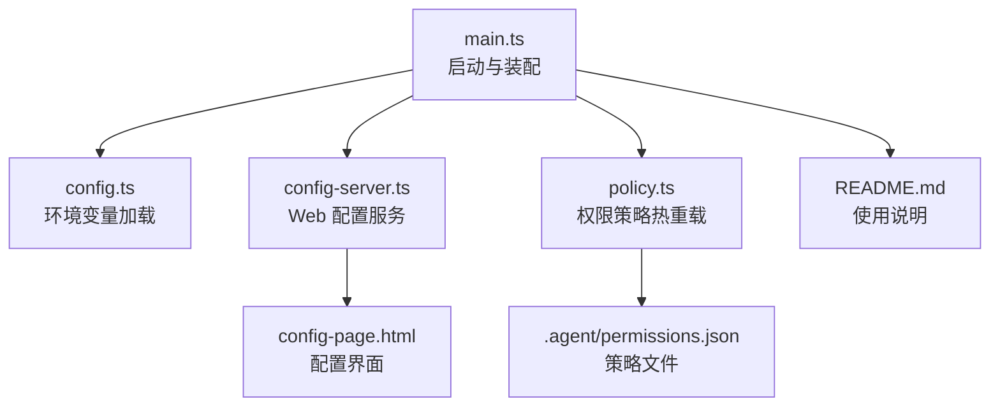
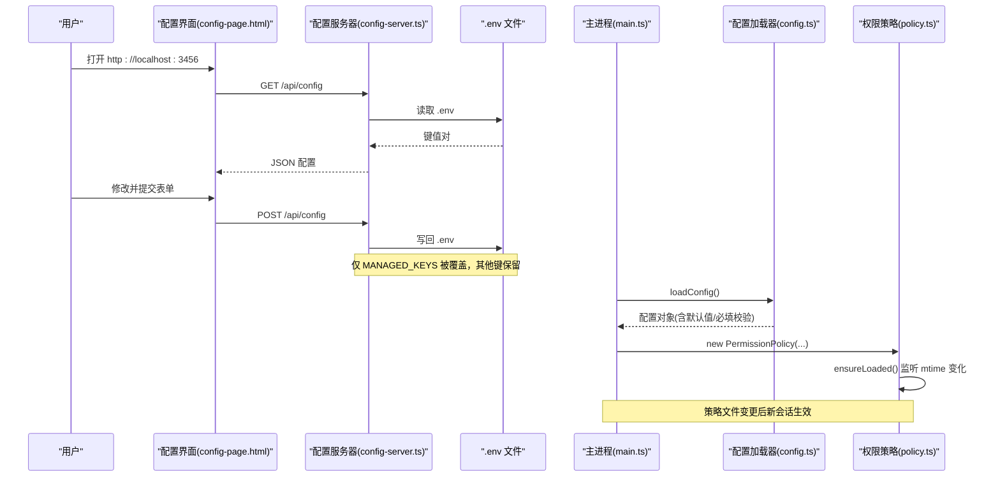
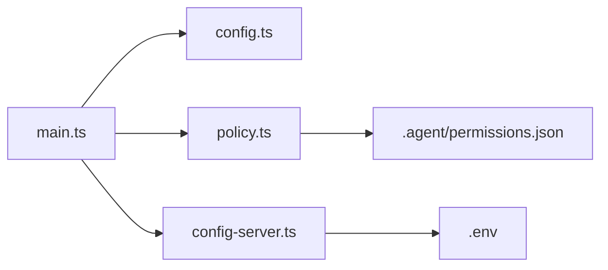

# 配置管理

<cite>
**本文引用的文件**
- [src/config.ts](file://src/config.ts)
- [src/config-server.ts](file://src/config-server.ts)
- [src/config-page.html](file://src/config-page.html)
- [src/main.ts](file://src/main.ts)
- [src/permission/policy.ts](file://src/permission/policy.ts)
- [.agent/permissions.json](file://.agent/permissions.json)
- [package.json](file://package.json)
- [README.md](file://README.md)
</cite>

## 目录
1. [简介](#简介)
2. [项目结构](#项目结构)
3. [核心组件](#核心组件)
4. [架构总览](#架构总览)
5. [详细组件分析](#详细组件分析)
6. [依赖关系分析](#依赖关系分析)
7. [性能与可靠性](#性能与可靠性)
8. [故障排除指南](#故障排除指南)
9. [结论](#结论)
10. [附录：配置项说明与示例](#附录配置项说明与示例)

## 简介
本文件为“配置管理系统”的完整参考文档，覆盖环境变量配置、Web 配置界面、动态配置更新机制、配置验证、默认值处理、热重载能力，以及飞书应用配置、AI 模型设置与权限策略配置。面向管理员与开发者，提供从入门到高级配置的完整指引，并包含常见问题排查方法。

## 项目结构
配置相关代码主要分布在以下位置：
- 环境变量加载与校验：src/config.ts
- Web 配置服务器与静态页面：src/config-server.ts、src/config-page.html
- 运行时装配与热切换入口：src/main.ts
- 权限策略与热重载：src/permission/policy.ts、.agent/permissions.json
- 启动脚本与命令：package.json
- 使用与配置说明：README.md

图表来源
- [src/main.ts:27-132](file://src/main.ts#L27-L132)
- [src/config.ts:24-50](file://src/config.ts#L24-L50)
- [src/config-server.ts:12-149](file://src/config-server.ts#L12-L149)
- [src/config-page.html:94-127](file://src/config-page.html#L94-L127)
- [src/permission/policy.ts:68-210](file://src/permission/policy.ts#L68-L210)
- [.agent/permissions.json:1-21](file://.agent/permissions.json#L1-L21)

章节来源
- [src/main.ts:27-132](file://src/main.ts#L27-L132)
- [src/config.ts:24-50](file://src/config.ts#L24-L50)
- [src/config-server.ts:12-149](file://src/config-server.ts#L12-L149)
- [src/config-page.html:94-127](file://src/config-page.html#L94-L127)
- [src/permission/policy.ts:68-210](file://src/permission/policy.ts#L68-L210)
- [.agent/permissions.json:1-21](file://.agent/permissions.json#L1-L21)
- [package.json:6-12](file://package.json#L6-L12)
- [README.md:187-250](file://README.md#L187-L250)

## 核心组件
- 环境变量加载器：负责读取、校验、提供默认值，构建运行时配置对象。
- Web 配置服务器：提供本地 HTTP 服务，读写 .env 文件，暴露配置表单与统计页面。
- 配置界面：前端 HTML + JS，渲染表单、加载/保存配置、选择随机表情等。
- 权限策略系统：基于 .agent/permissions.json 的动态权限控制，支持 mtime 热重载。
- 运行时装配：主进程在启动时加载配置、初始化传输层、工具守卫、会话管理等。

章节来源
- [src/config.ts:24-50](file://src/config.ts#L24-L50)
- [src/config-server.ts:23-149](file://src/config-server.ts#L23-L149)
- [src/config-page.html:47-127](file://src/config-page.html#L47-L127)
- [src/permission/policy.ts:68-210](file://src/permission/policy.ts#L68-L210)
- [src/main.ts:27-132](file://src/main.ts#L27-L132)

## 架构总览
下图展示了配置系统的整体交互：用户通过浏览器访问配置界面，后端读取/写入 .env；应用启动时由配置加载器解析环境变量；权限策略文件变更会被自动检测并热重载；运行时将配置注入到传输层、工具守卫和会话管理中。

图表来源
- [src/config-page.html:210-260](file://src/config-page.html#L210-L260)
- [src/config-server.ts:94-120](file://src/config-server.ts#L94-L120)
- [src/config.ts:24-50](file://src/config.ts#L24-L50)
- [src/main.ts:27-132](file://src/main.ts#L27-L132)
- [src/permission/policy.ts:178-210](file://src/permission/policy.ts#L178-L210)

## 详细组件分析

### 环境变量配置与校验
- 必填字段：FEISHU_APP_ID、FEISHU_APP_SECRET 缺失会抛出错误，阻止启动。
- 可选字段与默认值：
  - FEISHU_ADMIN：留空表示未配置管理员。
  - FEISHU_PI_CWD：默认当前工作目录。
  - sessionDir：固定为 data/sessions。
  - modelProvider：默认 anthropic。
  - modelName：默认 claude-sonnet-4-6。
  - modelBaseUrl/systemPrompt：可选。
  - guardBaseUrl/guardModels/guardApiKey/guardTimeoutMs/approvalTimeoutMs：用于智能体审核与授权卡超时。
- 废弃字段：FEISHU_CMD_WHITELIST 已废弃，仅保留解析并在启动时给出警告提示，规则迁移至 .agent/permissions.json。

章节来源
- [src/config.ts:24-50](file://src/config.ts#L24-L50)
- [src/main.ts:113-115](file://src/main.ts#L113-L115)

### Web 配置界面与服务
- 启动方式：npm run config，监听本机 127.0.0.1:3456，避免暴露到局域网。
- 路由：
  - GET /：返回配置页面 HTML。
  - GET /api/config：读取 .env 并返回键值对。
  - POST /api/config：接收表单数据，仅覆盖 MANAGED_KEYS 对应的键，其余键原样保留。
- 表单字段：
  - 飞书应用：FEISHU_APP_ID、FEISHU_APP_SECRET、FEISHU_ADMIN。
  - AI 模型：FEISHU_PI_MODEL_PROVIDER、FEISHU_PI_MODEL_NAME、FEISHU_PI_MODEL_BASE_URL。
  - API Key：FEISHU_PI_MODEL_API_KEY。
  - 系统提示词：FEISHU_PI_SYSTEM_PROMPT。
  - 随机表情：FEISHU_RANDOM_EMOJIS（逗号分隔类型）。
- 安全提示：接口明文返回 App Secret，仅限本机访问。

章节来源
- [src/config-server.ts:12-149](file://src/config-server.ts#L12-L149)
- [src/config-page.html:47-127](file://src/config-page.html#L47-L127)
- [package.json:6-12](file://package.json#L6-L12)

### 动态配置更新机制
- .env 持久化：POST /api/config 将表单数据写回 .env，重启后生效。
- 模型热切换：
  - 运行时通过 onModelSwitch 回调将新模型名注入运行时实例，新会话立即使用新模型。
  - 同时持久化到 .env，保证重启后一致。
- 权限策略热重载：
  - 策略文件 .agent/permissions.json 的 mtime 变化会被检测，下次查询组策略时重新加载。
  - 新会话生效，无需重启服务。

章节来源
- [src/main.ts:93-104](file://src/main.ts#L93-L104)
- [src/permission/policy.ts:178-210](file://src/permission/policy.ts#L178-L210)

### 配置验证与默认值处理
- 必填校验：loadConfig 中对必需环境变量进行严格检查，缺失即抛错。
- 默认值：
  - 模型提供商与名称有合理默认值。
  - 审核超时与授权超时具备数值兜底。
- 兼容与降级：
  - 管理员标识支持多种格式，启动时尝试解析。
  - 策略文件缺失或解析失败按保守默认处理，确保最小权限。

章节来源
- [src/config.ts:24-50](file://src/config.ts#L24-L50)
- [src/permission/policy.ts:178-210](file://src/permission/policy.ts#L178-L210)

### 飞书应用配置
- 必需：FEISHU_APP_ID、FEISHU_APP_SECRET。
- 可选：FEISHU_ADMIN（支持 Open ID、中文名、英文名、邮箱），启动时解析为 Open ID。
- 事件订阅与权限：详见 README 中“开始使用”部分，需配置消息、反应、联系人等权限及事件订阅。

章节来源
- [src/config.ts:31-39](file://src/config.ts#L31-L39)
- [README.md:147-186](file://README.md#L147-L186)

### AI 模型设置
- Provider：anthropic 或 openai。
- Model Name：如 claude-sonnet-4-6。
- Base URL：模型服务的 Base URL。
- API Key：对应 Provider 的密钥。
- 系统提示词：可选，用于定义助手行为。
- 模型切换：通过 /model 指令点击按钮即时切换，新会话生效并持久化到 .env。

章节来源
- [src/config.ts:37-40](file://src/config.ts#L37-L40)
- [src/config-page.html:69-100](file://src/config-page.html#L69-L100)
- [README.md:615-679](file://README.md#L615-L679)

### 权限策略配置
- 策略文件：.agent/permissions.json，定义 common、owner 与任意用户组的能力范围。
- 字段：
  - members：成员标识（openId/中文名/英文名）。
  - scripts：可调用的脚本名。
  - bash：可执行命令（精确、前缀匹配或全部）。
  - read/write：路径 glob 范围。
  - skills：技能可见性。
- 生效规则：common ∪ 所属各组（并集）；缺失/非法时按保守默认处理。
- 热重载：mtime 变化时自动重载，新会话生效。

章节来源
- [src/permission/policy.ts:5-32](file://src/permission/policy.ts#L5-L32)
- [src/permission/policy.ts:109-158](file://src/permission/policy.ts#L109-L158)
- [src/permission/policy.ts:178-210](file://src/permission/policy.ts#L178-L210)
- [.agent/permissions.json:1-21](file://.agent/permissions.json#L1-L21)

### 配置界面使用说明
- 启动：npm run config，浏览器访问 http://localhost:3456。
- 操作步骤：
  - 填写飞书应用信息（App ID、Secret、管理员）。
  - 选择模型 Provider、输入模型名称与 Base URL。
  - 填写 API Key 与可选的系统提示词。
  - 选择随机表情（支持全选/反选）。
  - 提交保存，刷新页面查看结果。
- 注意事项：
  - 仅本机访问，勿暴露到公网。
  - 非 MANAGED_KEYS 的配置不会被覆盖，避免丢失自定义项。

章节来源
- [src/config-server.ts:94-120](file://src/config-server.ts#L94-L120)
- [src/config-page.html:47-127](file://src/config-page.html#L47-L127)
- [README.md:187-200](file://README.md#L187-L200)

### 高级配置技巧
- 多模型审核：guardModels 支持逗号分隔多个模型，取安全交集放行。
- 授权卡超时：approvalTimeoutMs 控制等待管理员点击的超时时间。
- 工作目录：FEISHU_PI_CWD 指定运行目录，便于多实例隔离。
- 策略精细化：通过 bash 前缀匹配与 read/write glob 限制操作范围。
- 统计与可视化：/stats 页面展示技能使用情况，辅助评估与优化。

章节来源
- [src/config.ts:44-48](file://src/config.ts#L44-L48)
- [src/permission/policy.ts:135-155](file://src/permission/policy.ts#L135-L155)
- [src/config-server.ts:127-143](file://src/config-server.ts#L127-L143)

## 依赖关系分析
- main.ts 依赖 config.ts 获取配置，依赖 policy.ts 实现权限策略，依赖 config-server.ts 注册统计路由。
- config-server.ts 依赖 express/body-parser/fs/path，提供 Web 配置能力。
- policy.ts 依赖 fs/promises 与 path-glob 工具，实现策略文件的读取与匹配。
- package.json 提供脚本命令与依赖声明。

图表来源
- [src/main.ts:27-132](file://src/main.ts#L27-L132)
- [src/config-server.ts:12-149](file://src/config-server.ts#L12-L149)
- [src/permission/policy.ts:68-210](file://src/permission/policy.ts#L68-L210)

章节来源
- [src/main.ts:27-132](file://src/main.ts#L27-L132)
- [src/config-server.ts:12-149](file://src/config-server.ts#L12-L149)
- [src/permission/policy.ts:68-210](file://src/permission/policy.ts#L68-L210)
- [package.json:6-23](file://package.json#L6-L23)

## 性能与可靠性
- 配置读取：.env 解析为内存对象，GET /api/config 直接返回，开销低。
- 策略热重载：基于 mtime 判断，仅在变更时重新加载，减少 I/O。
- 默认值与容错：必填校验防止错误启动；策略解析失败走保守默认，保障最小权限。
- 网络与安全：配置服务仅监听本机，避免敏感信息泄露。

[本节为通用指导，不直接分析具体文件]

## 故障排除指南
- 启动时报缺少环境变量：
  - 检查 FEISHU_APP_ID、FEISHU_APP_SECRET 是否已配置。
  - 确认 .env 文件存在且键名正确。
- 配置界面无法保存：
  - 确认 .env 文件可写。
  - 检查 MANAGED_KEYS 列表外的自定义键是否被意外覆盖。
- 权限策略不生效：
  - 确认 .agent/permissions.json 语法正确。
  - 新建会话以触发策略热重载。
- 模型切换无效：
  - 确认 /model 指令由管理员执行。
  - 检查 Base URL 与 API Key 是否正确。
- 授权卡无响应：
  - 调整 approvalTimeoutMs 延长等待时间。
  - 确认管理员身份与转发逻辑正常。

章节来源
- [src/config.ts:24-50](file://src/config.ts#L24-L50)
- [src/config-server.ts:94-120](file://src/config-server.ts#L94-L120)
- [src/permission/policy.ts:178-210](file://src/permission/policy.ts#L178-L210)
- [README.md:615-679](file://README.md#L615-L679)

## 结论
本配置管理系统通过环境变量加载、Web 配置界面与权限策略热重载，提供了灵活、安全、易用的配置管理能力。管理员可通过界面快速完成基础配置，开发者可通过策略文件精细控制权限与能力边界。结合默认值与容错机制，系统在易用性与安全性之间取得平衡。

[本节为总结，不直接分析具体文件]

## 附录：配置项说明与示例
- 环境变量清单与含义：
  - FEISHU_APP_ID：飞书应用 ID（必填）。
  - FEISHU_APP_SECRET：飞书应用密钥（必填）。
  - FEISHU_ADMIN：管理员标识（可选）。
  - FEISHU_PI_CWD：运行目录（可选，默认当前目录）。
  - FEISHU_PI_MODEL_PROVIDER：模型提供商（默认 anthropic）。
  - FEISHU_PI_MODEL_NAME：模型名称（默认 claude-sonnet-4-6）。
  - FEISHU_PI_MODEL_BASE_URL：模型 Base URL（可选）。
  - FEISHU_PI_MODEL_API_KEY：API Key（可选）。
  - FEISHU_PI_SYSTEM_PROMPT：系统提示词（可选）。
  - FEISHU_GUARD_BASE_URL：审核服务 Base URL（可选）。
  - FEISHU_GUARD_MODELS：审核模型列表（逗号分隔，可选）。
  - FEISHU_GUARD_API_KEY：审核 API Key（可选，回退主模型 Key）。
  - FEISHU_GUARD_TIMEOUT_MS：审核超时毫秒（默认 15000）。
  - FEISHU_APPROVAL_TIMEOUT_MS：授权卡超时毫秒（默认 300000）。
- 权限策略示例：
  - common：所有人可读技能目录，可见所有技能。
  - owner：负责人组，拥有广泛读写与命令执行权限。
  - user1：普通用户组，受限脚本、命令与路径访问。
- 使用建议：
  - 优先使用 Web 界面完成基础配置。
  - 通过策略文件精细化控制权限。
  - 定期查看 /stats 页面评估技能使用情况。

章节来源
- [src/config.ts:31-48](file://src/config.ts#L31-L48)
- [.agent/permissions.json:1-21](file://.agent/permissions.json#L1-L21)
- [README.md:187-250](file://README.md#L187-L250)