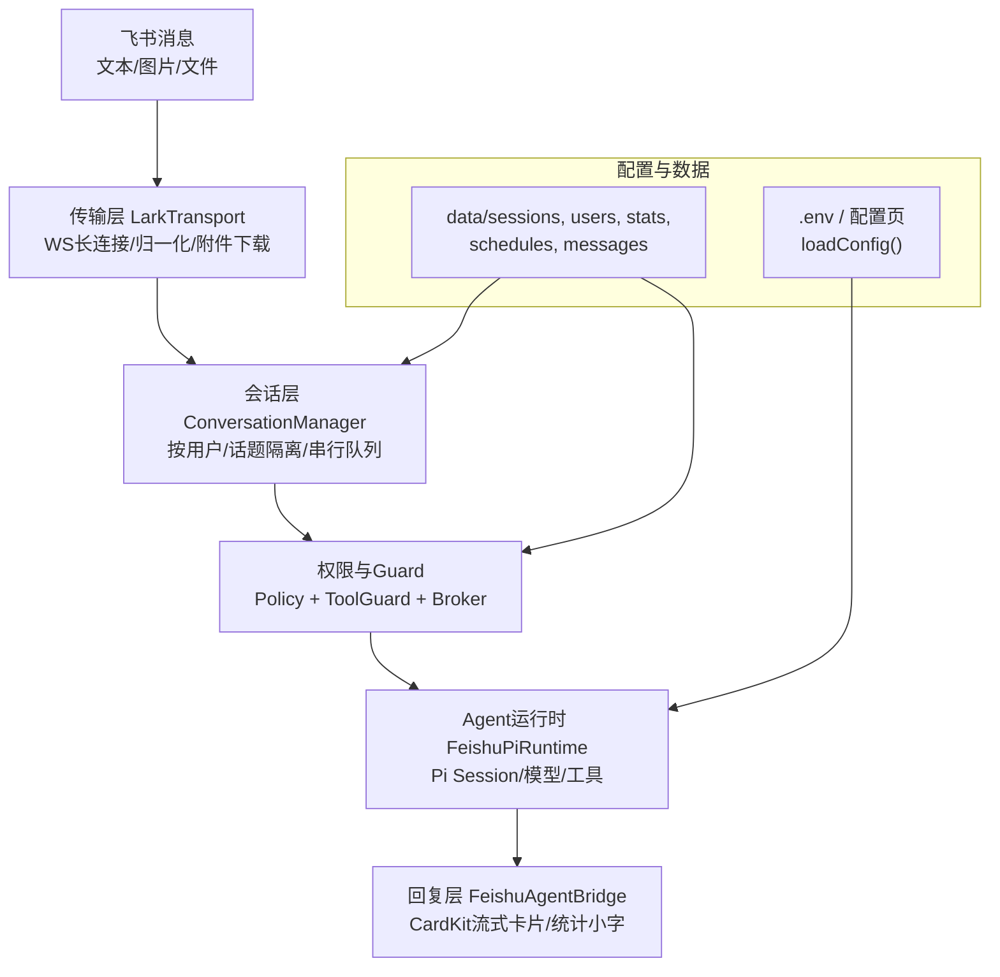
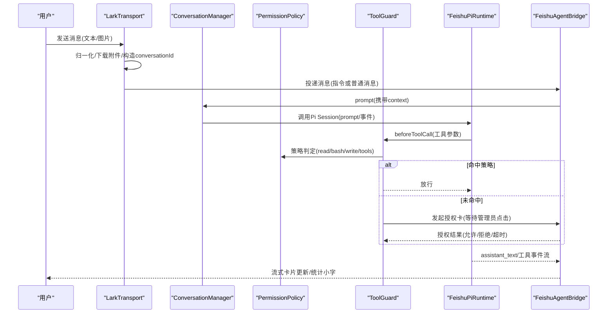
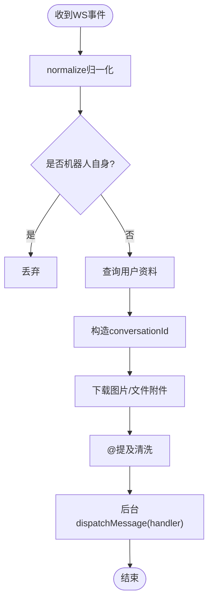
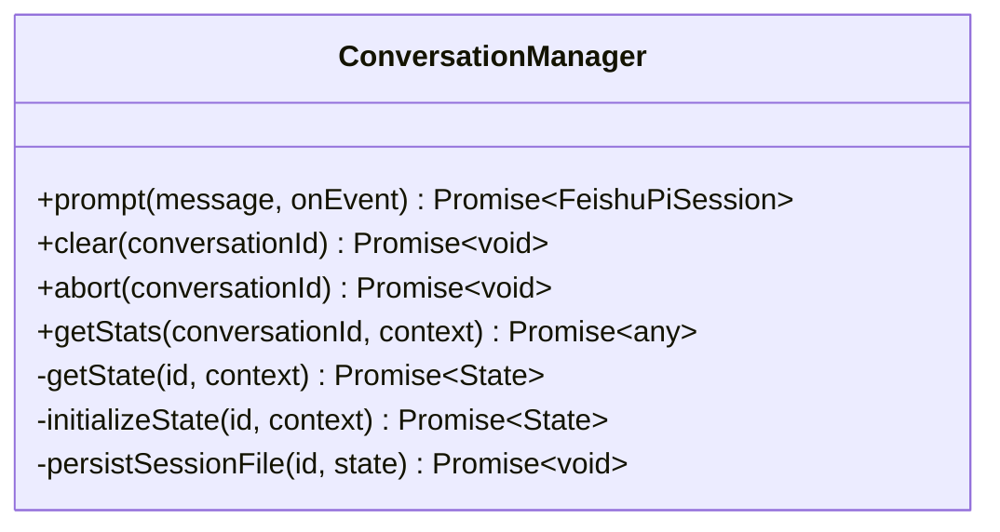
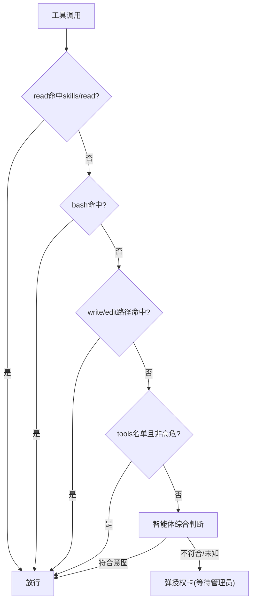
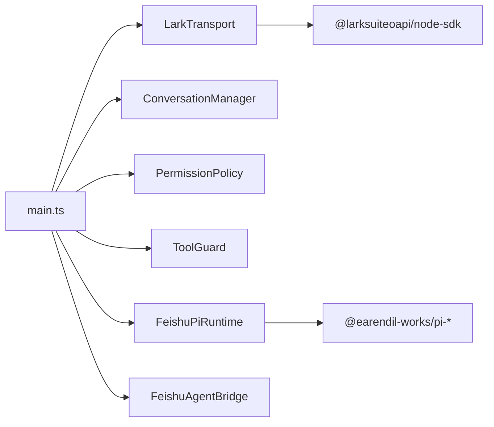

# 项目概述

<cite>
**本文引用的文件**   
- [README.md](file://README.md)
- [package.json](file://package.json)
- [src/main.ts](file://src/main.ts)
- [src/config.ts](file://src/config.ts)
- [docs/architecture.md](file://docs/architecture.md)
- [src/feishu/lark-transport.ts](file://src/feishu/lark-transport.ts)
- [src/runtime/conversation-manager.ts](file://src/runtime/conversation-manager.ts)
- [src/guard/broker.ts](file://src/guard/broker.ts)
- [src/permission/policy.ts](file://src/permission/policy.ts)
- [.agent/permissions.json](file://.agent/permissions.json)
</cite>

## 目录
1. [简介](#简介)
2. [项目结构](#项目结构)
3. [核心组件](#核心组件)
4. [架构总览](#架构总览)
5. [详细组件分析](#详细组件分析)
6. [依赖关系分析](#依赖关系分析)
7. [性能与可靠性](#性能与可靠性)
8. [故障排查指南](#故障排查指南)
9. [结论](#结论)
10. [附录：快速开始与环境配置](#附录快速开始与环境配置)

## 简介
mini-claw（仓库名 feishu-pi）是一个基于 Pi 的轻量级飞书 AI Agent 服务。它深度集成飞书的人员身份、会话与权限体系，为不同用户或群组提供定制化的 Agent 能力。项目以“统一上下文 + 会话隔离 + 策略化权限 + 流式卡片回复”为核心目标，既满足初学者快速上手，也为有经验的开发者提供可扩展的技术细节。

- 核心目标
  - 在飞书内提供稳定、可审计、可授权的 AI Agent 体验
  - 按人或话题隔离会话，支持多轮对话与中断恢复
  - 通过统一策略文件实现细粒度工具与命令授权
  - 使用 CardKit 2.0 流式卡片提升交互体验

- 主要特性
  - 流式卡片与思考动画、图片附件识别、消息去重与自动重连
  - 飞书用户上下文注入（中文名/英文名/部门），三级权限控制
  - 技能（Skill）与工具（Tool）协作，内置与自定义工具注册
  - 智能体审核 + 管理员授权卡（单次确认、可转发私聊）
  - 定时任务调度、技能使用统计、模型热切换、详细/精简模式

**章节来源**
- [README.md:7-24](file://README.md#L7-L24)
- [docs/architecture.md:3-8](file://docs/architecture.md#L3-L8)

## 项目结构
项目采用分层组织，围绕“传输层 → 会话层 → 权限/Guard → 运行时 → 回复层”构建，配合配置与数据持久化目录。

**图表来源**
- [src/feishu/lark-transport.ts:82-133](file://src/feishu/lark-transport.ts#L82-L133)
- [src/runtime/conversation-manager.ts:22-96](file://src/runtime/conversation-manager.ts#L22-L96)
- [src/guard/broker.ts:46-129](file://src/guard/broker.ts#L46-L129)
- [src/permission/policy.ts:68-158](file://src/permission/policy.ts#L68-L158)
- [src/main.ts:27-247](file://src/main.ts#L27-L247)

**章节来源**
- [docs/architecture.md:19-33](file://docs/architecture.md#L19-L33)
- [src/main.ts:27-247](file://src/main.ts#L27-L247)

## 核心组件
- 传输层（LarkTransport）
  - 基于官方底层 WSClient + EventDispatcher 建立长连接，处理消息归一化、附件下载、卡片回调路由
  - 负责构造 conversationId、过滤机器人自身消息、@提及清洗
- 会话层（ConversationManager）
  - 按 conversationId 复用 Pi Session，同一会话串行执行，新消息可打断在途请求
  - 增量持久化映射，进程退出后恢复会话
- 权限与 Guard
  - Policy：统一策略文件 .agent/permissions.json，定义 common/owner/user 等组的能力范围
  - ToolGuard：每次工具调用前进行白名单/策略/智能体/授权卡判定
  - PermissionBroker：管理授权卡生命周期、服务端校验 token/卡片来源/管理员身份
- 运行时（FeishuPiRuntime）
  - 封装 Pi AgentSession，加载资源、注册工具、注入 beforeToolCall 钩子
  - 支持模型热切换、统计小字、定时任务接入
- 回复层（FeishuAgentBridge）
  - 创建 CardKit 流式卡片，展示 spinner/工具动画，完成后写统计小字
  - 支持详细/精简模式，授权卡撤回/结果卡更新

**章节来源**
- [src/feishu/lark-transport.ts:33-80](file://src/feishu/lark-transport.ts#L33-L80)
- [src/runtime/conversation-manager.ts:22-96](file://src/runtime/conversation-manager.ts#L22-L96)
- [src/permission/policy.ts:6-32](file://src/permission/policy.ts#L6-L32)
- [src/guard/broker.ts:41-45](file://src/guard/broker.ts#L41-L45)
- [docs/architecture.md:128-157](file://docs/architecture.md#L128-L157)

## 架构总览
系统从飞书消息进入，经传输层归一化与附件处理，进入会话层排队与恢复；权限层对工具调用进行策略与智能体综合判断，必要时弹出授权卡；运行时驱动 Pi 完成推理与工具执行；回复层以 CardKit 流式卡片实时反馈，并在结束时输出统计小字。

**图表来源**
- [src/feishu/lark-transport.ts:82-133](file://src/feishu/lark-transport.ts#L82-L133)
- [src/runtime/conversation-manager.ts:65-96](file://src/runtime/conversation-manager.ts#L65-L96)
- [src/permission/policy.ts:109-158](file://src/permission/policy.ts#L109-L158)
- [src/guard/broker.ts:74-129](file://src/guard/broker.ts#L74-L129)
- [src/main.ts:106-177](file://src/main.ts#L106-L177)

## 详细组件分析

### 传输层：LarkTransport
- 使用官方底层 WSClient + EventDispatcher，避免高层封装导致的 ACK 丢失与事件吞没问题
- 消息管线：过滤自身消息 → 查询用户资料 → 构造 conversationId → 下载附件 → 清洗 @提及 → 后台处理
- 卡片回调：授权卡与模型切换按钮路由到上层处理

**图表来源**
- [src/feishu/lark-transport.ts:82-133](file://src/feishu/lark-transport.ts#L82-L133)
- [src/feishu/lark-transport.ts:141-200](file://src/feishu/lark-transport.ts#L141-L200)

**章节来源**
- [src/feishu/lark-transport.ts:33-80](file://src/feishu/lark-transport.ts#L33-L80)
- [docs/architecture.md:51-66](file://docs/architecture.md#L51-L66)

### 会话层：ConversationManager
- 按 conversationId 复用 Pi Session，保证同一会话串行执行
- 新消息到达时 abort 在途请求，避免阻塞
- 增量持久化：首个 message_end 即写入 sessionFile 映射，支持中断恢复

**图表来源**
- [src/runtime/conversation-manager.ts:22-96](file://src/runtime/conversation-manager.ts#L22-L96)

**章节来源**
- [docs/architecture.md:68-81](file://docs/architecture.md#L68-L81)

### 权限与授权：Policy + ToolGuard + Broker
- Policy：读取 .agent/permissions.json，合并 common ∪ 所属组，生成 GroupPolicy 判定函数
- ToolGuard：read/bash/write/tools 四步判定，未命中则走智能体综合判断，仍不放行则弹授权卡
- Broker：管理授权卡生命周期，服务端校验 token/卡片来源/管理员身份，支持转发到管理员私聊

**图表来源**
- [src/permission/policy.ts:109-158](file://src/permission/policy.ts#L109-L158)
- [src/guard/broker.ts:74-129](file://src/guard/broker.ts#L74-L129)
- [docs/architecture.md:99-114](file://docs/architecture.md#L99-L114)

**章节来源**
- [src/permission/policy.ts:6-32](file://src/permission/policy.ts#L6-L32)
- [.agent/permissions.json:1-21](file://.agent/permissions.json#L1-L21)
- [src/guard/broker.ts:41-45](file://src/guard/broker.ts#L41-L45)

### 运行时：FeishuPiRuntime
- 通过 Pi SDK 创建 AgentSession，加载 .agent 资源，注册工具并注入 beforeToolCall
- 支持模型热切换（/model）、统计小字、定时任务接入
- 将 Pi 事件映射为项目内部事件，屏蔽内部类型依赖

**章节来源**
- [docs/architecture.md:128-141](file://docs/architecture.md#L128-L141)
- [src/main.ts:211-227](file://src/main.ts#L211-L227)

### 回复层：FeishuAgentBridge
- 创建 CardKit 流式卡片，正文显示 spinner 思考动画，工具调用期间显示动画行
- 结束后写统计小字（模型、token、费用、耗时、会话短别名）
- 支持详细/精简模式，精简模式下授权确认后自动撤回卡片

**章节来源**
- [docs/architecture.md:142-157](file://docs/architecture.md#L142-L157)
- [README.md:642-667](file://README.md#L642-L667)

## 依赖关系分析
- 运行时依赖
  - Pi 系列包：pi-agent-core、pi-ai、pi-coding-agent（Agent loop、模型适配、编码工具）
  - 飞书 SDK：@larksuiteoapi/node-sdk（WS 长连接、消息收发、卡片回调）
  - 其他：express/body-parser/croner/dotenv（配置页、定时任务、环境变量）
- 启动入口
  - main.ts 组装各组件：配置加载、传输层、会话层、权限/Guard、运行时、桥接层、定时任务、优雅退出

**图表来源**
- [src/main.ts:27-247](file://src/main.ts#L27-L247)
- [package.json:14-22](file://package.json#L14-L22)

**章节来源**
- [package.json:1-34](file://package.json#L1-L34)
- [src/main.ts:27-247](file://src/main.ts#L27-L247)

## 性能与可靠性
- 长连接与自动重连：WSClient 自带重连，应用层设置握手与 ping 超时
- 消息去重与会话串行：MessageStore 去重，ConversationManager 串行队列，避免重复与竞态
- 增量持久化：首个 message_end 落盘映射，进程退出后可恢复
- 数据清理：DataCleaner 定期清理过期会话、图片与消息，降低磁盘占用
- 流式卡片：减少首屏延迟，提升用户体验

[本节为通用指导，不直接分析具体文件]

## 故障排查指南
- 无法接收消息
  - 检查飞书应用权限与事件订阅是否正确
  - 查看 WS 连接日志与重连提示
- 授权卡无响应
  - 确认管理员 Open ID 已配置
  - 检查授权卡回调参数（approval_id/token）与服务端校验逻辑
- 会话异常中断
  - 查看 conversations.json 映射与 session 文件是否存在
  - 使用 /new 清空当前会话重试
- 权限误判
  - 使用 /perm 查看生效策略
  - 调整 .agent/permissions.json 中 read/bash/write/tools 范围

**章节来源**
- [src/guard/broker.ts:131-166](file://src/guard/broker.ts#L131-L166)
- [src/permission/policy.ts:178-200](file://src/permission/policy.ts#L178-L200)
- [docs/architecture.md:177-195](file://docs/architecture.md#L177-L195)

## 结论
mini-claw 以最小自有代码实现了飞书渠道的完整 Agent 闭环：统一上下文、会话隔离、策略化权限、流式卡片回复与授权机制。通过复用 Pi 的稳定能力，项目聚焦于飞书业务所需的连接、路由、权限与记忆策略，具备高可维护性与扩展性。

[本节为总结性内容，不直接分析具体文件]

## 附录：快速开始与环境配置

- 环境要求
  - Node.js 22+，npm 包管理器
- 安装与依赖补丁
  - npm install（postinstall 自动对 pi-ai 打补丁，避免中转站 403）
- 配置飞书应用权限
  - 必需权限：im:message、im:message.group_at_msg、im:message.p2p_msg、im:message.reaction:write、contact:user.base:readonly、im:chat.member:readonly
  - 可选权限：im:resource（图片附件）
  - 事件订阅：im.message.receive_v1、card.action.trigger（长连接模式）
- 配置 lark-cli（外部成员查询降级）
  - 全局安装并登录，确保具备搜索用户权限
- 应用配置
  - 方式一：npm run config，浏览器打开 http://localhost:3456 填写 App ID/Secret、管理员标识、模型 Provider/Name/Base URL、API Key
  - 方式二：手动编辑 .env 文件，至少配置 FEISHU_APP_ID、FEISHU_APP_SECRET、FEISHU_ADMIN
- 启动服务
  - npm start
  - 启动前确保至少配置上述必需项
- 管理员说明
  - FEISHU_ADMIN 支持 Open ID、中文姓名、英文姓名、邮箱，启动时自动解析并输出 Open ID
- 用户信息缓存
  - 首次聊天自动查询并缓存至 data/users/{appId}_users.json，3 天后刷新

**章节来源**
- [README.md:120-250](file://README.md#L120-L250)
- [src/config.ts:24-50](file://src/config.ts#L24-L50)
- [package.json:6-12](file://package.json#L6-L12)