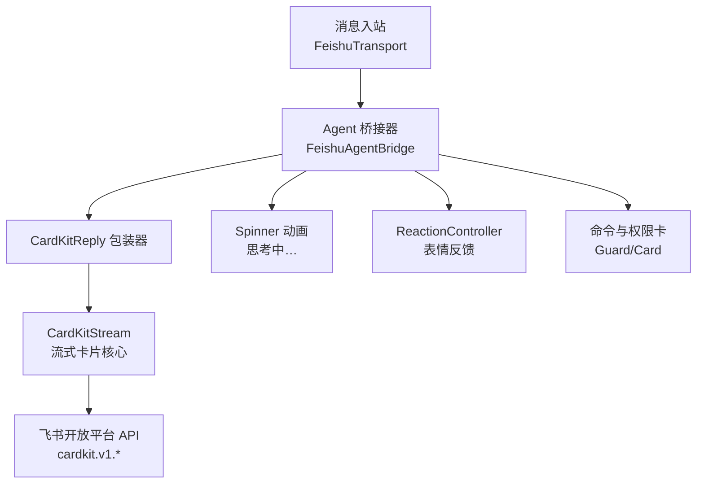
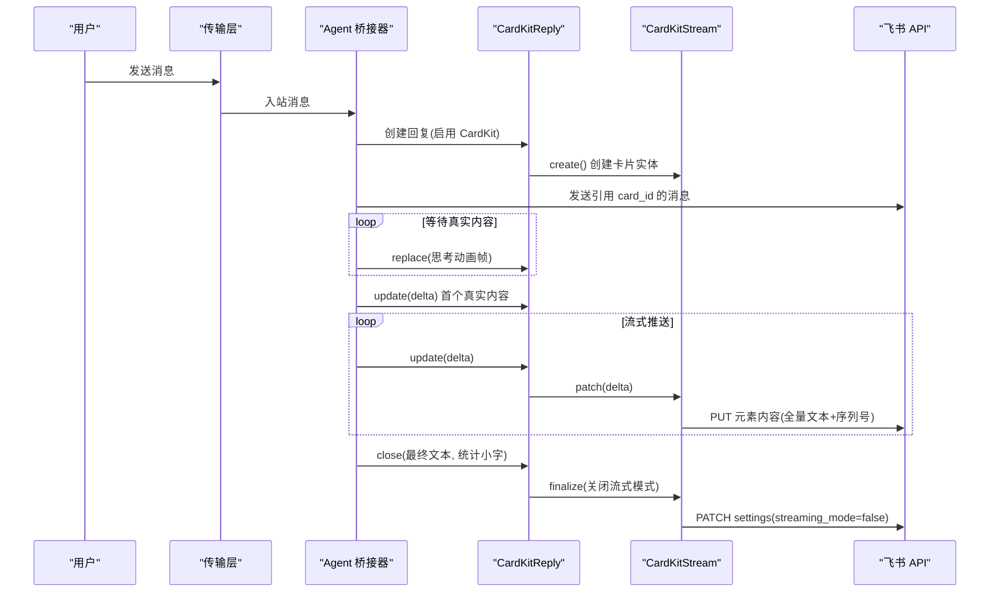
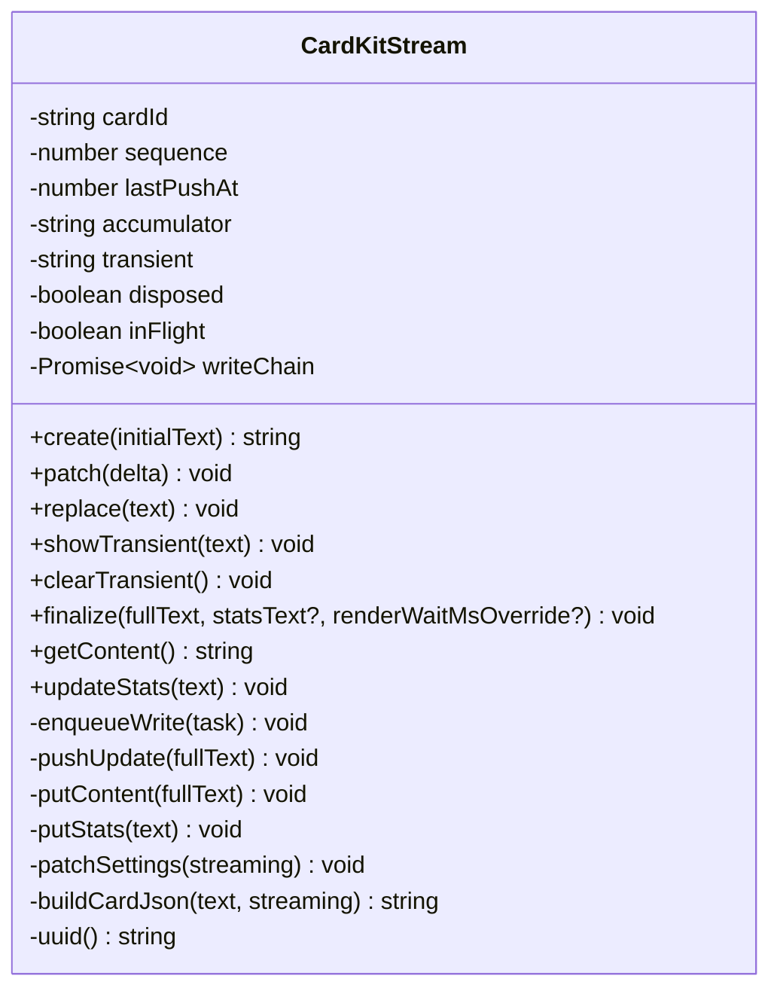
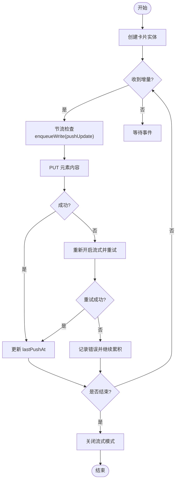
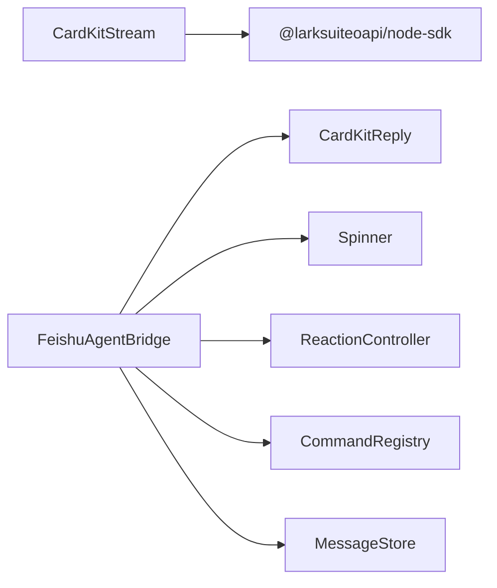

# 卡片流式传输

<cite>
**本文引用的文件**
- [src/feishu/cardkit-stream.ts](file://src/feishu/cardkit-stream.ts)
- [src/feishu/agent-bridge.ts](file://src/feishu/agent-bridge.ts)
- [src/feishu/types.ts](file://src/feishu/types.ts)
- [src/feishu/spinner.ts](file://src/feishu/spinner.ts)
- [src/feishu/reaction-controller.ts](file://src/feishu/reaction-controller.ts)
- [src/guard/card.ts](file://src/guard/card.ts)
- [docs/cardkit-streaming.md](file://docs/cardkit-streaming.md)
- [README.md](file://README.md)
</cite>

## 目录
1. [简介](#简介)
2. [项目结构](#项目结构)
3. [核心组件](#核心组件)
4. [架构总览](#架构总览)
5. [详细组件分析](#详细组件分析)
6. [依赖关系分析](#依赖关系分析)
7. [性能考量](#性能考量)
8. [故障排查指南](#故障排查指南)
9. [结论](#结论)
10. [附录](#附录)

## 简介
本文件面向开发者，系统化说明 CardKit 2.0 流式卡片在飞书 Agent 中的实现与使用。重点覆盖：
- 实时打字机效果的原理与客户端渲染机制
- 流式数据推送、增量更新策略与节流控制
- 卡片状态管理（正文、统计小字、临时文本）
- CardKitStream 类的设计模式、生命周期与错误恢复
- 客户端兼容性处理与调试技巧
- 完整的使用示例、配置参数说明与实践建议

## 项目结构
本项目将流式卡片能力集中在飞书适配层，并通过桥接器与运行时事件联动，形成“事件驱动 + 流式卡片”的闭环。

图表来源
- [src/feishu/agent-bridge.ts:16-237](file://src/feishu/agent-bridge.ts#L16-L237)
- [src/feishu/cardkit-stream.ts:32-288](file://src/feishu/cardkit-stream.ts#L32-L288)
- [src/feishu/spinner.ts:50-67](file://src/feishu/spinner.ts#L50-L67)
- [src/feishu/reaction-controller.ts:57-121](file://src/feishu/reaction-controller.ts#L57-L121)
- [src/guard/card.ts:28-86](file://src/guard/card.ts#L28-L86)

章节来源
- [src/feishu/agent-bridge.ts:16-237](file://src/feishu/agent-bridge.ts#L16-L237)
- [src/feishu/cardkit-stream.ts:32-288](file://src/feishu/cardkit-stream.ts#L32-L288)
- [docs/cardkit-streaming.md:1-241](file://docs/cardkit-streaming.md#L1-L241)
- [README.md:1-679](file://README.md#L1-L679)

## 核心组件
- CardKitStream：封装 CardKit Schema 2.0 的创建、流式更新、关闭流式模式、统计小字写入等能力，提供节流、队列串行化、临时文本附加与错误恢复。
- FeishuAgentBridge：将 Pi 会话事件（assistant_text、tool_started/finished）映射到卡片更新；负责思考动画、工具调用动画、最终收尾与统计小字。
- Spinner：随机选择 spinner 样式与前缀，周期性生成“思考中…”帧。
- ReactionController：为消息添加/移除表情，提升交互体验。
- Guard/Card：构建授权卡、结果卡与提示卡，支持参数脱敏与按钮行为。

章节来源
- [src/feishu/cardkit-stream.ts:32-288](file://src/feishu/cardkit-stream.ts#L32-L288)
- [src/feishu/agent-bridge.ts:16-237](file://src/feishu/agent-bridge.ts#L16-L237)
- [src/feishu/spinner.ts:50-67](file://src/feishu/spinner.ts#L50-L67)
- [src/feishu/reaction-controller.ts:57-121](file://src/feishu/reaction-controller.ts#L57-L121)
- [src/guard/card.ts:28-86](file://src/guard/card.ts#L28-L86)

## 架构总览
整体流程：用户消息进入后，桥接器启动思考动画并创建 CardKit 回复对象；随后订阅 Pi 会话事件，首个真实内容到达时停止动画并清空累积器，开始流式推送；工具调用期间在小字位置显示旋转动画；最终关闭流式模式并写入统计小字。

图表来源
- [src/feishu/agent-bridge.ts:72-237](file://src/feishu/agent-bridge.ts#L72-L237)
- [src/feishu/cardkit-stream.ts:57-152](file://src/feishu/cardkit-stream.ts#L57-L152)
- [docs/cardkit-streaming.md:7-114](file://docs/cardkit-streaming.md#L7-L114)

## 详细组件分析

### CardKitStream：设计模式与增量更新
- 设计要点
  - 单例生命周期：create → 多次 patch/replace → finalize，内部维护 cardId、sequence、lastPushAt、accumulator、transient、disposed、inFlight、writeChain。
  - 增量与替换：patch 累加增量；replace 直接替换全文（用于动画帧）。
  - 临时文本：showTransient/clearTransient 在正文后附加临时行（如精简模式的工具行），避免并发 patch 导致闪烁。
  - 节流与串行：minPushIntervalMs 控制最小推送间隔；enqueueWrite 通过 Promise 链串行化写操作，避免并发冲突。
  - 错误恢复：pushUpdate 捕获失败，尝试重新开启流式模式并重试一次；若仍失败则记录日志并继续累积，不中断后续流程。
  - 统计小字：updateStats 独立于正文元素，用于展示工具调用或最终统计信息。
  - 关闭流式：finalize 先覆盖正文、等待客户端渲染完成、再写入统计小字、最后关闭流式模式。

- 关键接口与职责
  - create(initialText): 创建卡片实体，返回 card_id。
  - patch(delta): 累积增量并节流推送。
  - replace(text): 替换全部内容（无节流）。
  - showTransient(text)/clearTransient(text): 临时文本追加与清除。
  - finalize(fullText, statsText?, renderWaitMsOverride?): 收尾流程。
  - getContent(): 获取当前累积正文。
  - updateStats(text): 更新统计小字。

图表来源
- [src/feishu/cardkit-stream.ts:32-288](file://src/feishu/cardkit-stream.ts#L32-L288)

章节来源
- [src/feishu/cardkit-stream.ts:32-288](file://src/feishu/cardkit-stream.ts#L32-L288)

### 流式响应生命周期与错误恢复
- 生命周期阶段
  - 创建：POST /open-apis/cardkit/v1/cards，携带 schema 2.0、streaming_mode=true、打印频率与步长配置。
  - 引用：发送消息引用 card_id，使卡片可见。
  - 流式更新：PUT /cards/:card_id/elements/stream_md/content，全量文本 + 单调递增 sequence + uuid。
  - 关闭流式：PATCH /cards/:card_id/settings，设置 streaming_mode=false。
  - 最终内容：如需最终覆盖，可在关闭前或关闭后按策略写入（当前实现以 finalize 为主）。

- 错误恢复机制
  - 当 PUT 失败（可能因官方约 10 分钟自动关闭流式模式），自动尝试重新开启流式模式并再次推送；若仍失败，记录日志并继续累积，保证后续可用。
  - 关闭流式失败不影响最终内容发送，仅记录错误。

图表来源
- [src/feishu/cardkit-stream.ts:86-192](file://src/feishu/cardkit-stream.ts#L86-L192)
- [docs/cardkit-streaming.md:69-114](file://docs/cardkit-streaming.md#L69-L114)

章节来源
- [src/feishu/cardkit-stream.ts:86-192](file://src/feishu/cardkit-stream.ts#L86-L192)
- [docs/cardkit-streaming.md:69-114](file://docs/cardkit-streaming.md#L69-L114)

### 打字机效果与客户端渲染
- 客户端渲染由 CardKit 配置驱动：print_frequency_ms 控制每步渲染间隔，print_step 控制每次推进字符数，print_strategy 为 fast。
- 服务端只推送全量文本，无需自行实现逐字动画；网络开销小，渲染流畅。
- 首次真实内容到达时，桥接器会停止思考动画并清空累积器，确保正文从新内容开始。

章节来源
- [docs/cardkit-streaming.md:12-45](file://docs/cardkit-streaming.md#L12-L45)
- [src/feishu/cardkit-stream.ts:248-283](file://src/feishu/cardkit-stream.ts#L248-L283)
- [src/feishu/agent-bridge.ts:142-170](file://src/feishu/agent-bridge.ts#L142-L170)

### 卡片状态管理与临时文本
- 正文状态：accumulator 保存累积正文，用于最终内容与分卡切分。
- 临时文本：transient 用于精简模式下工具调用行的临时显示，由 pushUpdate 统一附加渲染，避免并发 patch 冲掉产生闪烁。
- 统计小字：stats_md 元素独立于正文，用于工具调用动画与最终统计信息。

章节来源
- [src/feishu/cardkit-stream.ts:32-157](file://src/feishu/cardkit-stream.ts#L32-L157)
- [src/feishu/cardkit-stream.ts:207-224](file://src/feishu/cardkit-stream.ts#L207-L224)

### 桥接器与事件映射
- 事件类型：assistant_text（正文）、tool_started/tool_finished（工具调用）。
- 行为映射：
  - assistant_text：首个真实内容到达时停止思考动画、清空累积器，然后增量推送。
  - tool_started：根据详细/精简模式决定是否永久保留工具调用行；同时在小字位置显示工具名与旋转符号。
  - tool_finished：清理小字动画，精简模式下清除临时工具行。
- 最终收尾：close 时写入最终正文与统计小字，并在 finalize 中关闭流式模式。

章节来源
- [src/feishu/agent-bridge.ts:142-220](file://src/feishu/agent-bridge.ts#L142-L220)
- [src/feishu/types.ts:13-18](file://src/feishu/types.ts#L13-L18)

### 思考动画与表情反馈
- 思考动画：使用 Spinner 随机选择样式与前缀，每 200ms 刷新一帧，直到首个真实内容到达。
- 表情反馈：ReactionController 在处理消息时添加随机表情，完成后移除，提升交互体验。

章节来源
- [src/feishu/spinner.ts:50-67](file://src/feishu/spinner.ts#L50-L67)
- [src/feishu/reaction-controller.ts:57-121](file://src/feishu/reaction-controller.ts#L57-L121)
- [src/feishu/agent-bridge.ts:86-122](file://src/feishu/agent-bridge.ts#L86-L122)

### 授权卡与参数脱敏
- 授权卡：构建包含工具摘要与按钮（允许一次/拒绝/转发管理员）的卡片，支持回调行为。
- 参数脱敏：递归对敏感字段（token、password、api_key 等）进行脱敏，命令展示上限截断。
- 结果卡：根据决策（允许/拒绝/超时/取消）更新卡片文案。

章节来源
- [src/guard/card.ts:28-86](file://src/guard/card.ts#L28-L86)
- [src/guard/card.ts:88-101](file://src/guard/card.ts#L88-L101)

## 依赖关系分析
- CardKitStream 依赖飞书 SDK Client 进行 HTTP 请求；通过 buildCardJson 构造 schema 2.0 卡片 JSON。
- AgentBridge 依赖 CardKitReply（包装器）、Spinner、ReactionController、MessageStore、CommandRegistry 等。
- 事件流：Pi 会话事件经 Bridge 映射到卡片更新，形成“事件→流式卡片”的链路。

图表来源
- [src/feishu/cardkit-stream.ts:12-14](file://src/feishu/cardkit-stream.ts#L12-L14)
- [src/feishu/agent-bridge.ts:1-13](file://src/feishu/agent-bridge.ts#L1-L13)

章节来源
- [src/feishu/cardkit-stream.ts:12-14](file://src/feishu/cardkit-stream.ts#L12-L14)
- [src/feishu/agent-bridge.ts:1-13](file://src/feishu/agent-bridge.ts#L1-L13)

## 性能考量
- 节流推送：默认最小推送间隔 800ms，避免频繁网络请求；可根据场景调整。
- 客户端渲染速度：print_frequency_ms=30ms、print_step=3，兼顾流畅度与网络负载。
- 串行写入：writeChain 保证写操作顺序，避免并发导致的闪烁与覆盖。
- 临时文本：transient 统一附加渲染，减少并发 patch 带来的抖动。
- 统计小字：独立元素，避免与正文竞争渲染资源。
- 错误恢复：自动重试一次，降低偶发失败影响。

[本节为通用性能指导，不直接分析具体文件]

## 故障排查指南
- 流式更新失败
  - 现象：PUT 元素内容失败，日志提示“流式模式可能已被官方关闭”。
  - 处理：自动重新开启流式模式并重试；若仍失败，记录错误并继续累积。
  - 建议：检查网络稳定性与权限；关注日志中的错误详情。

- 关闭流式失败
  - 现象：PATCH settings 失败。
  - 处理：不影响最终内容发送，仅记录错误；可忽略或手动重试。

- 统计小字未显示
  - 现象：工具调用动画或最终统计未出现。
  - 处理：确认 updateStats 调用时机与 finalize 顺序；检查 stats_md 元素是否存在。

- 思考动画未停止
  - 现象：真实内容到达后仍显示“思考中…”。
  - 处理：确认首个 assistant_text 事件触发 startRealContent；检查 replace("") 是否执行。

章节来源
- [src/feishu/cardkit-stream.ts:168-192](file://src/feishu/cardkit-stream.ts#L168-L192)
- [src/feishu/cardkit-stream.ts:227-246](file://src/feishu/cardkit-stream.ts#L227-L246)
- [src/feishu/agent-bridge.ts:142-170](file://src/feishu/agent-bridge.ts#L142-L170)

## 结论
CardKit 2.0 流式卡片通过“客户端原生打字机渲染 + 服务端增量推送”的组合，实现了高效、低延迟的实时回复体验。CardKitStream 提供了健壮的节流、串行化、临时文本与错误恢复机制；AgentBridge 将 Pi 事件无缝映射到卡片更新，配合思考动画与表情反馈，提升了交互质量。结合授权卡与参数脱敏，系统在安全性与可用性之间取得平衡。

[本节为总结性内容，不直接分析具体文件]

## 附录

### 使用示例与配置参数
- 创建卡片实体：POST /open-apis/cardkit/v1/cards，schema 2.0，streaming_mode=true，配置 print_frequency_ms、print_step、print_strategy。
- 发送消息引用：msg_type="interactive"，content 引用 card_id。
- 流式更新：PUT /cards/:card_id/elements/stream_md/content，全量文本 + sequence + uuid。
- 关闭流式：PATCH /cards/:card_id/settings，streaming_mode=false。
- 统计小字：PUT /cards/:card_id/elements/stats_md/content。

章节来源
- [docs/cardkit-streaming.md:7-114](file://docs/cardkit-streaming.md#L7-L114)
- [src/feishu/cardkit-stream.ts:248-283](file://src/feishu/cardkit-stream.ts#L248-L283)

### 调试技巧
- 观察日志：关注 CardKit 相关日志，尤其是流式更新失败与重试信息。
- 验证 sequence：确保每次更新（内容、配置）都单调递增。
- 检查元素 ID：确认 stream_md 与 stats_md 元素存在且正确引用。
- 控制节流：根据场景调整 minPushIntervalMs、print_frequency_ms、print_step。
- 临时文本：在精简模式下验证 transient 的显示与清除逻辑。

章节来源
- [src/feishu/cardkit-stream.ts:86-192](file://src/feishu/cardkit-stream.ts#L86-L192)
- [src/feishu/agent-bridge.ts:172-194](file://src/feishu/agent-bridge.ts#L172-L194)

### 权限要求
- 必需权限：cardkit:card:write、im:message:send_as_bot。
- 可选权限：im:message.reactions:write_as_bot（用于表情反馈）。

章节来源
- [docs/cardkit-streaming.md:230-234](file://docs/cardkit-streaming.md#L230-L234)