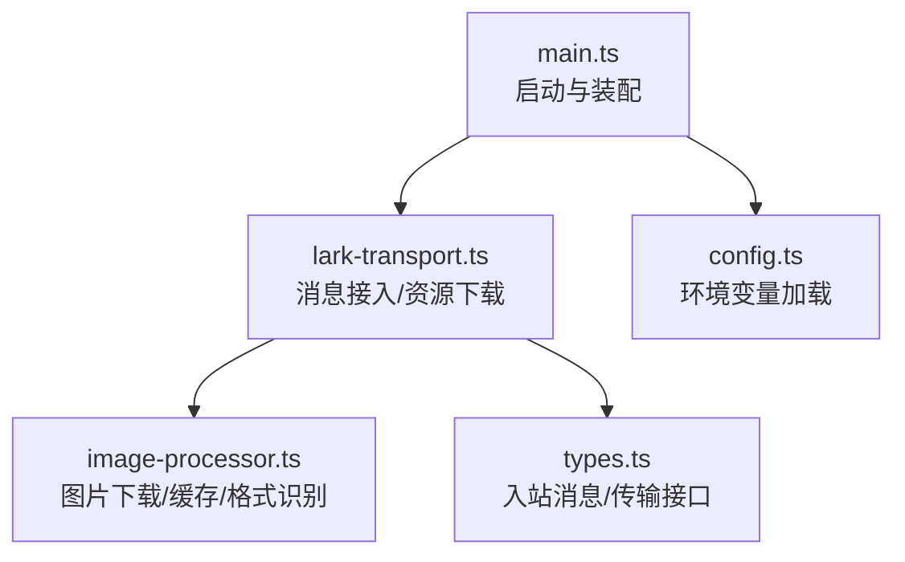
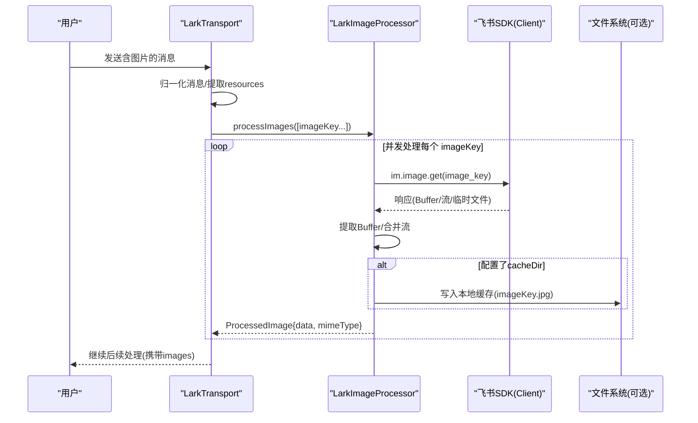
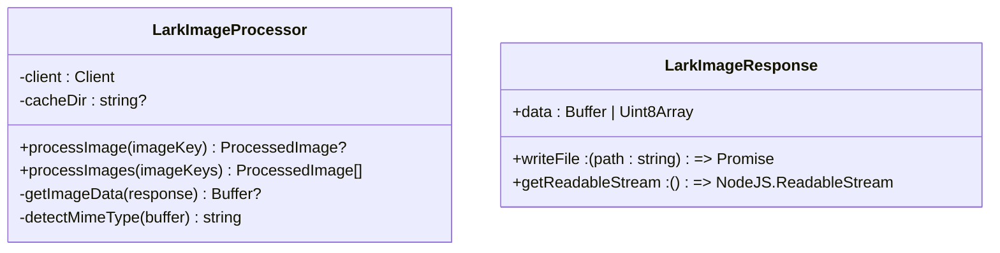
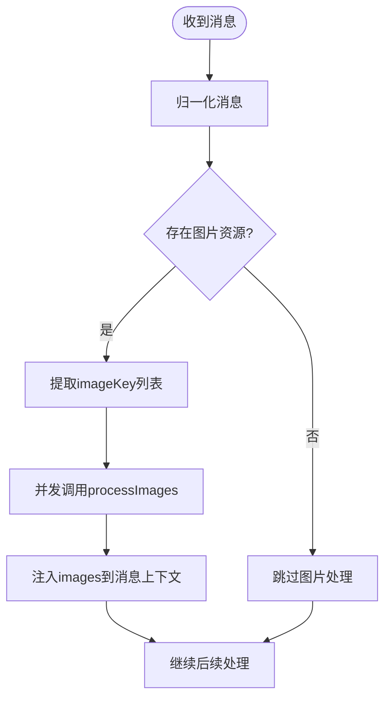
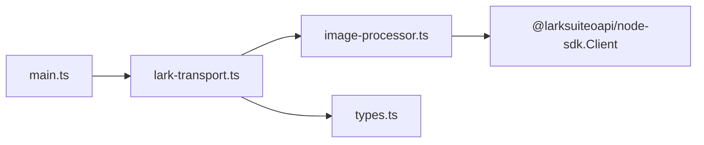

# 图片处理系统

<cite>
**本文引用的文件**
- [image-processor.ts](file://src/feishu/image-processor.ts)
- [lark-transport.ts](file://src/feishu/lark-transport.ts)
- [main.ts](file://src/main.ts)
- [config.ts](file://src/config.ts)
- [types.ts](file://src/feishu/types.ts)
</cite>

## 更新摘要
**所做更改**
- 增强了目录创建的健壮性，添加了错误处理和日志记录
- 引入了 LarkImageResponse 接口以实现类型安全的 SDK 响应处理
- 改进了缓存目录失败的报告机制
- 优化了图片下载和缓存的容错能力

## 目录
1. [简介](#简介)
2. [项目结构](#项目结构)
3. [核心组件](#核心组件)
4. [架构总览](#架构总览)
5. [详细组件分析](#详细组件分析)
6. [依赖关系分析](#依赖关系分析)
7. [性能考量](#性能考量)
8. [故障排查指南](#故障排查指南)
9. [结论](#结论)
10. [附录：API 使用与配置](#附录api-使用与配置)

## 简介
本系统为飞书机器人提供图片附件的下载、缓存与格式转换能力，支撑后续智能体（Pi）对图片内容的消费。核心由 LarkImageProcessor 负责从飞书 SDK 拉取图片数据、识别 MIME 类型、可选落盘缓存，并输出统一的数据结构；LarkTransport 在消息入站时自动解析资源、并发下载并注入到上层处理流程中；主入口 main.ts 负责装配传输层与图片处理器，并提供会话级图片缓存目录。

**更新** 系统现在具备更健壮的目录创建机制、类型安全的 SDK 响应处理以及改进的错误报告功能。

## 项目结构
- 图片处理逻辑集中在 feishu/image-processor.ts，定义统一的接口与实现。
- 消息接入与资源下载在 feishu/lark-transport.ts，负责将图片资源转换为可被上层使用的对象数组。
- 启动与装配在 src/main.ts，创建 Client、设置图片缓存目录、连接长连接。
- 配置加载在 src/config.ts，提供运行时所需的环境变量与默认值。
- 传输层抽象在 src/feishu/types.ts，定义入站消息与传输接口。

**图表来源**
- [main.ts:61-104](file://src/main.ts#L61-L104)
- [lark-transport.ts:64-80](file://src/feishu/lark-transport.ts#L64-L80)
- [image-processor.ts:24-38](file://src/feishu/image-processor.ts#L24-L38)
- [config.ts:25-50](file://src/config.ts#L25-L50)
- [types.ts:8-20](file://src/feishu/types.ts#L8-L20)

**章节来源**
- [main.ts:61-104](file://src/main.ts#L61-L104)
- [lark-transport.ts:64-80](file://src/feishu/lark-transport.ts#L64-L80)
- [image-processor.ts:24-38](file://src/feishu/image-processor.ts#L24-L38)
- [config.ts:25-50](file://src/config.ts#L25-L50)
- [types.ts:8-20](file://src/feishu/types.ts#L8-L20)

## 核心组件
- LarkImageProcessor：封装图片下载、本地缓存、MIME 类型检测与内存适配（Uint8Array）。
- LarkTransport：消息归一化后，提取图片资源 key，调用 LarkImageProcessor 批量下载，并将结果注入 FeishuInboundMessage.images。
- 主入口 main.ts：创建 Client、初始化 LarkTransport 并传入图片缓存目录，建立 WebSocket 连接。
- 配置 config.ts：集中读取环境变量，驱动服务行为（如模型、超时等），图片相关路径由 main.ts 组装。
- 类型 types.ts：定义入站消息结构与传输层接口，确保图片字段 images 的类型安全。

**更新** 新增了 LarkImageResponse 接口用于类型安全的 SDK 响应处理，增强了目录创建的健壮性和错误处理能力。

**章节来源**
- [image-processor.ts:11-22](file://src/feishu/image-processor.ts#L11-L22)
- [lark-transport.ts:177-187](file://src/feishu/lark-transport.ts#L177-L187)
- [main.ts:61-104](file://src/main.ts#L61-L104)
- [config.ts:25-50](file://src/config.ts#L25-L50)
- [types.ts:8-20](file://src/feishu/types.ts#L8-L20)

## 架构总览
图片处理管道从消息入站开始，经过资源解析、并发下载、格式识别与缓存落盘，最终将二进制数据与 MIME 类型以统一结构返回给上层。

**图表来源**
- [lark-transport.ts:177-187](file://src/feishu/lark-transport.ts#L177-L187)
- [image-processor.ts:40-81](file://src/feishu/image-processor.ts#L40-L81)
- [image-processor.ts:83-123](file://src/feishu/image-processor.ts#L83-L123)
- [image-processor.ts:126-152](file://src/feishu/image-processor.ts#L126-L152)

## 详细组件分析

### LarkImageProcessor：功能与实现
- 资源获取
  - 通过飞书 SDK 的 image.get 接口拉取图片。
  - 兼容多种响应形态：直接 Buffer、Uint8Array、带 writeFile 方法的对象、或可读流 getReadableStream。
  - **更新** 使用 LarkImageResponse 接口进行类型安全的响应处理。
- 本地缓存策略
  - 若构造时传入 cacheDir，则尝试将图片以 imageKey.jpg 形式落盘，便于后续离线访问或调试。
  - **更新** 增强的目录创建机制，包含递归创建和错误处理，失败时仅记录警告不影响主流程。
  - 写失败仅记录警告，不影响主流程。
- 内存优化
  - 统一输出 Uint8Array 与 MIME 类型，避免上层重复转换。
  - 流式响应通过累积 chunks 再 concat，减少中间对象数量。
- 格式识别
  - 基于文件头字节判断 PNG/JPEG/GIF/WebP，未知时回退 JPEG。
- 并发控制
  - 批量处理使用 Promise.allSettled，保证部分失败不影响其他图片处理。
- 错误处理
  - 单张图片异常不中断整体流程，记录错误日志并返回 undefined，最终过滤掉无效项。
  - **更新** 改进的缓存目录失败报告，提供更详细的错误信息。

**图表来源**
- [image-processor.ts:24-38](file://src/feishu/image-processor.ts#L24-L38)
- [image-processor.ts:40-81](file://src/feishu/image-processor.ts#L40-L81)
- [image-processor.ts:83-123](file://src/feishu/image-processor.ts#L83-L123)
- [image-processor.ts:126-152](file://src/feishu/image-processor.ts#L126-L152)
- [image-processor.ts:7-11](file://src/feishu/image-processor.ts#L7-L11)

**章节来源**
- [image-processor.ts:40-81](file://src/feishu/image-processor.ts#L40-L81)
- [image-processor.ts:83-123](file://src/feishu/image-processor.ts#L83-L123)
- [image-processor.ts:126-152](file://src/feishu/image-processor.ts#L126-L152)

### LarkTransport：图片处理管道与集成点
- 消息入站
  - 使用 EventDispatcher 接收 im.message.receive_v1，归一化后进入 dispatchMessage。
- 资源解析
  - 从 resources 中筛选 type=image 的条目，提取 fileKey 列表。
- 并发下载
  - 调用 LarkImageProcessor.processImages 进行并发下载，结果注入 FeishuInboundMessage.images。
- 文件附件
  - 对 file/audio/video/media 类型资源，下载到 filesCacheDir，并在文本中追加保存路径提示。
- 会话模式与话题根
  - 根据 chatId 查询会话模式，支持 topic 群收敛到同一会话。
- 卡片回调
  - 处理授权卡与模型切换等卡片操作，更新或撤回卡片。

**图表来源**
- [lark-transport.ts:87-112](file://src/feishu/lark-transport.ts#L87-L112)
- [lark-transport.ts:177-187](file://src/feishu/lark-transport.ts#L177-L187)
- [lark-transport.ts:198-217](file://src/feishu/lark-transport.ts#L198-L217)

**章节来源**
- [lark-transport.ts:87-112](file://src/feishu/lark-transport.ts#L87-L112)
- [lark-transport.ts:177-187](file://src/feishu/lark-transport.ts#L177-L187)
- [lark-transport.ts:198-217](file://src/feishu/lark-transport.ts#L198-L217)

### 主入口与配置：装配与运行
- 创建 Client：用于图片下载与卡片操作。
- 初始化 LarkTransport：传入 appId、appSecret、botOpenId、adminOpenId、以及图片与文件缓存目录。
- 启动连接：建立 WebSocket 长连接并开始接收事件。
- 配置加载：从环境变量读取必要参数，未配置时使用默认值。

**章节来源**
- [main.ts:61-104](file://src/main.ts#L61-L104)
- [config.ts:25-50](file://src/config.ts#L25-L50)

## 依赖关系分析
- LarkTransport 依赖 LarkImageProcessor 完成图片下载与格式识别。
- LarkImageProcessor 依赖飞书 SDK Client 进行网络请求。
- main.ts 负责装配 Client 与 Transport，并注入缓存目录。
- types.ts 定义入站消息结构，确保 images 字段类型一致。

**图表来源**
- [main.ts:61-104](file://src/main.ts#L61-L104)
- [lark-transport.ts:64-80](file://src/feishu/lark-transport.ts#L64-L80)
- [image-processor.ts:6-9](file://src/feishu/image-processor.ts#L6-L9)
- [types.ts:8-20](file://src/feishu/types.ts#L8-L20)

**章节来源**
- [main.ts:61-104](file://src/main.ts#L61-L104)
- [lark-transport.ts:64-80](file://src/feishu/lark-transport.ts#L64-L80)
- [image-processor.ts:6-9](file://src/feishu/image-processor.ts#L6-L9)
- [types.ts:8-20](file://src/feishu/types.ts#L8-L20)

## 性能考量
- 并发控制
  - 使用 Promise.allSettled 并发下载多张图片，提升吞吐；单个失败不影响整体。
- 内存管理
  - 统一输出 Uint8Array，避免额外拷贝；流式响应累积后一次性拼接，减少中间对象。
- 磁盘 I/O
  - 图片落盘为可选，仅在配置 cacheDir 时执行；写失败仅告警，不阻塞主流程。
- 网络容错
  - 对不可用响应结构进行兼容处理（Buffer/流/临时文件），提高鲁棒性。
- **更新** 增强的目录创建机制减少了文件系统操作失败的风险。
- 建议
  - 在高并发场景下，合理限制并发度以避免瞬时峰值；必要时引入队列或限流器。
  - 对大图片考虑分块处理或转码压缩以降低内存占用。
  - 定期清理图片缓存目录，避免磁盘膨胀。

## 故障排查指南
- 图片下载失败
  - 检查飞书 App ID/Secret 是否正确，Client 是否成功初始化。
  - 查看日志中的错误信息，确认 imageKey 是否有效。
- 缓存写入失败
  - **更新** 确认 cacheDir 是否存在且可写；权限不足会导致写入失败但不会中断流程。
  - 检查目录创建失败的日志，确认是否有足够的磁盘空间和权限。
- 响应结构不兼容
  - 当前已兼容 Buffer、Uint8Array、writeFile、getReadableStream；如遇新结构，需扩展 getImageData。
  - **更新** 使用 LarkImageResponse 接口提供更好的类型安全保障。
- 消息处理阻塞
  - 传输层采用 fire-and-forget 后台处理，避免阻塞事件分发；若出现卡顿，检查上游 handler 耗时。
- **新增** 目录创建问题
  - 检查父目录是否存在且可写。
  - 确认文件系统权限配置正确。
  - 查看详细的错误日志以确定具体失败原因。

**章节来源**
- [image-processor.ts:51-69](file://src/feishu/image-processor.ts#L51-L69)
- [image-processor.ts:83-123](file://src/feishu/image-processor.ts#L83-L123)
- [lark-transport.ts:226-243](file://src/feishu/lark-transport.ts#L226-L243)

## 结论
本图片处理系统围绕 LarkImageProcessor 与 LarkTransport 构建，实现了从飞书拉取图片、格式识别、本地缓存与内存适配的一体化方案。通过并发下载与健壮的错误处理，系统在复杂网络与响应结构下保持稳定。结合主入口的装配与配置加载，开发者可快速集成到现有飞书机器人中，获得高性能的图片处理能力。

**更新** 最新的改进包括更健壮的目录创建机制、类型安全的 SDK 响应处理以及改进的错误报告功能，进一步提升了系统的稳定性和可维护性。

## 附录：API 使用与配置

### API 使用示例
- 单张图片处理
  - 调用 LarkImageProcessor.processImage(imageKey)，返回 ProcessedImage 或未定义。
  - 参考路径：[image-processor.ts:40-70](file://src/feishu/image-processor.ts#L40-L70)
- 批量图片处理
  - 调用 LarkImageProcessor.processImages([imageKey...])，返回 ProcessedImage[]。
  - 参考路径：[image-processor.ts:72-81](file://src/feishu/image-processor.ts#L72-L81)
- 在消息处理中集成
  - LarkTransport 在消息入站时自动提取图片资源并调用 processImages，结果注入 FeishuInboundMessage.images。
  - 参考路径：[lark-transport.ts:177-187](file://src/feishu/lark-transport.ts#L177-L187)

### 配置选项说明
- 图片缓存目录
  - 通过 LarkTransportConfig.imageCacheDir 传入，用于图片落盘。
  - **更新** 现在具有更好的错误处理和日志记录。
  - 参考路径：[lark-transport.ts:21-24](file://src/feishu/lark-transport.ts#L21-L24)
- 文件附件缓存目录
  - 通过 LarkTransportConfig.filesCacheDir 传入，用于 file/audio/video/media 附件下载。
  - 参考路径：[lark-transport.ts:21-24](file://src/feishu/lark-transport.ts#L21-L24)
- 启动装配
  - main.ts 中创建 Client 并初始化 LarkTransport，设置图片与文件缓存目录。
  - 参考路径：[main.ts:61-104](file://src/main.ts#L61-L104)
- 环境变量
  - 通过 config.ts 加载 FEISHU_APP_ID、FEISHU_APP_SECRET 等必需参数，以及模型、超时等可选参数。
  - 参考路径：[config.ts:25-50](file://src/config.ts#L25-L50)

### 性能调优建议
- 控制并发度：在高负载环境下，可对 processImages 增加并发限制，避免瞬时压力过大。
- 内存优化：对超大图片考虑分块读取与转码，降低内存峰值。
- 缓存策略：启用图片缓存目录，减少重复下载；定期清理过期文件。
- 网络容错：对不可用响应结构进行兼容处理，提升鲁棒性。
- **更新** 利用增强的目录创建机制确保缓存目录的可用性。

### 错误处理最佳实践
- **新增** 目录创建失败处理
  - 捕获 mkdirSync 异常并记录详细错误信息。
  - 确保应用程序在目录创建失败时仍能正常运行。
- **新增** 类型安全的响应处理
  - 使用 LarkImageResponse 接口确保 SDK 响应的类型安全。
  - 提供更好的编译时错误检查和 IDE 支持。
- **新增** 改进的错误报告
  - 提供更详细的错误信息和上下文。
  - 区分不同类型的错误并采取相应的恢复策略。

**章节来源**
- [image-processor.ts:38-46](file://src/feishu/image-processor.ts#L38-L46)
- [image-processor.ts:7-11](file://src/feishu/image-processor.ts#L7-L11)
- [image-processor.ts:60-67](file://src/feishu/image-processor.ts#L60-L67)