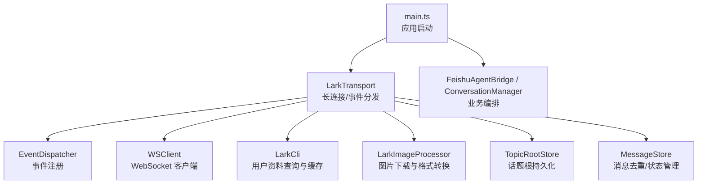
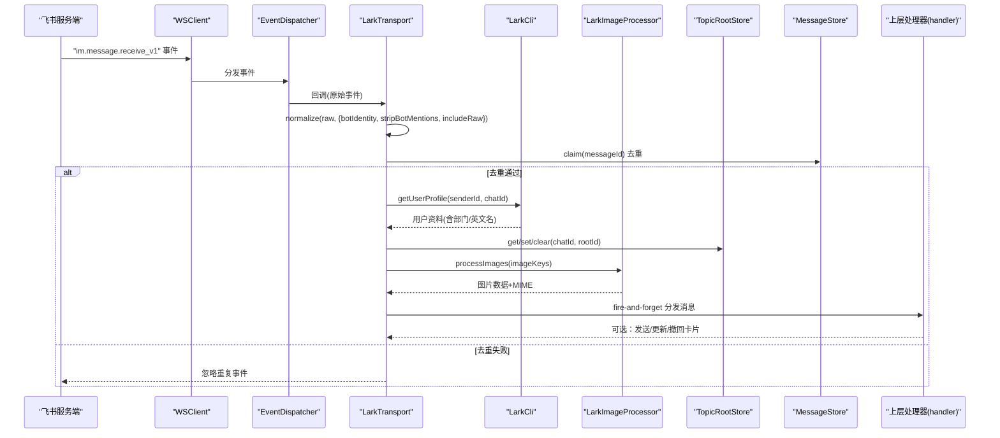
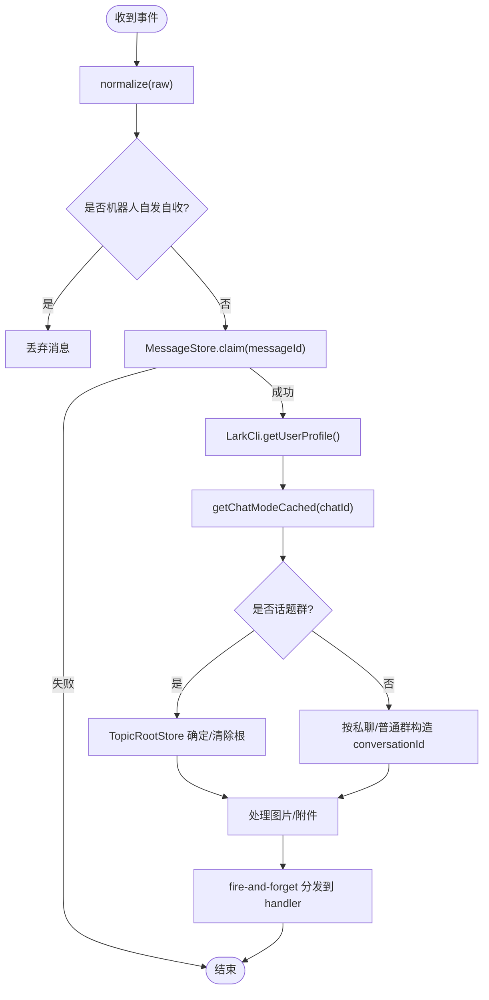
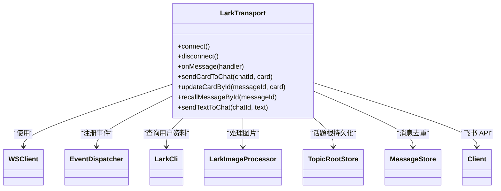

# 消息传输层

<cite>
**本文引用的文件**
- [lark-transport.ts](file://src/feishu/lark-transport.ts)
- [types.ts](file://src/feishu/types.ts)
- [message-store.ts](file://src/feishu/message-store.ts)
- [topic-root-store.ts](file://src/feishu/topic-root-store.ts)
- [image-processor.ts](file://src/feishu/image-processor.ts)
- [lark-cli.ts](file://src/feishu/lark-cli.ts)
- [session-alias.ts](file://src/feishu/session-alias.ts)
- [main.ts](file://src/main.ts)
- [types.ts（运行时）](file://src/runtime/types.ts)
- [types.ts（上下文）](file://src/context/types.ts)
</cite>

## 目录
1. [简介](#简介)
2. [项目结构](#项目结构)
3. [核心组件](#核心组件)
4. [架构总览](#架构总览)
5. [详细组件分析](#详细组件分析)
6. [依赖关系分析](#依赖关系分析)
7. [性能考量](#性能考量)
8. [故障排查指南](#故障排查指南)
9. [结论](#结论)
10. [附录：API 与配置示例](#附录api-与配置示例)

## 简介
本章节面向“飞书消息传输层”的实现，聚焦以下目标：
- 基于 WebSocket 的长连接建立、事件分发与错误恢复机制
- 事件归一化流程（normalize）与资源处理（图片、附件）
- LarkTransport 类的核心职责：消息接收、会话模式识别（私聊/群聊/话题群）、用户上下文注入、消息去重
- normalize 函数的作用、错误处理策略与性能优化技巧
- 为开发者提供可直接参考的 API 调用与配置选项

## 项目结构
传输层位于 src/feishu 目录下，围绕 LarkTransport 组织，配合消息存储、图片处理、用户信息缓存、话题根持久化等模块。启动入口在 main.ts 中完成初始化并驱动传输层连接。

图表来源
- [main.ts:93-104](file://src/main.ts#L93-L104)
- [lark-transport.ts:82-133](file://src/feishu/lark-transport.ts#L82-L133)

章节来源
- [main.ts:27-104](file://src/main.ts#L27-L104)
- [lark-transport.ts:1-133](file://src/feishu/lark-transport.ts#L1-L133)

## 核心组件
- LarkTransport：实现 FeishuTransport 接口，封装 WSClient + EventDispatcher，负责长连接、事件分发、消息归一化、资源处理、会话模式识别、卡片回调处理、消息发送与更新。
- MessageStore：基于 JSON 文件的消息状态存储，提供 claim/complete/fail 能力，避免重复投递与执行。
- TopicRootStore：话题群首条消息无 threadId 时，持久化待定的话题根 messageId，确保后续消息收敛到同一会话。
- LarkImageProcessor：下载图片并转换为 Pi 可用格式（Uint8Array），支持本地缓存与 MIME 类型检测。
- LarkCli：三级查询用户资料（API/群成员列表/lark-cli），带过期缓存与降级入库。
- session-alias：会话 ID 短别名映射，用于卡片小字展示。
- types：定义入站消息、回复句柄、传输层抽象、Pi 会话事件等。

章节来源
- [lark-transport.ts:11-80](file://src/feishu/lark-transport.ts#L11-L80)
- [message-store.ts:1-49](file://src/feishu/message-store.ts#L1-L49)
- [topic-root-store.ts:1-27](file://src/feishu/topic-root-store.ts#L1-L27)
- [image-processor.ts:1-154](file://src/feishu/image-processor.ts#L1-L154)
- [lark-cli.ts:1-269](file://src/feishu/lark-cli.ts#L1-L269)
- [session-alias.ts:1-34](file://src/feishu/session-alias.ts#L1-L34)
- [types.ts（传输层）:1-39](file://src/feishu/types.ts#L1-L39)
- [types.ts（上下文）:1-11](file://src/context/types.ts#L1-L11)
- [types.ts（运行时）:13-25](file://src/runtime/types.ts#L13-L25)

## 架构总览
下图展示了从飞书事件到达、归一化、上下文注入、会话模式识别、资源处理到最终分发给上层处理的完整链路。

图表来源
- [lark-transport.ts:87-133](file://src/feishu/lark-transport.ts#L87-L133)
- [lark-transport.ts:141-248](file://src/feishu/lark-transport.ts#L141-L248)
- [message-store.ts:23-30](file://src/feishu/message-store.ts#L23-L30)
- [topic-root-store.ts:8-26](file://src/feishu/topic-root-store.ts#L8-L26)
- [image-processor.ts:40-81](file://src/feishu/image-processor.ts#L40-L81)

## 详细组件分析

### LarkTransport：长连接与事件分发
- 长连接建立
  - 使用 WSClient 配置 appId/appSecret/source/handshakeTimeoutMs/wsConfig.pingTimeout，并注册 onReconnecting/onReconnected/onError 日志。
  - 通过 EventDispatcher 注册事件：
    - im.message.receive_v1：调用 normalize 进行归一化，过滤机器人自身消息，构造上下文后分发。
    - card.action.trigger：调用 normalizeCardAction，返回 toast 以反馈 ACK，避免超时提示。
- 消息分发与去重
  - 分发采用 fire-and-forget 方式，避免阻塞 SDK 事件处理；会话顺序由 ConversationManager 保证，消息去重由 MessageStore.claim 保证。
- 会话模式识别
  - 通过 client.im.v1.chat.get 获取 chat_mode，缓存 p2p/group/topic 三种模式，影响 conversationId 构造与话题根策略。
- 用户上下文注入
  - 调用 LarkCli.getUserProfile 获取 openId、name、englishName、departmentNames，结合 chatId/threadId 构造 FeishuContext。
- 资源处理
  - 图片：通过 LarkImageProcessor.processImages 批量下载并转为 Uint8Array，附带 MIME。
  - 文件附件：当配置 filesCacheDir 时，下载 file/audio/video/media 并写入本地路径，将路径追加到文本以便 Agent 直接访问。
- 卡片回调处理
  - 解析 value（对象或 JSON 字符串），区分授权卡回调与普通卡片（如 /model）。
  - 管理员校验后执行模型切换，持久化 .env 并通知运行时热切换；失败则回退 token 更新卡片。
- 消息发送与更新
  - sendCardToChat/updateCardById/recallMessageById/sendTextToChat 封装常用 API。

图表来源
- [lark-transport.ts:87-133](file://src/feishu/lark-transport.ts#L87-L133)
- [lark-transport.ts:141-248](file://src/feishu/lark-transport.ts#L141-L248)
- [message-store.ts:23-30](file://src/feishu/message-store.ts#L23-L30)
- [topic-root-store.ts:8-26](file://src/feishu/topic-root-store.ts#L8-L26)

章节来源
- [lark-transport.ts:82-133](file://src/feishu/lark-transport.ts#L82-L133)
- [lark-transport.ts:141-248](file://src/feishu/lark-transport.ts#L141-L248)
- [lark-transport.ts:250-363](file://src/feishu/lark-transport.ts#L250-L363)
- [lark-transport.ts:365-423](file://src/feishu/lark-transport.ts#L365-L423)

### 事件归一化与资源处理
- normalize 的作用
  - 将飞书原始事件转换为统一结构，剥离 @机器人 标记，保留原始内容（includeRaw），便于上层稳定消费。
- 资源处理流程
  - 图片：批量下载并转换为 Pi 可用的 Uint8Array 与 MIME 类型，支持本地缓存。
  - 文件附件：下载到 filesCacheDir，并将路径附加到文本，供 Agent 读取。
- 错误处理策略
  - 归一化/分发异常捕获并记录日志，不中断事件流。
  - 图片/附件下载失败仅警告，不影响主流程。
  - 卡片回调解析失败记录警告，继续处理。

章节来源
- [lark-transport.ts:87-133](file://src/feishu/lark-transport.ts#L87-L133)
- [lark-transport.ts:177-217](file://src/feishu/lark-transport.ts#L177-L217)
- [image-processor.ts:40-81](file://src/feishu/image-processor.ts#L40-L81)

### 会话模式识别与话题群收敛
- 会话模式
  - 通过 chat.get 获取 chat_mode，缓存结果以减少请求。
  - 模式决定 conversationId 构造与话题根策略。
- 话题群收敛
  - 首条消息无 threadId 时，用 messageId 作为话题根并持久化；后续消息携带 threadId 即视为已确立根，清理待定根。
  - 若根未确立前用户追加消息，从持久化取回话题根，避免裂成新会话。

章节来源
- [lark-transport.ts:314-328](file://src/feishu/lark-transport.ts#L314-L328)
- [lark-transport.ts:155-175](file://src/feishu/lark-transport.ts#L155-L175)
- [topic-root-store.ts:8-26](file://src/feishu/topic-root-store.ts#L8-L26)

### 用户上下文注入
- 三级查询策略
  - 优先 API 获取用户资料；失败则尝试群成员列表；再失败通过 lark-cli 搜索补充部门中文名与英文名。
- 缓存与过期
  - 有档案 3 天过期，空档案 1 天过期；全部失败时降级入库，保留旧字段并刷新时间戳。
- 上下文字段
  - userOpenId、userName、departmentNames、chatId、threadId、conversationId、isAdmin。

章节来源
- [lark-cli.ts:53-169](file://src/feishu/lark-cli.ts#L53-L169)
- [lark-cli.ts:171-220](file://src/feishu/lark-cli.ts#L171-L220)
- [lark-cli.ts:222-269](file://src/feishu/lark-cli.ts#L222-L269)
- [types.ts（上下文）:1-11](file://src/context/types.ts#L1-L11)

### 消息去重机制
- MessageStore 提供 claim/complete/fail 能力，基于 JSON 文件持久化消息状态。
- processing 状态超过阈值视为卡住，允许重新认领；completed/failed 不再重复执行。
- 启动时 DataCleaner 清理卡住消息与过期数据。

章节来源
- [message-store.ts:1-49](file://src/feishu/message-store.ts#L1-L49)
- [main.ts:29-59](file://src/main.ts#L29-L59)

### 卡片回调与权限控制
- 卡片回调
  - normalizeCardAction 解析回调，返回 toast 反馈 ACK。
  - 授权卡回调交由 PermissionBroker 在服务端校验（含管理员身份），支持转发给管理员。
  - 非管理员点击受控卡片（如 /model）会拒绝并更新卡片提示。
- 模型切换
  - 管理员确认后持久化 .env 中的模型名，并通过 onModelSwitch 通知运行时热切换。

章节来源
- [lark-transport.ts:103-112](file://src/feishu/lark-transport.ts#L103-L112)
- [lark-transport.ts:250-312](file://src/feishu/lark-transport.ts#L250-L312)
- [main.ts:134-169](file://src/main.ts#L134-L169)

## 依赖关系分析
- LarkTransport 依赖：
  - WSClient/EventDispatcher：底层长连接与事件分发
  - LarkCli：用户资料查询与缓存
  - LarkImageProcessor：图片下载与格式转换
  - TopicRootStore：话题根持久化
  - MessageStore：消息去重与状态管理
  - Client：飞书 API 调用（消息发送、卡片更新、资源下载）
- 外部集成：
  - PermissionBroker：授权卡回调与服务端校验
  - ConversationManager：会话顺序保证
  - DataCleaner：定期清理与卡住消息恢复

图表来源
- [lark-transport.ts:11-80](file://src/feishu/lark-transport.ts#L11-L80)
- [lark-transport.ts:82-133](file://src/feishu/lark-transport.ts#L82-L133)
- [lark-transport.ts:365-423](file://src/feishu/lark-transport.ts#L365-L423)

章节来源
- [lark-transport.ts:11-80](file://src/feishu/lark-transport.ts#L11-L80)
- [lark-transport.ts:82-133](file://src/feishu/lark-transport.ts#L82-L133)
- [lark-transport.ts:365-423](file://src/feishu/lark-transport.ts#L365-L423)

## 性能考量
- 长连接与重连
  - 设置 handshakeTimeoutMs 与 wsConfig.pingTimeout，监听 onReconnecting/onReconnected，提升稳定性。
- 事件处理非阻塞
  - 分发采用 fire-and-forget，避免阻塞 SDK 事件处理；会话顺序由 ConversationManager 保证。
- 缓存与复用
  - 会话模式缓存减少 chat.get 调用；用户资料缓存降低 API 压力；图片本地缓存减少重复下载。
- 资源处理优化
  - 图片批量处理 Promise.allSettled，单个失败不影响整体；文件附件限制数量（最多 5 个）避免过大负载。
- 去重与恢复
  - MessageStore 防止重复执行；DataCleaner 清理卡住消息，提高系统健壮性。

[本节为通用性能建议，不直接分析具体文件]

## 故障排查指南
- 连接问题
  - 检查 WSClient 配置（appId/appSecret/source/handshakeTimeoutMs/wsConfig.pingTimeout），关注 onReconnecting/onReconnected/onError 日志。
- 事件丢失或重复
  - 确认 normalize 是否成功；检查 MessageStore.claim 是否命中；查看 DataCleaner 是否清理了卡住消息。
- 图片/附件下载失败
  - 检查 filesCacheDir/imageCacheDir 权限；关注下载失败的警告日志；确认飞书资源有效。
- 卡片回调超时或未响应
  - 确认 card.action.trigger 返回 toast；检查 updateCardById 是否成功；必要时回退 token 更新。
- 会话模式识别错误
  - 检查 chat.get 返回值；确认 chatModeCache 是否正确缓存；话题群首条消息是否登记根。

章节来源
- [lark-transport.ts:87-133](file://src/feishu/lark-transport.ts#L87-L133)
- [lark-transport.ts:177-217](file://src/feishu/lark-transport.ts#L177-L217)
- [lark-transport.ts:250-312](file://src/feishu/lark-transport.ts#L250-L312)
- [message-store.ts:23-30](file://src/feishu/message-store.ts#L23-L30)
- [main.ts:29-59](file://src/main.ts#L29-L59)

## 结论
本传输层以 LarkTransport 为核心，结合 WSClient 与 EventDispatcher 实现稳定的飞书长连接与事件分发；通过 normalize 归一化、用户上下文注入、会话模式识别与资源处理，为上层提供一致的消息模型；借助 MessageStore 与 TopicRootStore 保障消息去重与会话收敛；通过卡片回调与权限控制实现安全可控的管理操作。整体设计兼顾可靠性、可维护性与扩展性。

[本节为总结性内容，不直接分析具体文件]

## 附录：API 与配置示例

### 传输层配置项（LarkTransportConfig）
- appId/appSecret：飞书应用凭证
- botOpenId：机器人 Open ID（用于过滤自发自收与清洗 @机器人）
- source：来源标识
- userProfileDir：用户资料缓存目录
- handshakeTimeoutMs/pingTimeout：握手与心跳超时
- client：飞书 Client 实例（消息发送、卡片更新、资源下载）
- imageCacheDir/filesCacheDir：图片与文件附件缓存目录
- adminOpenId：管理员 Open ID（用于权限控制）
- topicRootsFile：话题根持久化文件路径
- onModelSwitch：模型切换回调（运行时热切换）

章节来源
- [lark-transport.ts:11-31](file://src/feishu/lark-transport.ts#L11-L31)
- [main.ts:93-104](file://src/main.ts#L93-L104)

### 典型 API 调用示例
- 发送卡片到会话
  - sendCardToChat(chatId, card) → 返回 messageId
- 更新已发送卡片
  - updateCardById(messageId, card)
- 撤回消息
  - recallMessageById(messageId)
- 发送文本消息
  - sendTextToChat(chatId, text)

章节来源
- [lark-transport.ts:388-423](file://src/feishu/lark-transport.ts#L388-L423)

### 事件订阅与处理
- 注册消息处理器
  - transport.onMessage(handler)
- 注册授权卡回调处理器
  - transport.onApproval(handler)

章节来源
- [lark-transport.ts:379-386](file://src/feishu/lark-transport.ts#L379-L386)
- [main.ts:134-169](file://src/main.ts#L134-L169)

### 运行期集成
- 启动流程
  - 创建 Client → 构建 LarkTransport → 注册回调 → 启动 bridge → connect()
- 优雅退出
  - 监听 SIGINT/SIGTERM/SIGBREAK，断开连接并延迟退出

章节来源
- [main.ts:61-104](file://src/main.ts#L61-L104)
- [main.ts:244-283](file://src/main.ts#L244-L283)