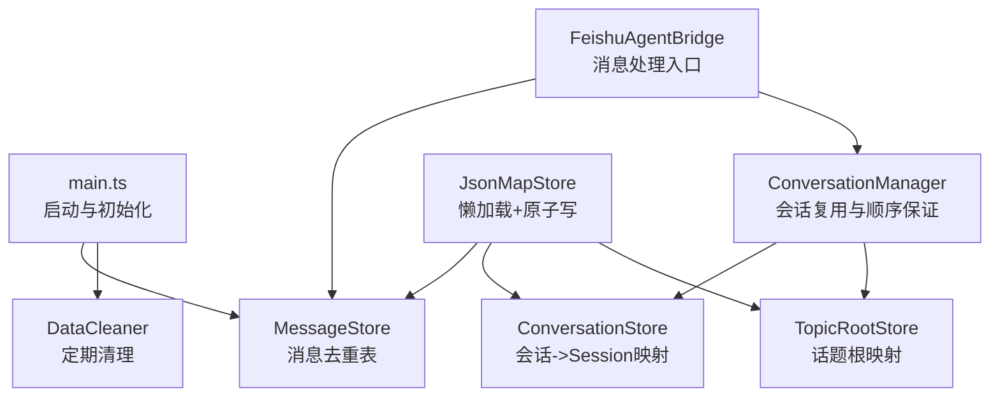
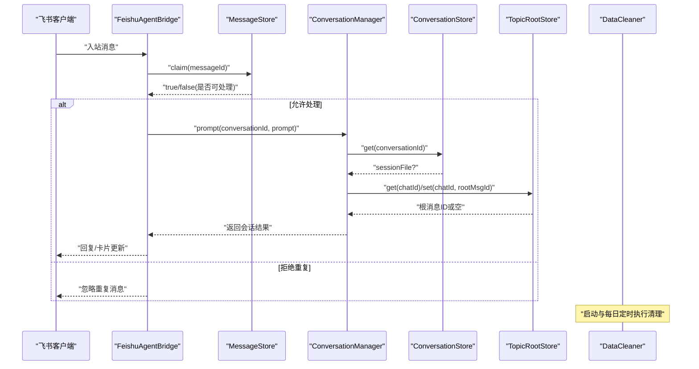
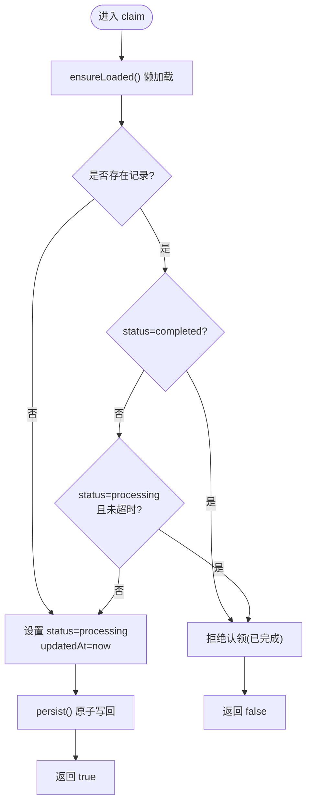
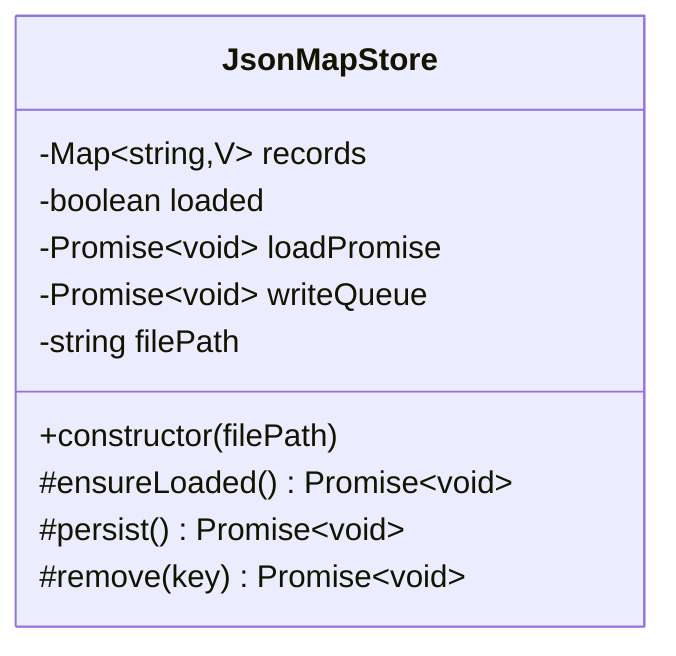
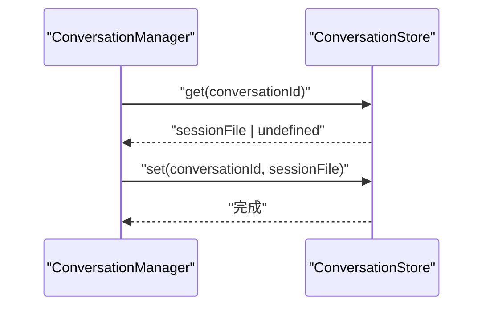
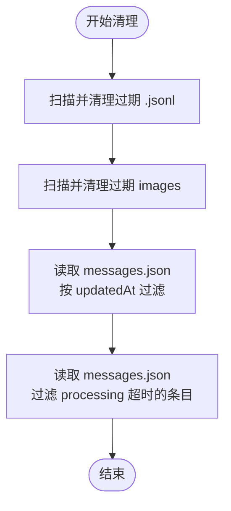
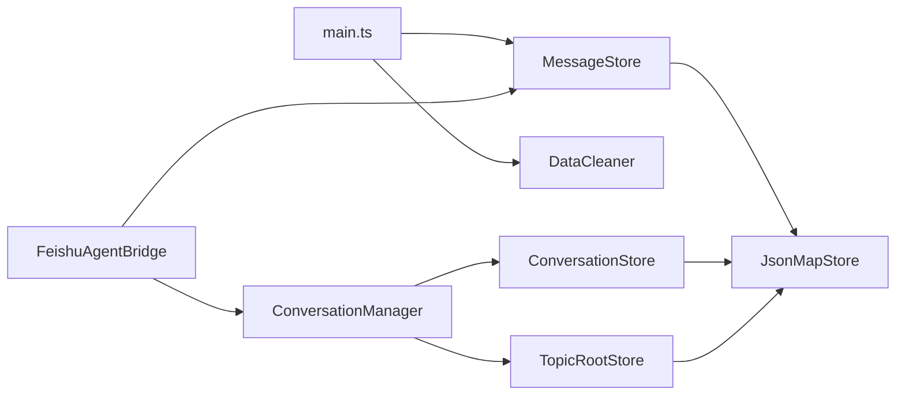

# 消息存储管理

<cite>
**本文引用的文件**
- [message-store.ts](file://src/feishu/message-store.ts)
- [json-store.ts](file://src/utils/json-store.ts)
- [conversation-store.ts](file://src/runtime/conversation-store.ts)
- [topic-root-store.ts](file://src/feishu/topic-root-store.ts)
- [data-cleaner.ts](file://src/runtime/data-cleaner.ts)
- [agent-bridge.ts](file://src/feishu/agent-bridge.ts)
- [main.ts](file://src/main.ts)
- [data-management.md](file://docs/data-management.md)
</cite>

## 目录
1. [简介](#简介)
2. [项目结构](#项目结构)
3. [核心组件](#核心组件)
4. [架构总览](#架构总览)
5. [详细组件分析](#详细组件分析)
6. [依赖关系分析](#依赖关系分析)
7. [性能与内存优化](#性能与内存优化)
8. [故障排查指南](#故障排查指南)
9. [结论](#结论)
10. [附录：使用示例与配置项](#附录：使用示例与配置项)

## 简介
本文件面向“消息存储管理”主题，系统性说明消息去重机制、会话隔离策略与数据持久化实现。重点围绕 MessageStore 类及其底层 JsonMapStore 框架，解释消息索引、查询优化、存储策略、生命周期管理、内存占用控制与数据一致性保证，并提供使用示例、配置选项与性能优化建议，帮助开发者构建可靠的数据存储方案。

## 项目结构
本项目采用分层与按功能组织的方式：
- 基础持久化能力由通用基类提供（JsonMapStore），支持懒加载、串行写队列与原子替换落盘。
- 业务存储层基于该基类扩展出三类存储：
  - 消息状态存储（MessageStore）：用于跨群聊的全局消息去重与处理状态追踪。
  - 会话映射存储（ConversationStore）：维护飞书 conversationId 到 Pi Session 文件的映射。
  - 话题根存储（TopicRootStore）：维护话题首条消息的待定根消息 ID，确保话题收敛。
- 运行时清理器（DataCleaner）负责定期清理过期会话文件、图片缓存与消息状态，并处理卡住的消息。
- 入口与桥接：
  - main.ts 启动时创建 MessageStore 并执行清理任务。
  - agent-bridge.ts 在入站消息处理前通过 MessageStore.claim 进行去重。

图表来源
- [main.ts:25-49](file://src/main.ts#L25-L49)
- [agent-bridge.ts:71-74](file://src/feishu/agent-bridge.ts#L71-L74)
- [conversation-manager.ts:33-53](file://src/runtime/conversation-manager.ts#L33-L53)
- [json-store.ts:4-57](file://src/utils/json-store.ts#L4-L57)

章节来源
- [main.ts:25-49](file://src/main.ts#L25-L49)
- [data-management.md:20-163](file://docs/data-management.md#L20-L163)

## 核心组件
- JsonMapStore<V>：提供统一的 JSON 字典持久化能力，包括懒加载、并发安全读取、串行写队列与原子替换（临时文件 + rename）。
- MessageStore：继承自 JsonMapStore<MessageRecord>，实现消息去重与状态流转（processing/completed/failed），支持 processing 超时重试。
- ConversationStore：维护 conversationId 到 session 文件路径的映射，支持 get/set/delete。
- TopicRootStore：维护 chatId 到待定话题根 messageId 的映射，支持 set/clear/get。
- DataCleaner：清理过期会话文件、图片缓存、过期消息状态，以及卡住的消息。

章节来源
- [json-store.ts:4-57](file://src/utils/json-store.ts#L4-L57)
- [message-store.ts:1-49](file://src/feishu/message-store.ts#L1-L49)
- [conversation-store.ts:1-31](file://src/runtime/conversation-store.ts#L1-L31)
- [topic-root-store.ts:1-27](file://src/feishu/topic-root-store.ts#L1-L27)
- [data-cleaner.ts:30-184](file://src/runtime/data-cleaner.ts#L30-L184)

## 架构总览
消息从飞书进入后，先经 FeishuAgentBridge 处理，调用 MessageStore.claim 完成去重；随后交由 ConversationManager 进行会话复用与顺序执行；会话映射由 ConversationStore 维护；话题群的首条消息通过 TopicRootStore 收敛到同一会话；DataCleaner 定时清理过期数据与卡住消息。

图表来源
- [agent-bridge.ts:71-74](file://src/feishu/agent-bridge.ts#L71-L74)
- [conversation-manager.ts:33-53](file://src/runtime/conversation-manager.ts#L33-L53)
- [conversation-store.ts:14-24](file://src/runtime/conversation-store.ts#L14-L24)
- [topic-root-store.ts:9-20](file://src/feishu/topic-root-store.ts#L9-L20)
- [data-cleaner.ts:44-67](file://src/runtime/data-cleaner.ts#L44-L67)

## 详细组件分析

### MessageStore：消息去重与状态管理
- 目标：避免重复投递导致重复执行 Agent，同时支持处理中消息的超时重试。
- 关键方法：
  - claim(messageId)：原子认领消息。若已 completed 或在 processing 且未超过处理超时，则拒绝；否则标记为 processing 并返回 true。
  - complete(messageId)：标记为 completed。
  - fail(messageId)：标记为 failed，避免立即再次执行。
- 状态字段：
  - status：processing/completed/failed
  - updatedAt：最近更新时间（毫秒时间戳），用于过期与卡住判断
- 存储策略：
  - 继承 JsonMapStore，records 为 Map<string, MessageRecord>
  - ensureLoaded() 懒加载，首次读取失败（ENOENT）视为空映射
  - persist() 串行写队列，先写临时文件再 rename 原子替换，避免读到半写文件

图表来源
- [message-store.ts:23-47](file://src/feishu/message-store.ts#L23-L47)
- [json-store.ts:32-56](file://src/utils/json-store.ts#L32-L56)

章节来源
- [message-store.ts:1-49](file://src/feishu/message-store.ts#L1-L49)
- [json-store.ts:4-57](file://src/utils/json-store.ts#L4-L57)

### JsonMapStore：懒加载与原子写
- 懒加载：
  - loaded 标志与 loadPromise 缓存，避免并发重复读
  - 首次读取 ENOENT 时按空映射处理
- 串行写队列：
  - writeQueue 串联所有写入操作，避免并发写冲突
  - 临时文件命名包含时间与进程号，rename 原子替换
- 删除：
  - remove(key) 删除记录并触发持久化

图表来源
- [json-store.ts:4-57](file://src/utils/json-store.ts#L4-L57)

章节来源
- [json-store.ts:4-57](file://src/utils/json-store.ts#L4-L57)

### ConversationStore：会话映射
- 作用：持久化 conversationId 到 Pi Session 文件路径的映射，便于重启恢复与会话隔离。
- 方法：
  - get(conversationId)：返回 sessionFile 路径
  - set(conversationId, sessionFile)：保存映射并持久化
  - delete(conversationId)：删除映射

图表来源
- [conversation-store.ts:14-24](file://src/runtime/conversation-store.ts#L14-L24)
- [conversation-manager.ts:42-53](file://src/runtime/conversation-manager.ts#L42-L53)

章节来源
- [conversation-store.ts:1-31](file://src/runtime/conversation-store.ts#L1-L31)
- [conversation-manager.ts:33-53](file://src/runtime/conversation-manager.ts#L33-L53)

### TopicRootStore：话题根映射
- 作用：记录 chatId -> 待定话题根 messageId，使后续消息能收敛到同一会话，避免话题分裂。
- 方法：
  - get(chatId)：获取待定根消息 ID
  - set(chatId, rootMessageId)：登记根消息
  - clear(chatId)：清除（threadId 已确立后）

章节来源
- [topic-root-store.ts:1-27](file://src/feishu/topic-root-store.ts#L1-L27)

### DataCleaner：数据清理与一致性保障
- 清理对象：
  - 会话文件（.jsonl）：按文件修改时间清理
  - 图片缓存：按文件修改时间清理
  - 消息状态：按 updatedAt 清理
  - 卡住消息：processing 状态超过阈值（默认 1 小时）清理
- 触发时机：
  - 启动时执行一次
  - 之后每 24 小时自动执行
- 实现要点：
  - filterMessagesFile 统一过滤逻辑，支持 dryRun 统计模式
  - cleanupStuckMessages 专门处理卡住消息

图表来源
- [data-cleaner.ts:44-184](file://src/runtime/data-cleaner.ts#L44-L184)

章节来源
- [data-cleaner.ts:30-184](file://src/runtime/data-cleaner.ts#L30-L184)
- [data-management.md:143-163](file://docs/data-management.md#L143-L163)

## 依赖关系分析
- 入口依赖：
  - main.ts 创建 MessageStore 并初始化 DataCleaner，启动清理任务
  - agent-bridge.ts 在消息处理前调用 MessageStore.claim 去重
- 会话管理依赖：
  - ConversationManager 依赖 ConversationStore 与 TopicRootStore 进行会话恢复与话题收敛
- 持久化依赖：
  - 所有存储均依赖 JsonMapStore 提供的懒加载与原子写能力

图表来源
- [main.ts:25-49](file://src/main.ts#L25-L49)
- [agent-bridge.ts:71-74](file://src/feishu/agent-bridge.ts#L71-L74)
- [conversation-manager.ts:33-53](file://src/runtime/conversation-manager.ts#L33-L53)
- [json-store.ts:4-57](file://src/utils/json-store.ts#L4-L57)

章节来源
- [main.ts:25-49](file://src/main.ts#L25-L49)
- [agent-bridge.ts:71-74](file://src/feishu/agent-bridge.ts#L71-L74)
- [conversation-manager.ts:33-53](file://src/runtime/conversation-manager.ts#L33-L53)
- [json-store.ts:4-57](file://src/utils/json-store.ts#L4-L57)

## 性能与内存优化
- 懒加载减少冷启动开销：
  - 首次访问才读取 JSON 文件，避免不必要的 I/O
  - 并发读取通过 loadPromise 去重，避免重复 IO
- 串行写队列提升一致性：
  - 所有写入排队执行，避免竞争条件
  - 原子替换（临时文件 + rename）防止读到半写数据
- 内存占用控制：
  - records 为 Map，键值对数量受业务规模限制
  - 定期清理过期消息与会话文件，降低磁盘与内存压力
- 查询优化：
  - 直接 Map.get/Set 操作，时间复杂度 O(1)
  - 清理阶段批量读取 JSON 并按谓词过滤，减少多次 I/O
- 建议：
  - 合理设置 processingTtlMs，平衡重试窗口与资源占用
  - 根据业务量调整清理周期与保留天数
  - 监控 messages.json 大小与增长趋势，必要时拆分或归档

章节来源
- [json-store.ts:32-56](file://src/utils/json-store.ts#L32-L56)
- [data-cleaner.ts:44-184](file://src/runtime/data-cleaner.ts#L44-L184)
- [data-management.md:189-203](file://docs/data-management.md#L189-L203)

## 故障排查指南
- 重复消息问题：
  - 检查 MessageStore.claim 是否正确调用，确认 messageId 唯一性
  - 查看 messages.json 中对应记录的 status 与 updatedAt
- 卡住消息：
  - 使用 DataCleaner.cleanupStuckMessages 清理 processing 超时的条目
  - 调整 timeoutMs 参数以适配不同场景
- 会话恢复失败：
  - 检查 ConversationStore 映射是否存在且有效
  - 若 session 文件被清理，会话层会容错新建会话
- 数据不一致：
  - 确认 persist() 串行写队列生效，避免并发写冲突
  - 检查临时文件与最终文件的一致性

章节来源
- [message-store.ts:23-47](file://src/feishu/message-store.ts#L23-L47)
- [data-cleaner.ts:164-184](file://src/runtime/data-cleaner.ts#L164-L184)
- [conversation-store.ts:14-24](file://src/runtime/conversation-store.ts#L14-L24)

## 结论
本方案通过 MessageStore 与 JsonMapStore 提供了高内聚、低耦合的消息存储与去重能力，结合 ConversationStore 与 TopicRootStore 实现了会话隔离与话题收敛，DataCleaner 保证了长期运行的稳定性与资源可控。整体设计兼顾了性能、一致性与可维护性，适合在大规模消息场景中稳定运行。

## 附录：使用示例与配置项

### 使用示例
- 启动时创建 MessageStore 并执行清理：
  - 参考路径：[main.ts:25-49](file://src/main.ts#L25-L49)
- 消息处理前进行去重：
  - 参考路径：[agent-bridge.ts:71-74](file://src/feishu/agent-bridge.ts#L71-L74)
- 会话映射读写：
  - 参考路径：[conversation-store.ts:14-24](file://src/runtime/conversation-store.ts#L14-L24)
- 话题根登记与清理：
  - 参考路径：[topic-root-store.ts:9-20](file://src/feishu/topic-root-store.ts#L9-L20)

### 配置选项
- MessageStore.processingTtlMs：
  - 定义 processing 状态的超时阈值，超过后可重新认领
  - 默认值：10 * 60 * 1000 毫秒（10 分钟）
  - 参考路径：[message-store.ts:15-21](file://src/feishu/message-store.ts#L15-L21)
- DataCleaner.retentionDays：
  - 会话文件、图片缓存、消息状态的保留天数
  - 默认值：7 天
  - 参考路径：[data-cleaner.ts:35-39](file://src/runtime/data-cleaner.ts#L35-L39)
- DataCleaner.cleanupStuckMessages.timeoutMs：
  - 卡住消息的超时阈值，默认 1 小时
  - 参考路径：[data-cleaner.ts:173-182](file://src/runtime/data-cleaner.ts#L173-L182)

### 性能优化技巧
- 合理设置 processingTtlMs，避免频繁重试与资源浪费
- 根据业务峰值调整清理周期与保留天数
- 监控 messages.json 与 session 文件大小，及时归档或扩容
- 利用懒加载与串行写队列，减少 I/O 竞争与数据损坏风险

章节来源
- [message-store.ts:15-21](file://src/feishu/message-store.ts#L15-L21)
- [data-cleaner.ts:35-39](file://src/runtime/data-cleaner.ts#L35-L39)
- [data-cleaner.ts:173-182](file://src/runtime/data-cleaner.ts#L173-L182)
- [data-management.md:189-203](file://docs/data-management.md#L189-L203)