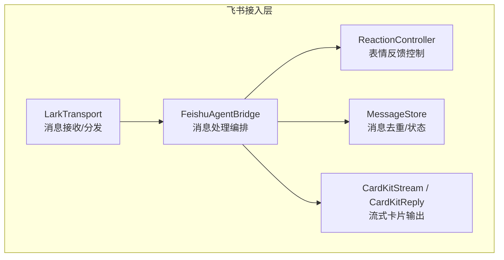
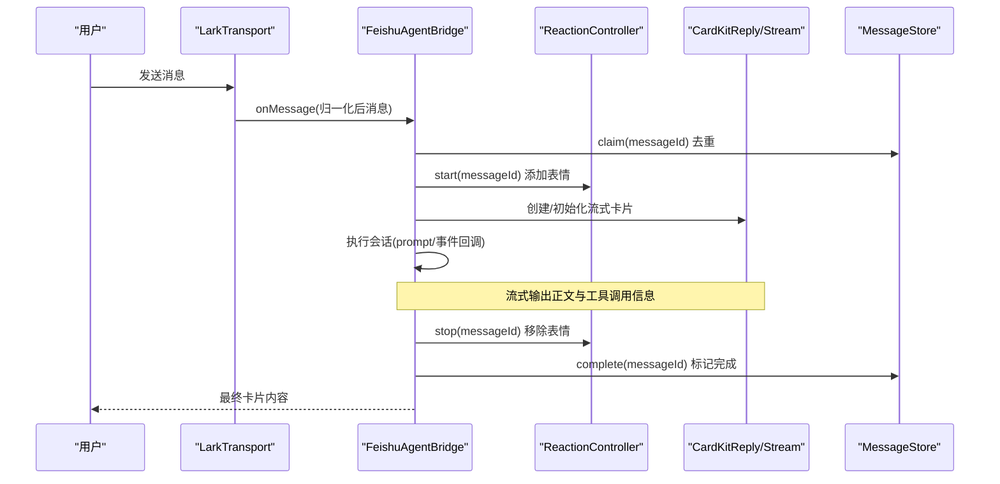
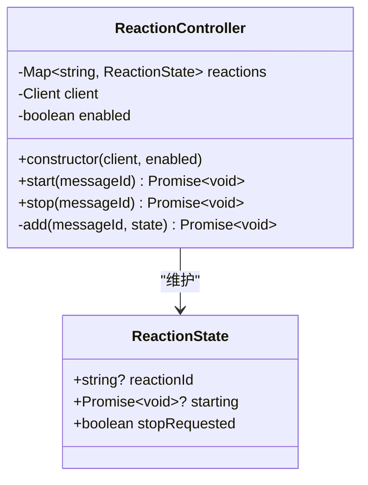
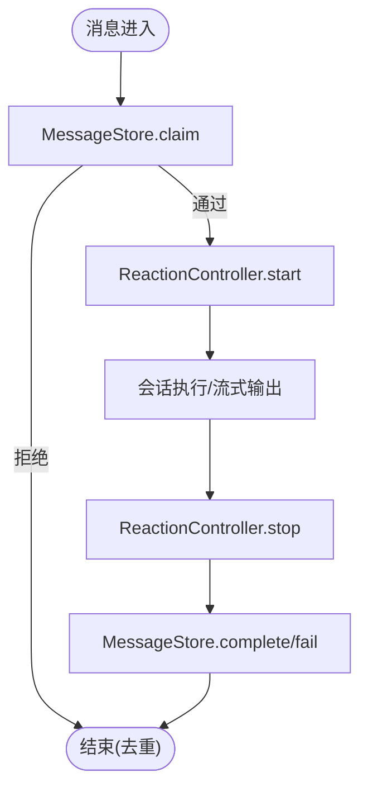
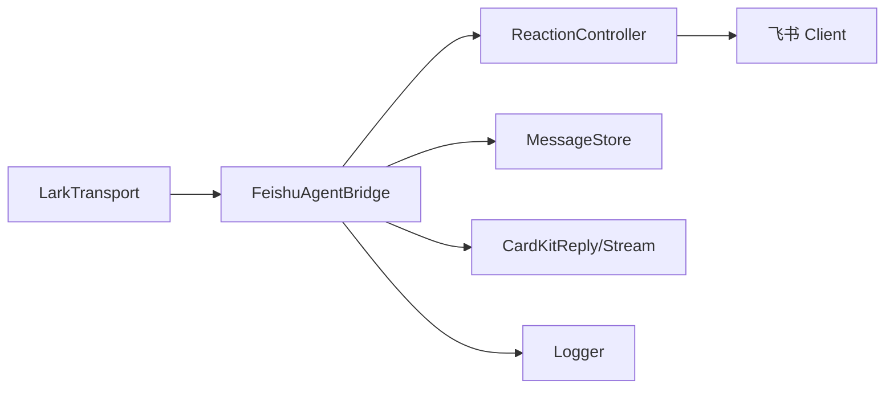

# 表情反馈控制器

<cite>
**本文引用的文件**
- [reaction-controller.ts](file://src/feishu/reaction-controller.ts)
- [agent-bridge.ts](file://src/feishu/agent-bridge.ts)
- [types.ts](file://src/feishu/types.ts)
- [message-store.ts](file://src/feishu/message-store.ts)
- [lark-transport.ts](file://src/feishu/lark-transport.ts)
- [cardkit-stream.ts](file://src/feishu/cardkit-stream.ts)
- [logger.ts](file://src/utils/logger.ts)
</cite>

## 目录
1. [简介](#简介)
2. [项目结构](#项目结构)
3. [核心组件](#核心组件)
4. [架构总览](#架构总览)
5. [详细组件分析](#详细组件分析)
6. [依赖关系分析](#依赖关系分析)
7. [性能与可用性](#性能与可用性)
8. [故障排查指南](#故障排查指南)
9. [结论](#结论)
10. [附录：API 与使用示例](#附录api-与使用示例)

## 简介
本文件围绕“表情反馈控制器”展开，系统性说明其在飞书消息处理链路中的职责、设计动机、实现细节与最佳实践。重点覆盖以下方面：
- 表情反应的管理机制：添加、移除、并发安全、生命周期管理
- 用户交互反馈：在消息处理期间提供“正在处理”的视觉提示，提升用户体验
- 状态同步：与消息去重、会话顺序、卡片流式更新等子系统协同工作
- ReactionController 类的设计：表情池、随机选择、冲突解决、异常容错
- 集成方案：如何在 Agent 桥接层中启用、配置与扩展

## 项目结构
表情反馈控制器位于飞书接入层，作为消息处理的辅助能力，与消息传输、会话管理、卡片流式输出等模块协作。

图表来源
- [lark-transport.ts:82-133](file://src/feishu/lark-transport.ts#L82-L133)
- [agent-bridge.ts:66-236](file://src/feishu/agent-bridge.ts#L66-L236)
- [reaction-controller.ts:57-121](file://src/feishu/reaction-controller.ts#L57-L121)
- [message-store.ts:13-47](file://src/feishu/message-store.ts#L13-L47)
- [cardkit-stream.ts:32-152](file://src/feishu/cardkit-stream.ts#L32-L152)

章节来源
- [lark-transport.ts:82-133](file://src/feishu/lark-transport.ts#L82-L133)
- [agent-bridge.ts:66-236](file://src/feishu/agent-bridge.ts#L66-L236)
- [reaction-controller.ts:57-121](file://src/feishu/reaction-controller.ts#L57-L121)
- [message-store.ts:13-47](file://src/feishu/message-store.ts#L13-L47)
- [cardkit-stream.ts:32-152](file://src/feishu/cardkit-stream.ts#L32-L152)

## 核心组件
- ReactionController：负责单条消息的“处理中”表情反应的生命周期管理（添加、删除、并发保护、失败补偿）
- FeishuAgentBridge：消息处理编排器，负责在消息进入时启动表情反应，在处理完成后移除；同时协调卡片流式输出与会话执行
- LarkTransport：底层消息传输，负责事件接收与归一化，将消息交给 Bridge 处理
- MessageStore：消息去重与状态持久化，避免重复投递与重复执行
- CardKitStream/CardKitReply：流式卡片输出，承载正文与统计小字，与表情反应形成“思考中/完成”的用户体验闭环

章节来源
- [reaction-controller.ts:57-121](file://src/feishu/reaction-controller.ts#L57-L121)
- [agent-bridge.ts:66-236](file://src/feishu/agent-bridge.ts#L66-L236)
- [lark-transport.ts:82-133](file://src/feishu/lark-transport.ts#L82-L133)
- [message-store.ts:13-47](file://src/feishu/message-store.ts#L13-L47)
- [cardkit-stream.ts:32-152](file://src/feishu/cardkit-stream.ts#L32-L152)

## 架构总览
表情反馈控制器嵌入到消息处理主流程中，通过“开始-结束”配对调用，确保用户在等待期间获得即时反馈，并在响应完成后自动清理。

图表来源
- [lark-transport.ts:82-133](file://src/feishu/lark-transport.ts#L82-L133)
- [agent-bridge.ts:66-236](file://src/feishu/agent-bridge.ts#L66-L236)
- [reaction-controller.ts:57-121](file://src/feishu/reaction-controller.ts#L57-L121)
- [message-store.ts:13-47](file://src/feishu/message-store.ts#L13-L47)
- [cardkit-stream.ts:32-152](file://src/feishu/cardkit-stream.ts#L32-L152)

## 详细组件分析

### ReactionController 类设计
- 职责
  - 为指定消息添加一个“处理中”的表情反应
  - 在消息处理结束后移除该表情反应
  - 保证同一消息的并发安全（重复 start 不重复添加）
  - 处理网络异常与竞态条件（stop 可能早于 add 完成）
- 关键数据结构
  - reactions: Map<messageId, ReactionState>
  - ReactionState: reactionId、starting Promise、stopRequested 标志
- 表情池
  - 内置合法表情集合，随机选取，避免无效表情导致 API 失败
- 并发与竞态
  - 若同一 messageId 多次调用 start，会复用或等待已有 starting Promise
  - stop 设置 stopRequested，add 在成功创建后立即检查并补偿删除
  - 任何阶段异常都会清理本地状态，避免内存泄漏
- 错误处理
  - 添加/删除失败记录日志，不影响主流程
  - 内部状态始终与外部资源保持一致性（尽力而为）

图表来源
- [reaction-controller.ts:57-121](file://src/feishu/reaction-controller.ts#L57-L121)

章节来源
- [reaction-controller.ts:57-121](file://src/feishu/reaction-controller.ts#L57-L121)

### 表情反馈生命周期与状态同步
- 生命周期
  - 开始：消息进入 Bridge 时调用 start，添加随机表情
  - 进行中：卡片流式输出正文与工具调用动画，用户感知“正在处理”
  - 结束：无论成功或失败，finally 块中调用 stop 移除表情
- 状态同步
  - 与 MessageStore.claim 配合，避免重复执行导致重复表情
  - 与会话管理器 ConversationManager 配合，保证同一会话内顺序执行
  - 与 CardKit 流式输出配合，确保表情与正文渲染一致

图表来源
- [agent-bridge.ts:66-236](file://src/feishu/agent-bridge.ts#L66-L236)
- [message-store.ts:13-47](file://src/feishu/message-store.ts#L13-L47)
- [reaction-controller.ts:57-121](file://src/feishu/reaction-controller.ts#L57-L121)

章节来源
- [agent-bridge.ts:66-236](file://src/feishu/agent-bridge.ts#L66-L236)
- [message-store.ts:13-47](file://src/feishu/message-store.ts#L13-L47)
- [reaction-controller.ts:57-121](file://src/feishu/reaction-controller.ts#L57-L121)

### 冲突解决策略
- 重复 start
  - 若已存在 reactionId，直接返回
  - 若正在 starting，等待已有 Promise 完成
- stop 抢先
  - stop 设置 stopRequested 并等待 starting 完成
  - add 成功后立即检查 stopRequested，如为真则立即删除表情并清理状态
- 异常恢复
  - 添加/删除失败仅记录日志，不会中断主流程
  - 本地状态在异常分支中及时清理，避免悬挂引用

章节来源
- [reaction-controller.ts:67-121](file://src/feishu/reaction-controller.ts#L67-L121)

### 用户体验优化
- 表情随机化：从合法表情池中随机选择，避免单调感
- 快速反馈：消息进入即添加表情，降低首帧延迟感知
- 自动清理：finally 中确保表情移除，避免残留
- 与卡片动画协同：正文未到达前用 spinner 动画，到达后切换真实内容，表情在等待期增强“正在处理”的感知

章节来源
- [agent-bridge.ts:86-122](file://src/feishu/agent-bridge.ts#L86-L122)
- [cardkit-stream.ts:32-152](file://src/feishu/cardkit-stream.ts#L32-L152)
- [reaction-controller.ts:15-54](file://src/feishu/reaction-controller.ts#L15-L54)

## 依赖关系分析
- ReactionController 依赖飞书 Client 进行表情添加/删除
- FeishuAgentBridge 组合 ReactionController、MessageStore、CardKitReply/Stream
- LarkTransport 负责消息入站与分发，驱动 Bridge 处理
- 日志系统统一记录警告与错误，便于排障

图表来源
- [lark-transport.ts:82-133](file://src/feishu/lark-transport.ts#L82-L133)
- [agent-bridge.ts:66-236](file://src/feishu/agent-bridge.ts#L66-L236)
- [reaction-controller.ts:57-121](file://src/feishu/reaction-controller.ts#L57-L121)
- [logger.ts:24-39](file://src/utils/logger.ts#L24-L39)

章节来源
- [lark-transport.ts:82-133](file://src/feishu/lark-transport.ts#L82-L133)
- [agent-bridge.ts:66-236](file://src/feishu/agent-bridge.ts#L66-L236)
- [reaction-controller.ts:57-121](file://src/feishu/reaction-controller.ts#L57-L121)
- [logger.ts:24-39](file://src/utils/logger.ts#L24-L39)

## 性能与可用性
- 低开销：表情操作仅在消息边界触发，不阻塞主流程
- 幂等与去重：MessageStore.claim 防止重复执行；ReactionController 内部对重复 start 做幂等处理
- 容错：网络异常降级为日志记录，不中断用户可见流程
- 可观测性：所有异常与警告通过 logger 输出，便于监控与定位
- 可扩展：表情池可配置化，支持按场景定制表情集合

[本节为通用性能讨论，不直接分析具体文件]

## 故障排查指南
- 表情未显示
  - 检查 enableReaction 是否开启（默认 true）
  - 查看日志中是否有“添加飞书 reaction 失败”的警告
  - 确认飞书 Client 权限与网络连通性
- 表情未移除
  - 检查 finally 块是否执行（正常流程应执行）
  - 查看日志中是否有“移除飞书 reaction 失败”的警告
  - 确认 messageId 是否正确传递
- 重复表情
  - 检查是否存在重复 start 调用（通常由重复投递引起）
  - 确认 MessageStore.claim 是否生效
- 与卡片动画冲突
  - 确保正文到达后停止 spinner 动画，避免文字混入
  - 观察 CardKit 流式更新的节流与重试逻辑

章节来源
- [reaction-controller.ts:90-119](file://src/feishu/reaction-controller.ts#L90-L119)
- [agent-bridge.ts:86-236](file://src/feishu/agent-bridge.ts#L86-L236)
- [logger.ts:24-39](file://src/utils/logger.ts#L24-L39)

## 结论
ReactionController 以最小侵入的方式为飞书消息处理提供了“处理中”的视觉反馈，提升了用户体验。其设计充分考虑了并发安全、竞态处理与异常容错，并与消息去重、会话顺序、卡片流式输出等子系统紧密协作。通过合理的集成与配置，可在复杂业务场景中稳定运行并提供一致的交互体验。

[本节为总结性内容，不直接分析具体文件]

## 附录：API 与使用示例

### ReactionController API
- constructor(client, enabled = true)
  - 参数：飞书 Client 实例；是否启用表情反馈（默认启用）
- start(messageId)
  - 尝试为指定消息添加表情反应；幂等且并发安全
- stop(messageId)
  - 移除指定消息的表情反应；确保 finally 中调用

章节来源
- [reaction-controller.ts:57-121](file://src/feishu/reaction-controller.ts#L57-L121)

### 在 FeishuAgentBridge 中的集成
- 构造时可选启用：options.enableReaction（默认 true），传入 client 后自动创建 ReactionController
- 消息处理流程：
  - 进入 handle 时调用 reactionController.start(message.messageId)
  - 处理完成后在 finally 中调用 reactionController.stop(message.messageId)

章节来源
- [agent-bridge.ts:33-64](file://src/feishu/agent-bridge.ts#L33-L64)
- [agent-bridge.ts:86-236](file://src/feishu/agent-bridge.ts#L86-L236)

### 与 MessageStore 的状态同步
- claim：原子认领消息，避免重复执行
- complete/fail：标记处理结果，用于后续审计与重试策略

章节来源
- [message-store.ts:13-47](file://src/feishu/message-store.ts#L13-L47)

### 与 CardKit 流式输出的协同
- 正文未到达前：spinner 动画 + 表情反应，强化“正在处理”感知
- 正文到达后：停止动画，开始流式推送真实内容
- 最终关闭：写入统计小字，移除表情反应

章节来源
- [cardkit-stream.ts:32-152](file://src/feishu/cardkit-stream.ts#L32-L152)
- [agent-bridge.ts:110-220](file://src/feishu/agent-bridge.ts#L110-L220)

### 最佳实践
- 始终在 finally 中调用 stop，确保表情清理
- 合理配置 enableReaction，必要时可按 chatId 或功能开关控制
- 关注日志中的警告与错误，及时处理网络或权限问题
- 如需自定义表情，可扩展现有表情池以满足品牌或场景需求

[本节为通用实践建议，不直接分析具体文件]