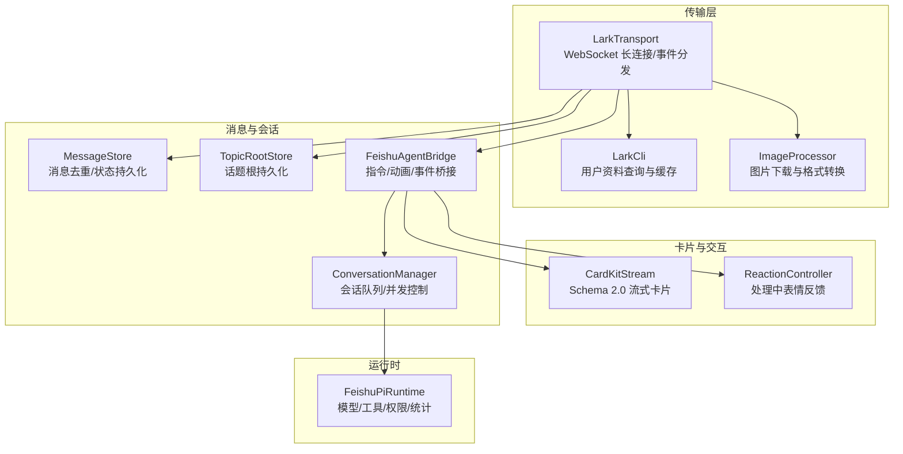
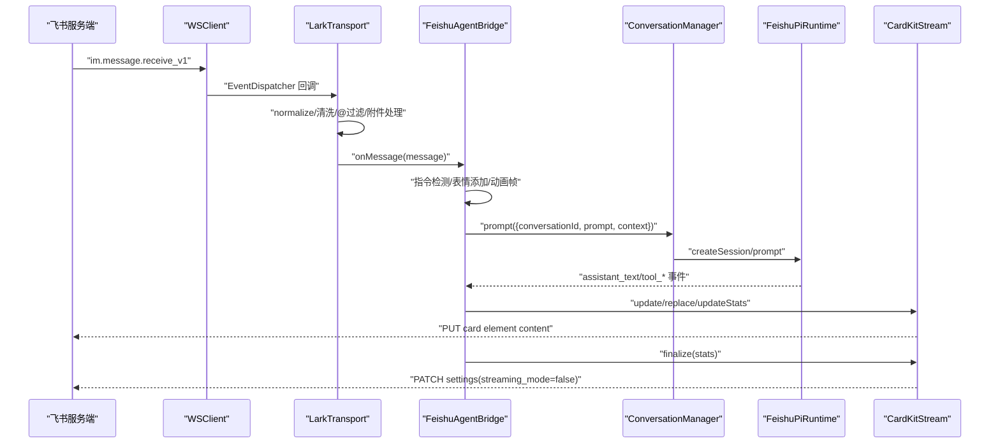
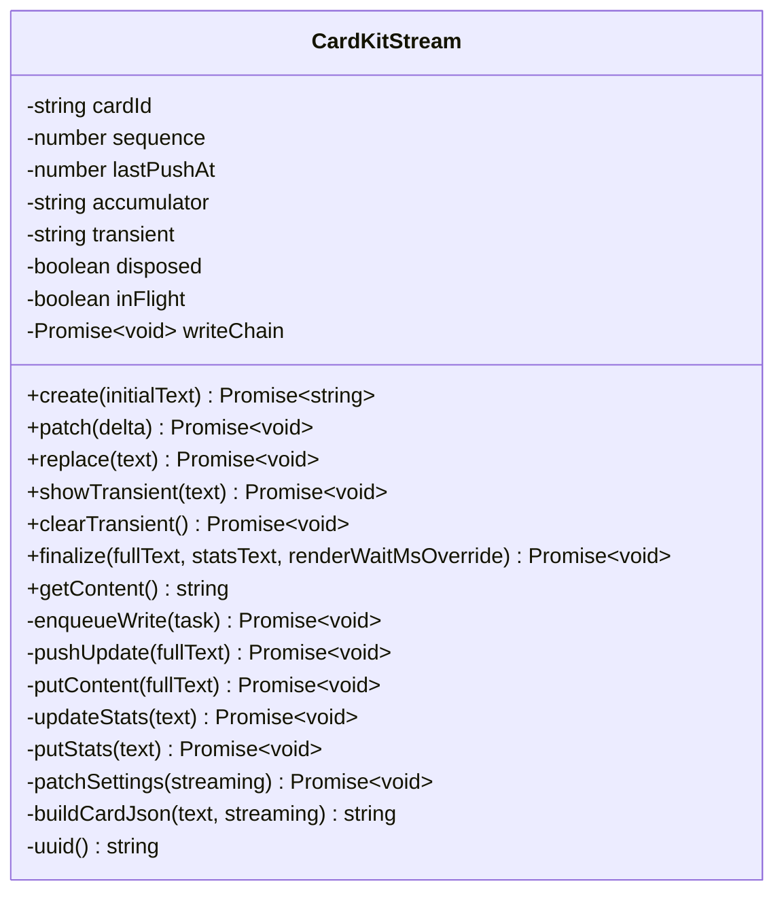
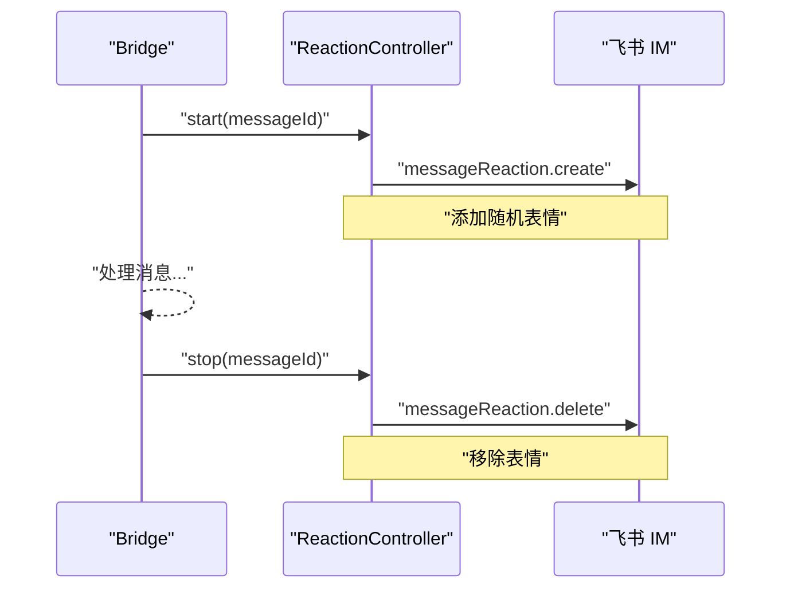
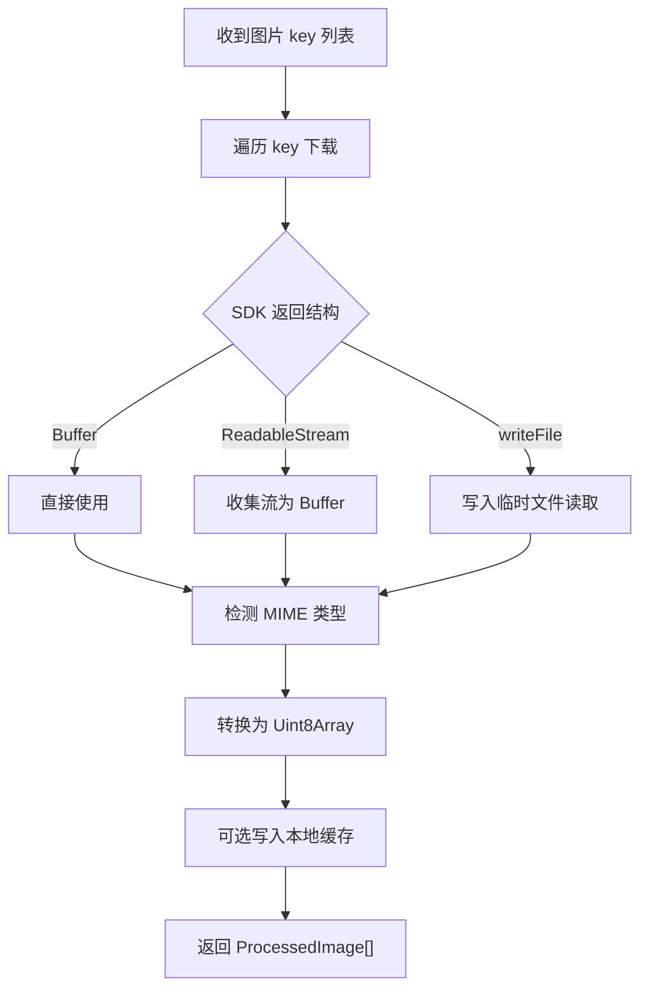
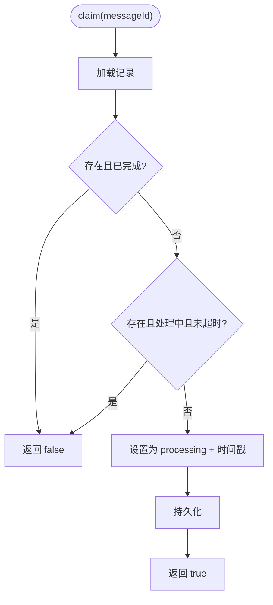
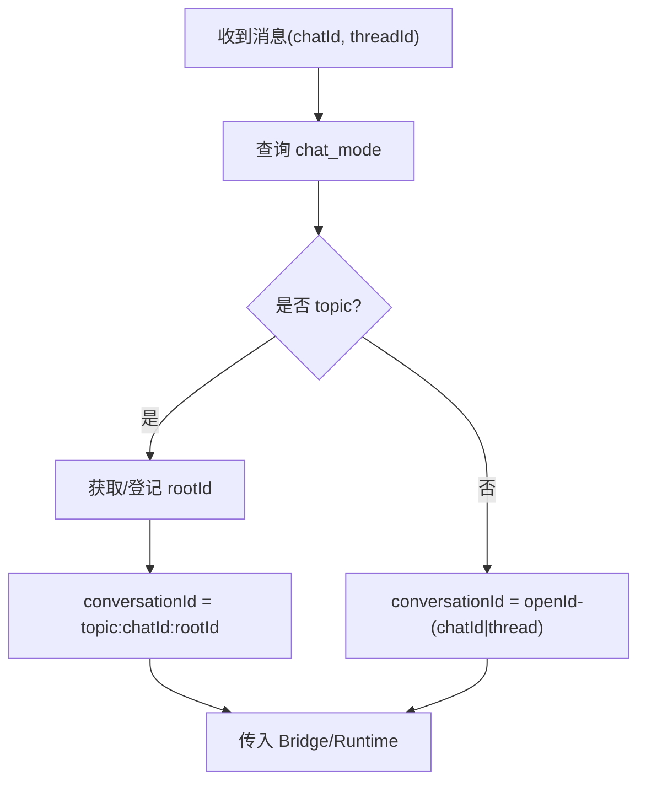
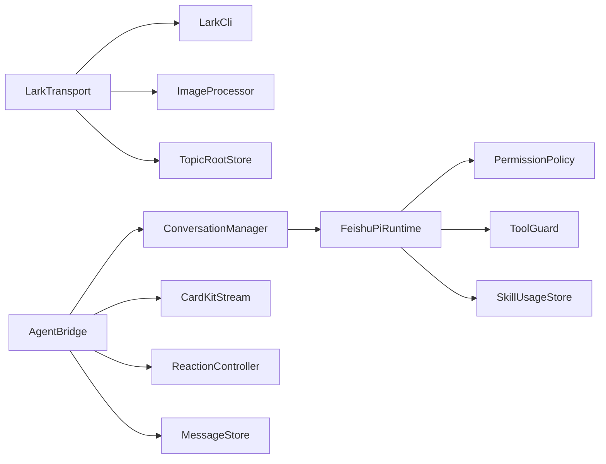

# 飞书集成

<cite>
**本文引用的文件**
- [lark-transport.ts](file://src/feishu/lark-transport.ts)
- [cardkit-stream.ts](file://src/feishu/cardkit-stream.ts)
- [reaction-controller.ts](file://src/feishu/reaction-controller.ts)
- [image-processor.ts](file://src/feishu/image-processor.ts)
- [message-store.ts](file://src/feishu/message-store.ts)
- [agent-bridge.ts](file://src/feishu/agent-bridge.ts)
- [types.ts](file://src/feishu/types.ts)
- [topic-root-store.ts](file://src/feishu/topic-root-store.ts)
- [lark-cli.ts](file://src/feishu/lark-cli.ts)
- [feishu-pi-runtime.ts](file://src/runtime/feishu-pi-runtime.ts)
- [conversation-manager.ts](file://src/runtime/conversation-manager.ts)
- [cardkit-streaming.md](file://docs/cardkit-streaming.md)
</cite>

## 目录
1. [简介](#简介)
2. [项目结构](#项目结构)
3. [核心组件](#核心组件)
4. [架构总览](#架构总览)
5. [详细组件分析](#详细组件分析)
6. [依赖关系分析](#依赖关系分析)
7. [性能考量](#性能考量)
8. [故障排查指南](#故障排查指南)
9. [结论](#结论)
10. [附录：API 调用示例与最佳实践](#附录api-调用示例与最佳实践)

## 简介
本文件面向需要在飞书平台深度集成的开发者，系统性说明以下能力：
- WebSocket 长连接机制与事件分发
- 消息传输协议与卡片操作（CardKit 2.0）
- 流式卡片的实时打字机效果、图片附件处理流程、表情反馈系统
- 消息去重机制、会话隔离策略、用户上下文注入
- 错误处理策略与性能优化技巧
- 完整的 API 调用参考与落地建议

## 项目结构
本项目将飞书集成拆分为“传输层”“卡片流式渲染”“表情反馈”“图片处理”“消息去重”“会话与运行时”等模块，职责清晰、可独立演进。

图表来源
- [lark-transport.ts:82-133](file://src/feishu/lark-transport.ts#L82-L133)
- [cardkit-stream.ts:57-84](file://src/feishu/cardkit-stream.ts#L57-L84)
- [reaction-controller.ts:57-121](file://src/feishu/reaction-controller.ts#L57-L121)
- [image-processor.ts:24-81](file://src/feishu/image-processor.ts#L24-L81)
- [message-store.ts:14-48](file://src/feishu/message-store.ts#L14-L48)
- [topic-root-store.ts:8-26](file://src/feishu/topic-root-store.ts#L8-L26)
- [agent-bridge.ts:16-69](file://src/feishu/agent-bridge.ts#L16-L69)
- [conversation-manager.ts:35-118](file://src/runtime/conversation-manager.ts#L35-L118)
- [feishu-pi-runtime.ts:81-285](file://src/runtime/feishu-pi-runtime.ts#L81-L285)

章节来源
- [lark-transport.ts:82-133](file://src/feishu/lark-transport.ts#L82-L133)
- [cardkit-stream.ts:57-84](file://src/feishu/cardkit-stream.ts#L57-L84)
- [agent-bridge.ts:16-69](file://src/feishu/agent-bridge.ts#L16-L69)

## 核心组件
- LarkTransport：基于官方 WSClient + EventDispatcher 的底层实现，负责建立 WebSocket 长连接、注册事件处理器、归一化消息、构造会话上下文、发送/更新卡片、下载资源等。
- CardKitStream：实现 CardKit Schema 2.0 流式卡片，提供创建、增量推送、替换、临时文本、关闭流式模式、统计小字等功能。
- ReactionController：为正在处理的消息添加随机表情，完成后移除，提升交互体验。
- ImageProcessor：下载飞书图片并转换为 Pi 可用格式（Uint8Array），支持可选本地缓存。
- MessageStore：基于 JSON 存储的消息去重与状态管理，避免重复投递与重复执行 Agent。
- TopicRootStore：话题群首条消息无 threadId 时的根消息持久化，保证后续消息收敛到同一会话。
- FeishuAgentBridge：消息入站后的统一入口，处理指令、启动思考动画、订阅 Pi 事件、驱动卡片流式输出、收尾统计。
- ConversationManager：按 conversationId 维护会话，串行化请求、并发安全、持久化映射。
- FeishuPiRuntime：封装 Pi 会话创建、工具注册、权限策略、技能使用统计、模型切换等。

章节来源
- [lark-transport.ts:42-80](file://src/feishu/lark-transport.ts#L42-L80)
- [cardkit-stream.ts:32-55](file://src/feishu/cardkit-stream.ts#L32-L55)
- [reaction-controller.ts:57-65](file://src/feishu/reaction-controller.ts#L57-L65)
- [image-processor.ts:24-38](file://src/feishu/image-processor.ts#L24-L38)
- [message-store.ts:14-21](file://src/feishu/message-store.ts#L14-L21)
- [topic-root-store.ts:8-26](file://src/feishu/topic-root-store.ts#L8-L26)
- [agent-bridge.ts:16-69](file://src/feishu/agent-bridge.ts#L16-L69)
- [conversation-manager.ts:35-118](file://src/runtime/conversation-manager.ts#L35-L118)
- [feishu-pi-runtime.ts:81-101](file://src/runtime/feishu-pi-runtime.ts#L81-L101)

## 架构总览
整体数据流从飞书 WebSocket 事件开始，经 LarkTransport 归一化后进入 Bridge，再通过 ConversationManager 路由到对应会话，由 Runtime 驱动 AI 生成内容，并以 CardKit 流式卡片实时推送到客户端。

图表来源
- [lark-transport.ts:87-133](file://src/feishu/lark-transport.ts#L87-L133)
- [agent-bridge.ts:71-196](file://src/feishu/agent-bridge.ts#L71-L196)
- [cardkit-stream.ts:57-152](file://src/feishu/cardkit-stream.ts#L57-L152)
- [conversation-manager.ts:35-118](file://src/runtime/conversation-manager.ts#L35-L118)
- [feishu-pi-runtime.ts:147-285](file://src/runtime/feishu-pi-runtime.ts#L147-L285)

## 详细组件分析

### WebSocket 长连接与事件分发（LarkTransport）
- 使用官方 WSClient + EventDispatcher 直接注册事件，避免高层封装对 ACK 返回值吞掉的问题。
- 注册两类事件：
  - im.message.receive_v1：归一化消息、过滤机器人自身消息、构造 conversationId、处理图片与文件附件、写入日志、fire-and-forget 交给上层 handler。
  - card.action.trigger：解析卡片回调，授权类交由审批处理器，其余管理员校验后执行（如模型切换）。
- 会话模式缓存：通过 chat_id 查询 chat_mode，区分 p2p/group/topic，影响会话隔离策略。
- 卡片更新策略：优先按 messageId 持久更新；失败回退到 token 临时更新。
- 资源下载：统一将响应收敛为 Buffer，支持 image/file/audio/video/media。

图表来源
- [lark-transport.ts:87-133](file://src/feishu/lark-transport.ts#L87-L133)
- [lark-transport.ts:141-248](file://src/feishu/lark-transport.ts#L141-L248)
- [lark-transport.ts:250-312](file://src/feishu/lark-transport.ts#L250-L312)
- [lark-transport.ts:314-363](file://src/feishu/lark-transport.ts#L314-L363)

章节来源
- [lark-transport.ts:82-133](file://src/feishu/lark-transport.ts#L82-L133)
- [lark-transport.ts:141-248](file://src/feishu/lark-transport.ts#L141-L248)
- [lark-transport.ts:250-312](file://src/feishu/lark-transport.ts#L250-L312)
- [lark-transport.ts:314-363](file://src/feishu/lark-transport.ts#L314-L363)

### CardKit 2.0 流式卡片与打字机效果（CardKitStream）
- 创建卡片实体：POST /open-apis/cardkit/v1/cards，开启 streaming_mode，配置 print_frequency_ms/print_step/print_strategy。
- 流式更新：PUT /cards/:card_id/elements/stream_md/content，全量文本+递增 sequence+uuid。
- 临时文本：showTransient/clearTransient，用于精简模式下工具调用行显示，不污染正文累加器。
- 关闭流式：PATCH /cards/:card_id/settings 设置 streaming_mode=false，并在关闭前等待客户端渲染完成。
- 统计小字：PUT /cards/:card_id/elements/stats_md/content，在关闭流式前写入。
- 健壮性：当官方约 10 分钟关闭流式导致 PUT 失败时，自动重新开启流式并重试一次。

图表来源
- [cardkit-stream.ts:32-55](file://src/feishu/cardkit-stream.ts#L32-L55)
- [cardkit-stream.ts:57-152](file://src/feishu/cardkit-stream.ts#L57-L152)
- [cardkit-stream.ts:159-246](file://src/feishu/cardkit-stream.ts#L159-L246)
- [cardkit-stream.ts:248-289](file://src/feishu/cardkit-stream.ts#L248-L289)

章节来源
- [cardkit-stream.ts:57-152](file://src/feishu/cardkit-stream.ts#L57-L152)
- [cardkit-stream.ts:159-246](file://src/feishu/cardkit-stream.ts#L159-L246)
- [cardkit-stream.ts:248-289](file://src/feishu/cardkit-stream.ts#L248-L289)
- [cardkit-streaming.md:7-119](file://docs/cardkit-streaming.md#L7-L119)

### 表情反馈系统（ReactionController）
- 在处理消息开始时添加随机表情（THINKING/SMILE/...），完成后删除。
- 并发安全：start 内部防重入，stop 支持抢占式清理。
- 异常容错：添加/删除失败仅记录告警，不影响主流程。

图表来源
- [reaction-controller.ts:57-121](file://src/feishu/reaction-controller.ts#L57-L121)
- [agent-bridge.ts:86-88](file://src/feishu/agent-bridge.ts#L86-L88)
- [agent-bridge.ts:233-236](file://src/feishu/agent-bridge.ts#L233-L236)

章节来源
- [reaction-controller.ts:57-121](file://src/feishu/reaction-controller.ts#L57-L121)
- [agent-bridge.ts:86-88](file://src/feishu/agent-bridge.ts#L86-L88)
- [agent-bridge.ts:233-236](file://src/feishu/agent-bridge.ts#L233-L236)

### 图片附件处理流程（ImageProcessor）
- 下载图片：调用 im.image.get，兼容不同 SDK 返回结构（Buffer/ReadableStream/writeFile）。
- 格式识别：根据文件头判断 PNG/JPEG/GIF/WebP，默认 JPEG。
- 可选缓存：将图片保存到本地目录，便于调试或离线访问。
- 批量处理：Promise.allSettled 并行下载，失败项不影响其他图片。

图表来源
- [image-processor.ts:40-81](file://src/feishu/image-processor.ts#L40-L81)
- [image-processor.ts:83-123](file://src/feishu/image-processor.ts#L83-L123)
- [image-processor.ts:125-152](file://src/feishu/image-processor.ts#L125-L152)

章节来源
- [image-processor.ts:40-81](file://src/feishu/image-processor.ts#L40-L81)
- [image-processor.ts:83-123](file://src/feishu/image-processor.ts#L83-L123)
- [image-processor.ts:125-152](file://src/feishu/image-processor.ts#L125-L152)

### 消息去重机制（MessageStore）
- claim：原子认领，若已 completed 或仍在 processing 且未超时则拒绝。
- complete/fail：标记处理完成或失败，落盘持久化。
- 超时保护：processing 超过阈值允许重新认领，防止卡住。

图表来源
- [message-store.ts:23-48](file://src/feishu/message-store.ts#L23-L48)

章节来源
- [message-store.ts:23-48](file://src/feishu/message-store.ts#L23-L48)

### 会话隔离策略与话题根持久化
- 会话模式：通过 chat_id 查询 chat_mode，区分 p2p/group/topic。
- 话题群：首条消息无 threadId，用 messageId 作为话题根并持久化；后续消息 threadId=根 ID，收敛到同一会话。
- 私聊/普通群：按用户隔离，conversationId 包含 openId 与 chatId/threadId。
- TopicRootStore：持久化 (chatId -> 待定话题根 messageId)，即使首条中断也能恢复。

图表来源
- [lark-transport.ts:155-175](file://src/feishu/lark-transport.ts#L155-L175)
- [topic-root-store.ts:8-26](file://src/feishu/topic-root-store.ts#L8-L26)

章节来源
- [lark-transport.ts:155-175](file://src/feishu/lark-transport.ts#L155-L175)
- [topic-root-store.ts:8-26](file://src/feishu/topic-root-store.ts#L8-L26)

### 用户上下文注入（FeishuContext）
- 字段：userOpenId、userName、departmentNames、chatId、threadId、conversationId、isAdmin。
- 来源：LarkTransport 通过 LarkCli 查询用户资料，结合 chat_mode 与 threadId 构造。
- 用途：权限判定、工具注册、技能可见范围、统计与审计。

章节来源
- [types.ts:8-20](file://src/feishu/types.ts#L8-L20)
- [context/types.ts:1-11](file://src/context/types.ts#L1-L11)
- [lark-cli.ts:31-169](file://src/feishu/lark-cli.ts#L31-L169)
- [lark-transport.ts:151-175](file://src/feishu/lark-transport.ts#L151-L175)

### 指令与卡片操作（AgentBridge）
- 指令：/new（清空会话）、/stop（中断响应）、/detail on/off（详细/精简模式）。
- 卡片操作：发送命令卡片、更新卡片、撤回消息、发送文本。
- 动画：思考动画（每 200ms 刷新）、工具调用动画（小字位置旋转符号）。
- 事件：订阅 assistant_text/tool_started/tool_updated/tool_finished，驱动卡片流式更新。

章节来源
- [agent-bridge.ts:71-196](file://src/feishu/agent-bridge.ts#L71-L196)
- [agent-bridge.ts:239-303](file://src/feishu/agent-bridge.ts#L239-L303)

## 依赖关系分析
- LarkTransport 依赖：
  - @larksuiteoapi/node-sdk（WSClient、EventDispatcher、Client）
  - LarkCli（用户资料）
  - ImageProcessor（图片/文件附件）
  - TopicRootStore（话题根持久化）
  - Logger（日志）
- CardKitStream 依赖：
  - Client（直接 HTTP 请求 CardKit API）
  - Logger（错误日志）
- ReactionController 依赖：
  - Client（IM reaction API）
  - Logger（告警）
- MessageStore/TopicRootStore 依赖：
  - JsonMapStore（JSON 持久化）
- AgentBridge 依赖：
  - ConversationManager（会话队列）
  - CardKitReply（卡片回复包装）
  - MessageStore（去重）
  - ReactionController（表情）
  - Spinner（动画帧）
  - Commands（指令注册）
- ConversationManager 依赖：
  - FeishuPiRuntime（会话创建/事件）
  - ConversationStore（会话映射持久化）
- FeishuPiRuntime 依赖：
  - Pi Agent（会话、工具、资源加载）
  - PermissionPolicy（组策略）
  - ToolGuard（工具审核）
  - SkillUsageStore（技能使用统计）
  - ScheduleService（定时任务）

图表来源
- [lark-transport.ts:42-80](file://src/feishu/lark-transport.ts#L42-L80)
- [agent-bridge.ts:16-69](file://src/feishu/agent-bridge.ts#L16-L69)
- [conversation-manager.ts:35-118](file://src/runtime/conversation-manager.ts#L35-L118)
- [feishu-pi-runtime.ts:81-285](file://src/runtime/feishu-pi-runtime.ts#L81-L285)

章节来源
- [lark-transport.ts:42-80](file://src/feishu/lark-transport.ts#L42-L80)
- [agent-bridge.ts:16-69](file://src/feishu/agent-bridge.ts#L16-L69)
- [conversation-manager.ts:35-118](file://src/runtime/conversation-manager.ts#L35-L118)
- [feishu-pi-runtime.ts:81-285](file://src/runtime/feishu-pi-runtime.ts#L81-L285)

## 性能考量
- 流式卡片节流：CardKitStream 默认最小推送间隔 800ms，避免频繁网络往返；客户端打印频率 30ms/步，每步 3 字符，平衡流畅度与带宽。
- 并发控制：ConversationManager 对同一 conversationId 的请求串行化，避免多轮对话竞争。
- 资源下载：ImageProcessor 使用 Promise.allSettled 并行下载，失败项不影响整体。
- 用户资料缓存：LarkCli 三级查询失败也落缓存，空档案 1 天重试，有档案 3 天重试，降低 API 压力。
- 会话模式缓存：chat_mode 结果缓存，减少重复查询。
- 卡片更新降级：按 messageId 更新失败回退 token 更新，提高鲁棒性。
- 流式模式自愈：官方关闭流式后自动重新开启并重试一次，避免长时间中断。

[本节为通用性能建议，不直接分析具体文件]

## 故障排查指南
- WebSocket 连接问题：
  - 检查 appId/appSecret/source 配置
  - 关注 onReconnecting/onReconnected/onError 日志
- 消息归一化失败：
  - 检查 normalize 参数（botIdentity、stripBotMentions、includeRaw）
  - 确认 resources 中的 type 与 fileKey 正确
- 卡片回调超时：
  - 确保 handler 返回值进入 ACK（底层方式）
  - 授权类回调需注册 approvalHandler
- 流式卡片更新失败：
  - 检查 sequence 单调递增与 uuid 唯一
  - 关注“流式模式可能已被官方关闭”的日志，自动重试逻辑会尝试重新开启
- 图片下载失败：
  - 检查 SDK 返回结构（Buffer/ReadableStream/writeFile）
  - 确认 cacheDir 可写
- 消息重复执行：
  - 检查 MessageStore.claim 是否成功
  - 确认 complete/fail 被调用
- 会话混乱：
  - 检查 conversationId 构造逻辑（topic/chat/thread）
  - 确认 TopicRootStore 是否正确登记/清除

章节来源
- [lark-transport.ts:87-133](file://src/feishu/lark-transport.ts#L87-L133)
- [lark-transport.ts:141-248](file://src/feishu/lark-transport.ts#L141-L248)
- [lark-transport.ts:250-312](file://src/feishu/lark-transport.ts#L250-L312)
- [cardkit-stream.ts:168-192](file://src/feishu/cardkit-stream.ts#L168-L192)
- [image-processor.ts:83-123](file://src/feishu/image-processor.ts#L83-L123)
- [message-store.ts:23-48](file://src/feishu/message-store.ts#L23-L48)
- [topic-root-store.ts:8-26](file://src/feishu/topic-root-store.ts#L8-L26)

## 结论
本方案通过底层 WebSocket 直连、CardKit 2.0 流式卡片、表情反馈、图片附件处理、消息去重与会话隔离，构建了高可靠、低延迟、用户体验友好的飞书集成体系。开发者可基于此快速扩展指令、卡片交互与业务逻辑，同时获得完善的错误处理与性能优化保障。

[本节为总结，不直接分析具体文件]

## 附录：API 调用示例与最佳实践

### WebSocket 长连接
- 建立连接：WSClient.start(eventDispatcher)
- 事件注册：register("im.message.receive_v1", ...)、register("card.action.trigger", ...)
- 断开连接：wsClient.close()

章节来源
- [lark-transport.ts:82-133](file://src/feishu/lark-transport.ts#L82-L133)
- [lark-transport.ts:374-377](file://src/feishu/lark-transport.ts#L374-L377)

### 消息发送与卡片操作
- 发送卡片：client.im.v1.message.create(msg_type="interactive")
- 更新卡片：client.im.v1.message.patch(message_id, content)
- 撤回消息：client.im.v1.message.delete(message_id)
- 发送文本：client.im.v1.message.create(msg_type="text")

章节来源
- [lark-transport.ts:388-422](file://src/feishu/lark-transport.ts#L388-L422)
- [agent-bridge.ts:285-303](file://src/feishu/agent-bridge.ts#L285-L303)

### CardKit 流式卡片
- 创建卡片：POST /open-apis/cardkit/v1/cards（streaming_mode=true）
- 流式更新：PUT /cards/:card_id/elements/stream_md/content（sequence++，uuid）
- 关闭流式：PATCH /cards/:card_id/settings（streaming_mode=false）
- 统计小字：PUT /cards/:card_id/elements/stats_md/content

章节来源
- [cardkit-stream.ts:57-84](file://src/feishu/cardkit-stream.ts#L57-L84)
- [cardkit-stream.ts:159-246](file://src/feishu/cardkit-stream.ts#L159-L246)
- [cardkit-streaming.md:7-119](file://docs/cardkit-streaming.md#L7-L119)

### 表情反馈
- 添加表情：client.im.messageReaction.create(message_id, reaction_type)
- 删除表情：client.im.messageReaction.delete(message_id, reaction_id)

章节来源
- [reaction-controller.ts:101-121](file://src/feishu/reaction-controller.ts#L101-L121)

### 图片附件
- 下载图片：client.im.image.get(image_key)
- 格式识别：根据文件头判断 MIME
- 批量处理：Promise.allSettled

章节来源
- [image-processor.ts:40-81](file://src/feishu/image-processor.ts#L40-L81)
- [image-processor.ts:83-123](file://src/feishu/image-processor.ts#L83-L123)
- [image-processor.ts:125-152](file://src/feishu/image-processor.ts#L125-L152)

### 消息去重与会话隔离
- 去重：MessageStore.claim/complete/fail
- 会话隔离：conversationId 构造（topic/chat/thread）
- 话题根：TopicRootStore.set/get/clear

章节来源
- [message-store.ts:23-48](file://src/feishu/message-store.ts#L23-L48)
- [lark-transport.ts:155-175](file://src/feishu/lark-transport.ts#L155-L175)
- [topic-root-store.ts:8-26](file://src/feishu/topic-root-store.ts#L8-L26)

### 用户上下文注入
- 构造 FeishuContext：userOpenId、userName、departmentNames、chatId、threadId、conversationId、isAdmin
- 来源：LarkCli 三级查询 + 缓存

章节来源
- [types.ts:8-20](file://src/feishu/types.ts#L8-L20)
- [context/types.ts:1-11](file://src/context/types.ts#L1-L11)
- [lark-cli.ts:31-169](file://src/feishu/lark-cli.ts#L31-L169)

### 运行时与权限
- 模型切换：setModelName（新会话生效）
- 工具注册：内置工具按组策略注册，脚本工具按组名单过滤
- 权限钩子：beforeToolCall 拦截 read/bash/write/edit 等
- 技能统计：记录技能读取事件，注入查询工具

章节来源
- [feishu-pi-runtime.ts:95-101](file://src/runtime/feishu-pi-runtime.ts#L95-L101)
- [feishu-pi-runtime.ts:147-285](file://src/runtime/feishu-pi-runtime.ts#L147-L285)